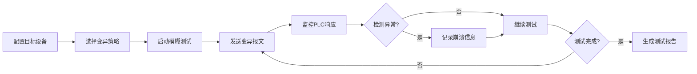

## 1. 产品概述

Modbus协议模糊测试平台，用于自动化测试PLC设备的协议健壮性。通过发送变异的Modbus报文（功能码异常、地址越界、数据畸形等），监控目标设备响应状态，检测潜在的安全漏洞和崩溃风险。

- 主要用途：工业控制系统安全测试、PLC设备健壮性验证
- 目标用户：工控安全研究员、设备测试工程师、渗透测试人员
- 价值：自动化发现协议实现漏洞，提升工控设备安全性

## 2. 核心功能

### 2.1 用户角色
| 角色 | 注册方式 | 核心权限 |
|------|----------|----------|
| 测试工程师 | 本地登录 | 配置测试、执行测试、查看结果、管理用例 |

### 2.2 功能模块
1. **仪表板**：测试概览、实时状态监控、统计图表
2. **测试配置**：目标设备配置、测试参数设置、变异策略选择
3. **测试执行**：实时控制、进度显示、报文捕获
4. **结果分析**：响应日志、崩溃报告、异常统计
5. **用例管理**：测试用例库、用例编辑、批量导入导出

### 2.3 页面详情
| 页面名称 | 模块名称 | 功能描述 |
|----------|----------|----------|
| 仪表板 | 状态概览 | 在线设备数、测试执行统计、崩溃检测统计 |
| 仪表板 | 实时监控 | 当前运行测试状态、最近异常日志 |
| 测试配置 | 目标配置 | PLC IP地址、端口、Slave ID配置 |
| 测试配置 | 变异策略 | 功能码异常、地址越界、数据长度异常等策略选择 |
| 测试执行 | 测试控制 | 开始/暂停/停止测试、实时进度条 |
| 测试执行 | 报文监控 | 发送/接收报文十六进制显示、时间戳 |
| 结果分析 | 响应日志 | 完整测试日志、筛选搜索功能 |
| 结果分析 | 崩溃报告 | 崩溃报文详情、复现步骤、严重程度 |
| 用例管理 | 用例列表 | 测试用例分页展示、搜索筛选 |
| 用例管理 | 用例编辑 | 新建/编辑测试用例、参数配置 |

## 3. 核心流程

用户配置目标PLC参数，选择变异策略，启动测试。系统持续发送变异Modbus报文，监控设备响应，记录异常和崩溃事件，最终生成测试报告。

## 4. 用户界面设计

### 4.1 设计风格
- **主色调**：深灰蓝 (#1a1a2e) - 专业工控风格，体现安全严谨
- **辅助色**：荧光绿 (#00ff88) - 正常状态；警示红 (#ff4757) - 异常/崩溃；琥珀黄 (#ffa502) - 警告
- **按钮风格**：棱角分明的工业风格，轻微3D效果，悬停时发光
- **字体**：JetBrains Mono - 等宽字体，适合显示十六进制和代码
- **布局**：侧边导航 + 主内容区，深色主题，工业监控仪表风格
- **图标**：线性图标，技术感强，使用Font Awesome

### 4.2 页面设计概述
| 页面名称 | 模块名称 | UI元素 |
|----------|----------|--------|
| 仪表板 | 状态概览 | 卡片式统计面板，数字动画，状态指示灯 |
| 测试配置 | 目标配置 | 表单输入，验证反馈，连接测试按钮 |
| 测试执行 | 报文监控 | 终端风格滚动区域，语法高亮，时间轴 |
| 结果分析 | 崩溃报告 | 时间线布局，严重程度标签，报文详情展开 |
| 用例管理 | 用例列表 | 数据表格，批量操作，分页控件 |

### 4.3 响应性
- Desktop-first设计，1920px为主适配宽度
- 侧边栏在平板设备可折叠
- 数据表格在移动端支持横向滚动
- 触控设备优化按钮尺寸和点击区域
