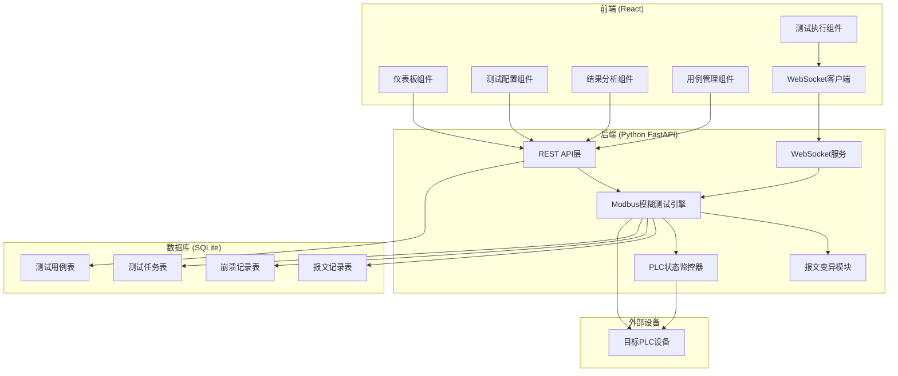
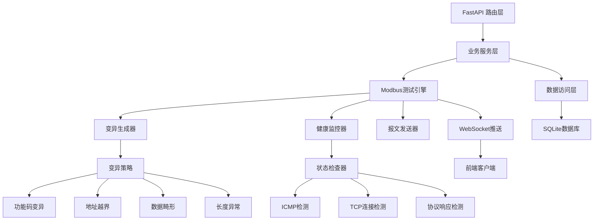
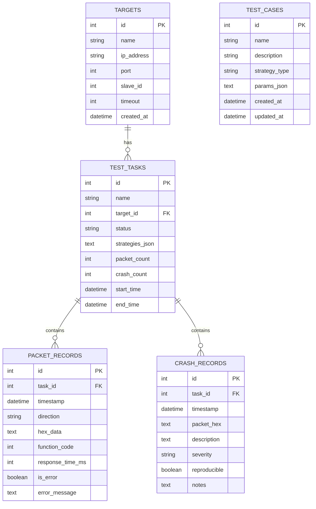

## 1. 架构设计



## 2. 技术描述

- **前端**：React@18 + TypeScript + TailwindCSS@3 + Vite + Recharts + Socket.io-client
- **初始化工具**：Vite
- **后端**：Python 3.10 + FastAPI + Uvicorn + Socket.io
- **Modbus协议**：pymodbus + 自定义报文构造
- **数据库**：SQLite + SQLAlchemy ORM
- **实时通信**：WebSocket (Socket.io)

## 3. 路由定义

| 路由 | 页面组件 | 功能描述 |
|------|----------|----------|
| / | Dashboard | 仪表板首页 |
| /config | TestConfig | 测试配置页面 |
| /execution | TestExecution | 测试执行页面 |
| /results | ResultsAnalysis | 结果分析页面 |
| /cases | TestCases | 测试用例管理页面 |

## 4. API 定义

### 4.1 TypeScript 类型定义

```typescript
// 目标设备配置
interface TargetConfig {
  id?: number;
  name: string;
  ipAddress: string;
  port: number;
  slaveId: number;
  timeout: number;
}

// 变异策略
interface MutationStrategy {
  id: string;
  name: string;
  description: string;
  enabled: boolean;
  params?: Record<string, any>;
}

// 测试任务
interface TestTask {
  id: number;
  name: string;
  targetId: number;
  status: 'idle' | 'running' | 'paused' | 'completed' | 'error';
  strategies: string[];
  packetCount: number;
  crashCount: number;
  startTime?: string;
  endTime?: string;
}

// 报文记录
interface PacketRecord {
  id: number;
  taskId: number;
  timestamp: string;
  direction: 'sent' | 'received';
  hexData: string;
  functionCode: number;
  responseTime: number;
  isError: boolean;
}

// 崩溃记录
interface CrashRecord {
  id: number;
  taskId: number;
  timestamp: string;
  packetHex: string;
  description: string;
  severity: 'low' | 'medium' | 'high' | 'critical';
  reproducible: boolean;
}

// 测试用例
interface TestCase {
  id: number;
  name: string;
  description: string;
  strategyType: string;
  params: Record<string, any>;
  createdAt: string;
  updatedAt: string;
}
```

### 4.2 REST API 接口

| 方法 | 路径 | 描述 |
|------|------|------|
| GET | /api/targets | 获取目标设备列表 |
| POST | /api/targets | 创建目标设备 |
| PUT | /api/targets/:id | 更新目标设备 |
| DELETE | /api/targets/:id | 删除目标设备 |
| POST | /api/targets/:id/test | 测试连接 |
| GET | /api/strategies | 获取变异策略列表 |
| GET | /api/tasks | 获取测试任务列表 |
| POST | /api/tasks | 创建测试任务 |
| GET | /api/tasks/:id | 获取任务详情 |
| DELETE | /api/tasks/:id | 删除任务 |
| POST | /api/tasks/:id/start | 启动任务 |
| POST | /api/tasks/:id/pause | 暂停任务 |
| POST | /api/tasks/:id/stop | 停止任务 |
| GET | /api/tasks/:id/packets | 获取报文记录 |
| GET | /api/tasks/:id/crashes | 获取崩溃记录 |
| GET | /api/cases | 获取测试用例列表 |
| POST | /api/cases | 创建测试用例 |
| PUT | /api/cases/:id | 更新测试用例 |
| DELETE | /api/cases/:id | 删除测试用例 |
| GET | /api/stats/dashboard | 获取仪表板统计数据 |

### 4.3 WebSocket 事件

| 事件 | 方向 | 描述 |
|------|------|------|
| test:packet | Server → Client | 实时报文推送 |
| test:status | Server → Client | 测试状态更新 |
| test:crash | Server → Client | 崩溃检测通知 |
| test:progress | Server → Client | 测试进度更新 |
| test:control | Client → Server | 测试控制命令 |

## 5. 后端服务架构



## 6. 数据模型

### 6.1 ER 图



### 6.2 DDL 语句

```sql
-- 目标设备表
CREATE TABLE targets (
    id INTEGER PRIMARY KEY AUTOINCREMENT,
    name VARCHAR(100) NOT NULL,
    ip_address VARCHAR(45) NOT NULL,
    port INTEGER NOT NULL DEFAULT 502,
    slave_id INTEGER NOT NULL DEFAULT 1,
    timeout INTEGER NOT NULL DEFAULT 5000,
    created_at DATETIME DEFAULT CURRENT_TIMESTAMP
);

-- 测试任务表
CREATE TABLE test_tasks (
    id INTEGER PRIMARY KEY AUTOINCREMENT,
    name VARCHAR(100) NOT NULL,
    target_id INTEGER NOT NULL,
    status VARCHAR(20) NOT NULL DEFAULT 'idle',
    strategies_json TEXT,
    packet_count INTEGER DEFAULT 0,
    crash_count INTEGER DEFAULT 0,
    start_time DATETIME,
    end_time DATETIME,
    FOREIGN KEY (target_id) REFERENCES targets(id)
);

-- 报文记录表
CREATE TABLE packet_records (
    id INTEGER PRIMARY KEY AUTOINCREMENT,
    task_id INTEGER NOT NULL,
    timestamp DATETIME DEFAULT CURRENT_TIMESTAMP,
    direction VARCHAR(10) NOT NULL,
    hex_data TEXT NOT NULL,
    function_code INTEGER,
    response_time_ms INTEGER,
    is_error BOOLEAN DEFAULT 0,
    error_message TEXT,
    FOREIGN KEY (task_id) REFERENCES test_tasks(id)
);

-- 崩溃记录表
CREATE TABLE crash_records (
    id INTEGER PRIMARY KEY AUTOINCREMENT,
    task_id INTEGER NOT NULL,
    timestamp DATETIME DEFAULT CURRENT_TIMESTAMP,
    packet_hex TEXT NOT NULL,
    description TEXT,
    severity VARCHAR(20) DEFAULT 'medium',
    reproducible BOOLEAN DEFAULT 0,
    notes TEXT,
    FOREIGN KEY (task_id) REFERENCES test_tasks(id)
);

-- 测试用例表
CREATE TABLE test_cases (
    id INTEGER PRIMARY KEY AUTOINCREMENT,
    name VARCHAR(100) NOT NULL,
    description TEXT,
    strategy_type VARCHAR(50) NOT NULL,
    params_json TEXT,
    created_at DATETIME DEFAULT CURRENT_TIMESTAMP,
    updated_at DATETIME DEFAULT CURRENT_TIMESTAMP
);

-- 创建索引
CREATE INDEX idx_packets_task_id ON packet_records(task_id);
CREATE INDEX idx_packets_timestamp ON packet_records(timestamp);
CREATE INDEX idx_crashes_task_id ON crash_records(task_id);
CREATE INDEX idx_crashes_severity ON crash_records(severity);
```
