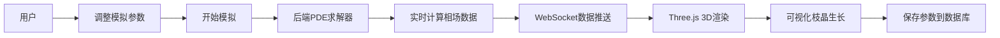

## 1. 产品概述

金属凝固枝晶生长相场模拟可视化平台，基于数值求解偏微分方程(PDE)的相场模型，实时模拟并三维可视化展示金属凝固过程中的微观组织演化。面向材料科学研究者、学生及教育工作者，提供直观的晶体生长动力学演示工具。

## 2. 核心功能

### 2.1 用户角色

| 角色 | 注册方式 | 核心权限 |
|------|----------|----------|
| 访客用户 | 无需注册 | 运行模拟、调整参数、查看3D可视化 |
| 注册用户 | 邮箱注册 | 保存模拟参数、加载历史记录、导出数据 |

### 2.2 功能模块

1. **模拟控制面板**：参数调节、模拟控制、状态显示
2. **3D可视化场景**：Three.js实时渲染晶体生长形态
3. **参数管理**：保存、加载、删除模拟参数配置
4. **数据展示**：模拟进度、时间步、能量曲线

### 2.3 页面详情

| 页面名称 | 模块名称 | 功能描述 |
|---------|----------|----------|
| 主页面 | 3D渲染区域 | 实时展示枝晶生长三维形态，支持旋转缩放 |
| 主页面 | 参数控制面板 | 过冷度滑块、各向异性参数调节、模拟启停按钮 |
| 主页面 | 参数管理面板 | 保存当前参数、加载历史配置、参数列表展示 |
| 主页面 | 数据监控区 | 模拟时间步、进度条、能量变化曲线 |

## 3. 核心流程

用户进入主页面 → 调整过冷度和各向异性参数 → 点击开始模拟 → 后端求解相场方程 → 实时传输计算结果 → 前端Three.js渲染3D晶体形态 → 可随时暂停/重置/保存参数

## 4. 用户界面设计

### 4.1 设计风格

**科技感-科研主题风格**
- **主色调**：深蓝色系 (#0a192f) 代表科学严谨，配以冰蓝色 (#64ffda) 作为晶体高亮色
- **辅助色**：金属质感的银灰色 (#8892b0)、能量感的青绿色 (#00ff88)
- **按钮风格**：微圆角、发光悬停效果、玻璃态透明背景
- **字体**：Display使用Orbitron（科技感），正文使用Roboto Mono（等宽，数据友好）
- **布局风格**：左右分栏布局，左侧控制面板，右侧大尺寸3D视窗
- **视觉元素**：科技感网格背景、粒子效果、扫描线装饰

### 4.2 页面设计概览

| 页面名称 | 模块名称 | UI元素 |
|---------|----------|--------|
| 主页面 | 3D渲染区 | 深色背景、体积光、晶体发光材质、坐标轴指示、旋转交互 |
| 主页面 | 参数面板 | 滑动条带数值显示、标签组、发光按钮、玻璃态卡片 |
| 主页面 | 数据监控 | 实时曲线图、数字跳动动画、进度条发光效果 |

### 4.3 响应性

- **桌面端**：左右分栏布局，3D视窗占70%宽度，控制面板占30%
- **平板端**：上下布局，控制面板自动折叠为可展开侧边栏
- **移动端**：优先展示3D视窗，控制面板通过底部抽屉呼出

### 4.4 3D场景指导

- **环境**：深空暗色背景配合低亮度网格地面，营造实验室微观观测氛围
- **光照**：主光源使用冷色调方向光，配合边缘光突出晶体轮廓，晶体自发光材质
- **相机**：PerspectiveCamera，初始距离适中，支持OrbitControls交互
- **动画**：晶体生长使用顶点变形过渡，生长速度与计算同步，表面脉动效果
- **后处理**：Bloom泛光效果增强晶体发光感，轻微色差营造科技感
- **性能**：使用InstancedMesh优化大量晶体单元，帧率目标30fps+
