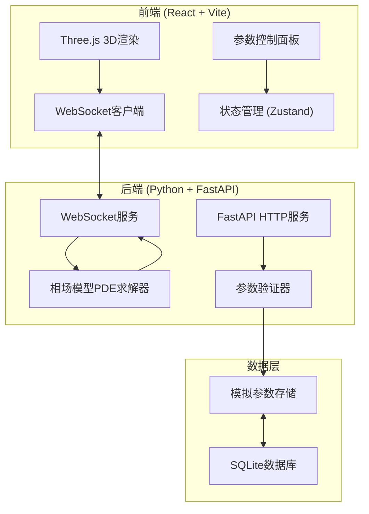
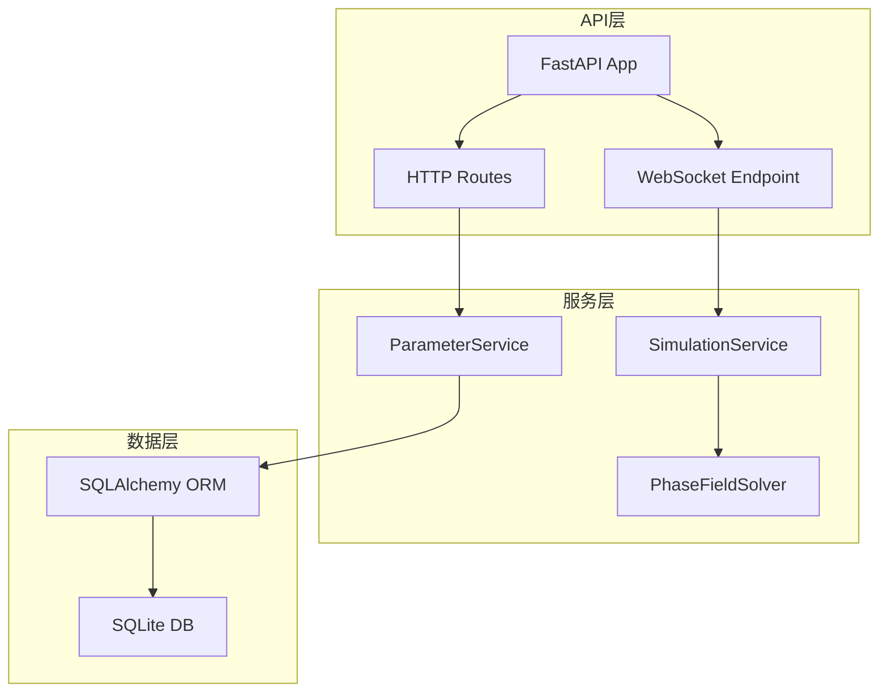
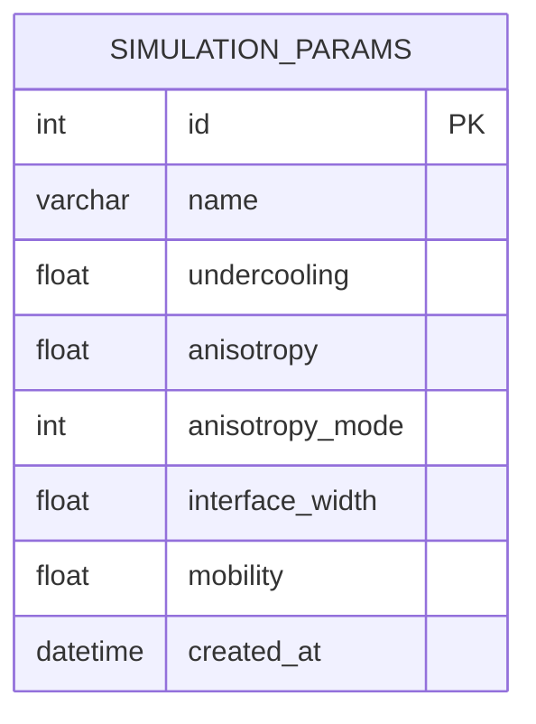

## 1. 架构设计



## 2. 技术描述

- **前端**: React@18 + TypeScript + Vite + TailwindCSS@3
- **3D渲染**: Three.js + @react-three/fiber + @react-three/drei + @react-three/postprocessing
- **后端**: Python 3.11 + FastAPI + Uvicorn
- **数值计算**: NumPy + SciPy（有限差分法求解PDE）
- **数据库**: SQLite + SQLAlchemy ORM
- **实时通信**: WebSocket
- **状态管理**: Zustand
- **图表**: Recharts

## 3. 路由定义

### 前端路由
| 路由 | 页面组件 | 功能描述 |
|------|----------|----------|
| / | SimulationPage | 主模拟页面，包含3D视窗和控制面板 |

### 后端API路由
| 方法 | 路由 | 功能描述 |
|------|------|----------|
| GET | /api/health | 健康检查 |
| GET | /api/parameters | 获取所有保存的参数配置 |
| POST | /api/parameters | 保存新的参数配置 |
| GET | /api/parameters/:id | 获取指定参数配置 |
| DELETE | /api/parameters/:id | 删除指定参数配置 |
| WS | /ws/simulate | WebSocket模拟连接 |

## 4. API定义

### TypeScript类型定义

```typescript
// 模拟参数
interface SimulationParams {
  id?: number;
  name: string;
  undercooling: number;      // 过冷度 ΔT (0.1 - 2.0)
  anisotropy: number;        // 各向异性强度 (0.0 - 0.1)
  anisotropyMode: number;    // 各向异性模式 (4 - 立方体, 6 - 八面体)
  interfaceWidth: number;    // 界面宽度
  mobility: number;          // 界面迁移率
  createdAt?: string;
}

// 模拟状态
interface SimulationState {
  isRunning: boolean;
  isPaused: boolean;
  currentStep: number;
  totalSteps: number;
  progress: number;
  freeEnergy: number;
}

// WebSocket消息
interface WSMessage {
  type: 'init' | 'step' | 'complete' | 'error' | 'pause' | 'resume';
  data?: any;
  step?: number;
}

// 相场数据帧
interface PhaseFieldFrame {
  step: number;
  phaseData: Float32Array;  // 3D数组扁平化
  dimensions: { nx: number; ny: number; nz: number };
}
```

### 请求/响应示例

#### 保存参数
```
POST /api/parameters
Request:
{
  "name": "标准枝晶模拟",
  "undercooling": 0.5,
  "anisotropy": 0.04,
  "anisotropyMode": 4,
  "interfaceWidth": 3.0,
  "mobility": 1.0
}

Response:
{
  "id": 1,
  "name": "标准枝晶模拟",
  "undercooling": 0.5,
  "anisotropy": 0.04,
  ...
  "createdAt": "2024-01-15T10:30:00Z"
}
```

## 5. 服务器架构图



## 6. 数据模型

### 6.1 数据模型定义



### 6.2 DDL语句

```sql
CREATE TABLE simulation_params (
    id INTEGER PRIMARY KEY AUTOINCREMENT,
    name VARCHAR(255) NOT NULL,
    undercooling FLOAT NOT NULL,
    anisotropy FLOAT NOT NULL,
    anisotropy_mode INTEGER NOT NULL DEFAULT 4,
    interface_width FLOAT NOT NULL DEFAULT 3.0,
    mobility FLOAT NOT NULL DEFAULT 1.0,
    created_at DATETIME DEFAULT CURRENT_TIMESTAMP
);

CREATE INDEX idx_params_created ON simulation_params(created_at);
```

## 7. 相场模型求解器设计

### 核心方程（相场模型）
- 使用Kobayashi枝晶生长模型
- 求解Allen-Cahn方程：∂φ/∂t = M∇²φ - M∂F/∂φ
- 包含各向异性的界面能项
- 温度场耦合

### 数值方法
- 有限差分法（FDM）
- 显式欧拉时间积分
- 周期性边界条件
- 3D网格大小：64×64×64（平衡性能与精度）

### 优化策略
- NumPy向量化计算
- 可选的Numba JIT加速
- 分块数据传输
