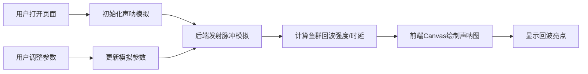

## 1. 产品概述
声呐Web模拟器是一个交互式的声呐系统仿真应用，通过可视化的方式展示声呐探测鱼群的过程。
- 主要目的：模拟声呐发射脉冲、接收回波的物理过程，直观展示声呐探测原理
- 目标用户：海洋工程学习者、声呐技术爱好者、教育演示场景

## 2. 核心功能

### 2.1 功能模块
1. **声呐模拟器主页面**: 扇形声呐图显示、鱼群回波亮点、参数控制面板

### 2.2 页面详情
| 页面名称 | 模块名称 | 功能描述 |
|-----------|-------------|---------------------|
| 主页面 | 扇形声呐图 | Canvas绘制扇形扫描区域，动态旋转扫描线 |
| 主页面 | 回波亮点显示 | 根据后端计算的回波数据，在对应位置显示鱼群亮点 |
| 主页面 | 参数控制面板 | 调整波束角、增益等参数，实时反馈到模拟效果 |

## 3. 核心流程
1. 用户打开页面，声呐模拟器自动开始运行
2. 后端模拟声呐发射脉冲，根据预设鱼群位置计算回波强度和时延
3. 前端Canvas动态绘制扇形扫描图和回波亮点
4. 用户通过控制面板调整波束角、增益参数
5. 参数变更实时传递给后端，更新模拟计算结果

## 4. 用户界面设计
### 4.1 设计风格
- 主色调：深蓝色（#0a1628）背景，青绿色（#00ffaa）扫描线，营造水下科技感
- 辅助色：黄色（#ffdd00）回波亮点，白色（#ffffff）文字
- 风格：暗黑科技风、军事雷达风格、科幻感
- 布局：左侧为Canvas显示区域，右侧为控制面板
- 字体：使用JetBrains Mono等宽字体，增强技术感

### 4.2 页面设计概述
| 页面名称 | 模块名称 | UI元素 |
|-----------|-------------|-------------|
| 主页面 | 扇形声呐图 | 深蓝色背景、圆形扫描区域、旋转扫描线、距离刻度环 |
| 主页面 | 回波亮点 | 黄色发光圆点、随距离衰减亮度、脉冲闪烁效果 |
| 主页面 | 参数控制面板 | 滑块控件、实时数值显示、参数标签 |

### 4.3 响应式
- 桌面端：左右布局，Canvas占70%宽度，控制面板占30%
- 移动端：上下布局，Canvas在上，控制面板在下
- 触摸优化：滑块支持触摸操作
