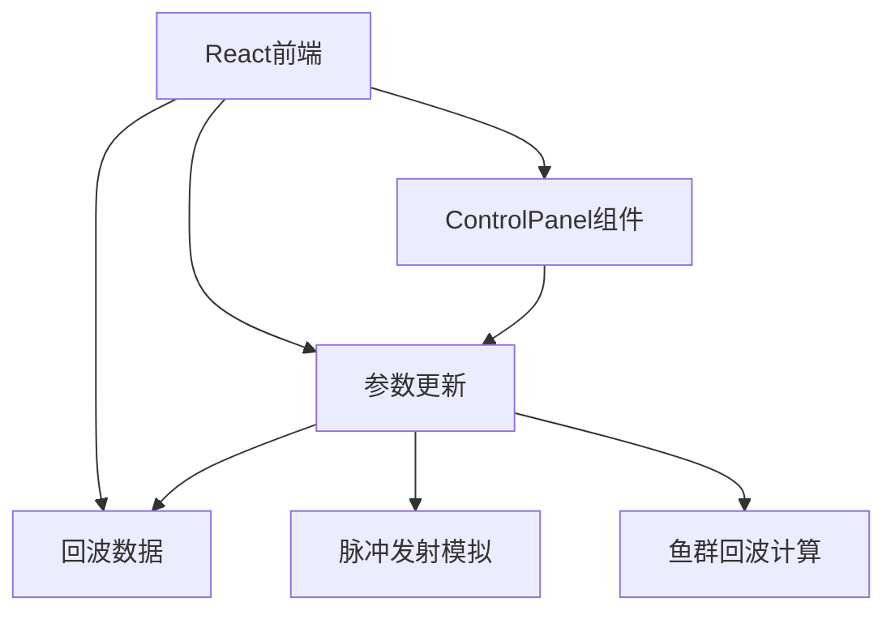

## 1. 架构设计



## 2. 技术描述
- 前端: React@18 + TypeScript + Vite
- 样式: TailwindCSS@3
- 后端: 无需独立后端，使用前端TypeScript模拟声呐计算逻辑
- 渲染: HTML5 Canvas 2D API
- 状态管理: React Hooks (useState, useEffect, useRef)

## 3. 目录结构
```
src/
├── components/
│   ├── SonarCanvas.tsx      # 声呐图Canvas组件
│   └── ControlPanel.tsx     # 参数控制面板组件
├── services/
│   └── SonarSimulator.ts    # 声呐模拟核心逻辑
├── types/
│   └── sonar.ts             # 类型定义
├── App.tsx                  # 主应用组件
├── main.tsx                 # 入口文件
└── index.css                # 全局样式
```

## 4. 类型定义

```typescript
// 鱼群对象
interface Fish {
  id: string;
  x: number;           // 极坐标 - 距离 (0-1)
  angle: number;       // 极坐标 - 角度 (0-360度)
  size: number;        // 鱼群大小 (影响回波强度)
  speed: number;       // 移动速度
  direction: number;   // 移动方向
}

// 回波数据
interface EchoData {
  fishId: string;
  distance: number;    // 距离 (0-1)
  angle: number;       // 角度 (度)
  intensity: number;   // 回波强度 (0-1)
  delay: number;       // 时延 (毫秒)
}

// 声呐参数
interface SonarParams {
  beamAngle: number;   // 波束角 (度)
  gain: number;        // 增益 (0-100)
  scanSpeed: number;   // 扫描速度 (度/秒)
  maxRange: number;    // 最大探测距离
}

// 声呐状态
interface SonarState {
  scanAngle: number;   // 当前扫描角度
  fishes: Fish[];      // 鱼群列表
  echoes: EchoData[];  // 当前可见回波
  params: SonarParams;
}
```

## 5. 核心算法

### 5.1 回波强度计算
```
回波强度 = 基础强度 × 增益系数 × 距离衰减 × 波束方向因子
- 基础强度: 与鱼群大小成正比
- 增益系数: (gain / 50) ^ 2
- 距离衰减: 1 / (distance ^ 2) （距离越远衰减越大）
- 波束方向因子: 波束中心最强，边缘衰减
```

### 5.2 时延计算
```
时延 = (2 × 距离 × 最大探测距离) / 声速
- 声速: 约1500m/s (水中声速)
- 乘以2: 声波往返时间
```

### 5.3 鱼群移动模拟
```
每一帧更新鱼群位置:
- 按速度和方向更新极坐标
- 边界检测（超出范围后反向）
- 随机微小方向变化
```
