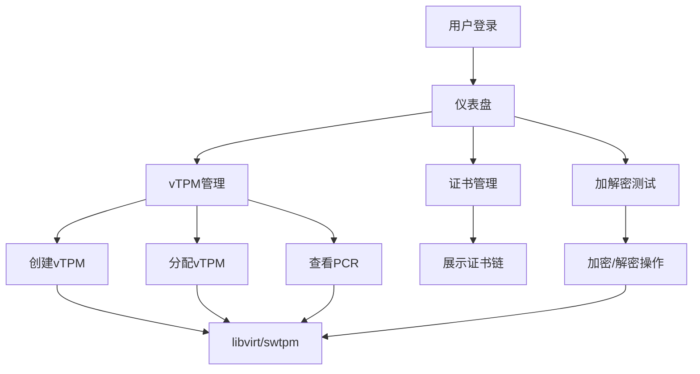

## 1. 产品概述

vTPM管理系统是一个基于Web的虚拟可信平台模块(virtual Trusted Platform Module)管理平台，通过libvirt管理swtpm软件TPM模拟器，为虚拟机提供vTPM设备的生命周期管理、证书链展示、PCR寄存器查看以及加解密测试功能。

- **核心目标**：简化vTPM设备的管理流程，提供可视化的vTPM状态监控和操作界面
- **目标用户**：虚拟化管理员、安全工程师、云平台运维人员
- **市场价值**：提升虚拟化环境的安全管理效率，降低vTPM运维成本

## 2. 核心功能

### 2.1 用户角色
| 角色 | 注册方式 | 核心权限 |
|------|---------|---------|
| 管理员 | 系统初始化 | vTPM全生命周期管理、系统配置、数据查看 |

### 2.2 功能模块
1. **仪表盘**：vTPM设备概览、状态统计、快速操作
2. **vTPM管理**：vTPM列表、分配/撤销、状态监控、PCR寄存器查看
3. **证书链管理**：证书链可视化展示、证书详情、导出功能
4. **加解密测试**：基于vTPM的加密/解密功能测试、签名验证
5. **虚拟机管理**：虚拟机列表、vTPM关联关系管理

### 2.3 页面详情
| 页面名称 | 模块名称 | 功能描述 |
|---------|---------|---------|
| 仪表盘 | 统计卡片 | vTPM总数、在线数、已分配数、待分配数 |
| 仪表盘 | 状态图表 | vTPM状态分布饼图、分配趋势折线图 |
| 仪表盘 | 快速操作 | 创建vTPM、分配vTPM快捷入口 |
| vTPM列表 | 数据表格 | vTPM ID、状态、关联虚拟机、创建时间 |
| vTPM列表 | 操作按钮 | 分配、撤销、删除、查看详情 |
| vTPM详情 | PCR寄存器 | 展示24个PCR寄存器的哈希值和状态 |
| vTPM详情 | 证书链 | 层级展示EK、AK、平台证书链 |
| 证书管理 | 证书列表 | 所有证书列表、过期提醒 |
| 加解密测试 | 加密测试 | 输入明文，选择vTPM进行加密 |
| 加解密测试 | 解密测试 | 输入密文，选择vTPM进行解密 |
| 加解密测试 | 签名验证 | 数据签名和验签测试 |
| 虚拟机管理 | 虚拟机列表 | 虚拟机信息、关联vTPM状态 |

## 3. 核心流程

### 3.1 vTPM创建流程
1. 管理员进入vTPM管理页面
2. 点击"创建vTPM"按钮
3. 系统通过libvirt调用swtpm创建vTPM设备
4. 初始化vTPM，生成EK证书
5. 保存vTPM状态到数据库
6. 返回创建结果

### 3.2 vTPM分配流程
1. 管理员选择待分配的vTPM
2. 选择目标虚拟机
3. 系统调用libvirt将vTPM挂载到虚拟机
4. 更新数据库中vTPM和虚拟机的关联关系
5. 返回分配结果

### 3.3 PCR查看流程
1. 用户选择vTPM并进入详情页
2. 系统读取vTPM的24个PCR寄存器值
3. 前端展示PCR寄存器列表和详细信息

## 4. 用户界面设计

### 4.1 设计风格
- **主色调**：深蓝色 (#1e3a8a) - 代表安全、可信、专业
- **辅助色**：青绿色 (#0d9488) - 代表成功、活跃状态
- **警示色**：琥珀色 (#d97706)、红色 (#dc2626) - 代表警告和错误状态
- **背景色**：深灰色背景 (#0f172a) 配合卡片式设计，营造科技感
- **按钮风格**：圆角按钮，带悬停动画和点击反馈
- **字体**：主字体使用 JetBrains Mono（等宽字体，适合技术类应用），辅助字体使用 Inter
- **布局风格**：侧边导航 + 内容区域的经典管理后台布局，卡片式内容容器
- **图标风格**：使用线条型图标，保持简洁专业

### 4.2 页面设计概述
| 页面名称 | 模块名称 | UI元素 |
|---------|---------|--------|
| 仪表盘 | 统计卡片 | 渐变背景、数字动画、状态指示点 |
| 仪表盘 | 图表区域 | 交互式饼图、折线图，支持悬停查看详情 |
| vTPM列表 | 数据表格 | 斑马纹表格、状态标签、行悬停高亮 |
| vTPM详情 | PCR寄存器 | 折叠面板、哈希值可复制、状态颜色标识 |
| vTPM详情 | 证书链 | 树状结构图、证书详情弹窗、证书导出按钮 |
| 加解密测试 | 测试面板 | 左右分栏布局、代码块展示、复制按钮 |

### 4.3 响应式
- **桌面端优先**：针对1920x1080及以上分辨率优化
- **平板适配**：侧边栏可折叠，内容区域自适应
- **移动端**：简化布局，优先展示核心功能列表

### 4.4 动效设计
- 页面加载时的渐入动画
- 卡片悬停时的轻微上浮和阴影加深
- 状态变更时的颜色过渡动画
- 证书链展开/收起的平滑过渡
