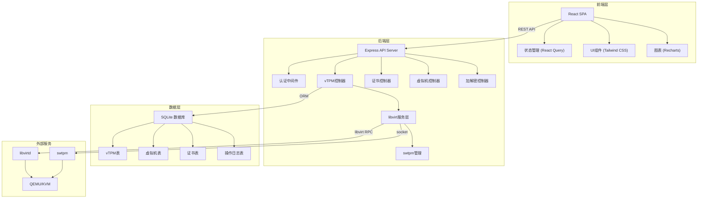
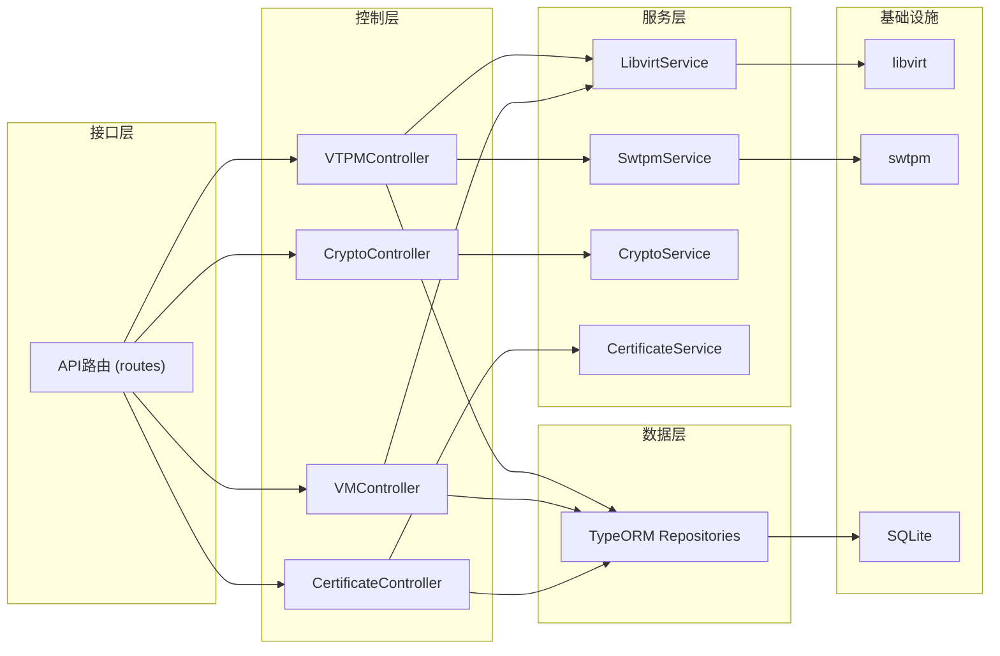
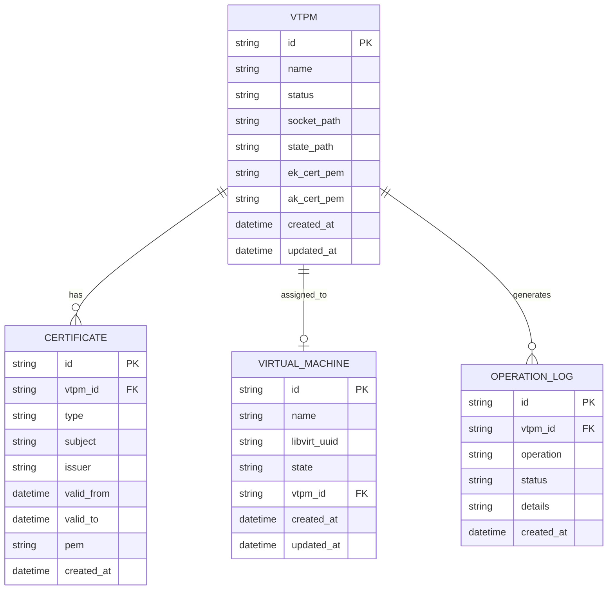

## 1. 架构设计



## 2. 技术描述

- **前端**: React@18 + TypeScript + Vite + TailwindCSS@3 + React Router + React Query
- **后端**: Node.js + Express@4 + TypeScript
- **数据库**: SQLite (开发环境) + TypeORM
- **vTPM管理**: libvirt + swtpm (软件TPM模拟器)
- **图表库**: Recharts
- **图标库**: Lucide React

## 3. 路由定义

### 前端路由
| 路由 | 页面 | 说明 |
|------|------|------|
| / | 仪表盘 | vTPM概览和统计 |
| /vtpm | vTPM列表 | 所有vTPM设备列表 |
| /vtpm/:id | vTPM详情 | PCR寄存器、证书链 |
| /certificates | 证书管理 | 证书列表和详情 |
| /crypto-test | 加解密测试 | 加密、解密、签名测试 |
| /vms | 虚拟机管理 | 虚拟机列表和vTPM关联 |

### 后端API路由
| 方法 | 路由 | 说明 |
|------|------|------|
| GET | /api/vtpm | 获取vTPM列表 |
| POST | /api/vtpm | 创建新vTPM |
| GET | /api/vtpm/:id | 获取vTPM详情 |
| DELETE | /api/vtpm/:id | 删除vTPM |
| POST | /api/vtpm/:id/assign | 分配vTPM给虚拟机 |
| POST | /api/vtpm/:id/unassign | 撤销vTPM分配 |
| GET | /api/vtpm/:id/pcrs | 获取PCR寄存器值 |
| GET | /api/vtpm/:id/certificates | 获取证书链 |
| GET | /api/vms | 获取虚拟机列表 |
| POST | /api/crypto/encrypt | 使用vTPM加密数据 |
| POST | /api/crypto/decrypt | 使用vTPM解密数据 |
| POST | /api/crypto/sign | 使用vTPM签名数据 |
| POST | /api/crypto/verify | 验证签名 |
| GET | /api/stats | 获取统计数据 |

## 4. API定义

### TypeScript类型定义

```typescript
// vTPM状态类型
type VTPMStatus = 'available' | 'assigned' | 'error' | 'initializing';

// vTPM模型
interface VTPM {
  id: string;
  name: string;
  status: VTPMStatus;
  vmId?: string;
  vmName?: string;
  ekCert?: string;
  akCert?: string;
  createdAt: Date;
  updatedAt: Date;
}

// PCR寄存器
interface PCRRegister {
  index: number;
  value: string;
  algorithm: 'SHA1' | 'SHA256';
}

// 证书信息
interface Certificate {
  id: string;
  vtpmId: string;
  type: 'EK' | 'AK' | 'platform';
  subject: string;
  issuer: string;
  validFrom: Date;
  validTo: Date;
  pem: string;
}

// 虚拟机
interface VirtualMachine {
  id: string;
  name: string;
  state: 'running' | 'stopped' | 'paused';
  vtpmId?: string;
  vtpmName?: string;
}

// 加解密请求
interface CryptoRequest {
  vtpmId: string;
  data: string;
  keyType?: 'EK' | 'AK';
}

// 加解密响应
interface CryptoResponse {
  success: boolean;
  result: string;
  error?: string;
}

// 统计数据
interface Stats {
  totalVtpm: number;
  availableVtpm: number;
  assignedVtpm: number;
  errorVtpm: number;
  totalVms: number;
  vmsWithVtpm: number;
}
```

## 5. 服务器架构图



## 6. 数据模型

### 6.1 数据模型定义



### 6.2 数据库初始化脚本

```sql
-- VTPM表
CREATE TABLE vtpm (
    id VARCHAR(36) PRIMARY KEY,
    name VARCHAR(100) NOT NULL,
    status VARCHAR(20) NOT NULL DEFAULT 'initializing',
    socket_path VARCHAR(255),
    state_path VARCHAR(255),
    ek_cert_pem TEXT,
    ak_cert_pem TEXT,
    vm_id VARCHAR(36),
    created_at DATETIME DEFAULT CURRENT_TIMESTAMP,
    updated_at DATETIME DEFAULT CURRENT_TIMESTAMP,
    FOREIGN KEY (vm_id) REFERENCES virtual_machine(id)
);

-- 虚拟机表
CREATE TABLE virtual_machine (
    id VARCHAR(36) PRIMARY KEY,
    name VARCHAR(100) NOT NULL,
    libvirt_uuid VARCHAR(36) UNIQUE,
    state VARCHAR(20) NOT NULL DEFAULT 'stopped',
    created_at DATETIME DEFAULT CURRENT_TIMESTAMP,
    updated_at DATETIME DEFAULT CURRENT_TIMESTAMP
);

-- 证书表
CREATE TABLE certificate (
    id VARCHAR(36) PRIMARY KEY,
    vtpm_id VARCHAR(36) NOT NULL,
    type VARCHAR(10) NOT NULL,
    subject VARCHAR(255),
    issuer VARCHAR(255),
    valid_from DATETIME,
    valid_to DATETIME,
    pem TEXT NOT NULL,
    created_at DATETIME DEFAULT CURRENT_TIMESTAMP,
    FOREIGN KEY (vtpm_id) REFERENCES vtpm(id) ON DELETE CASCADE
);

-- 操作日志表
CREATE TABLE operation_log (
    id VARCHAR(36) PRIMARY KEY,
    vtpm_id VARCHAR(36),
    operation VARCHAR(50) NOT NULL,
    status VARCHAR(20) NOT NULL,
    details TEXT,
    created_at DATETIME DEFAULT CURRENT_TIMESTAMP,
    FOREIGN KEY (vtpm_id) REFERENCES vtpm(id) ON DELETE SET NULL
);

-- 索引
CREATE INDEX idx_vtpm_status ON vtpm(status);
CREATE INDEX idx_vtpm_vm_id ON vtpm(vm_id);
CREATE INDEX idx_certificate_vtpm_id ON certificate(vtpm_id);
CREATE INDEX idx_operation_log_vtpm_id ON operation_log(vtpm_id);
CREATE INDEX idx_operation_log_created_at ON operation_log(created_at DESC);
```
