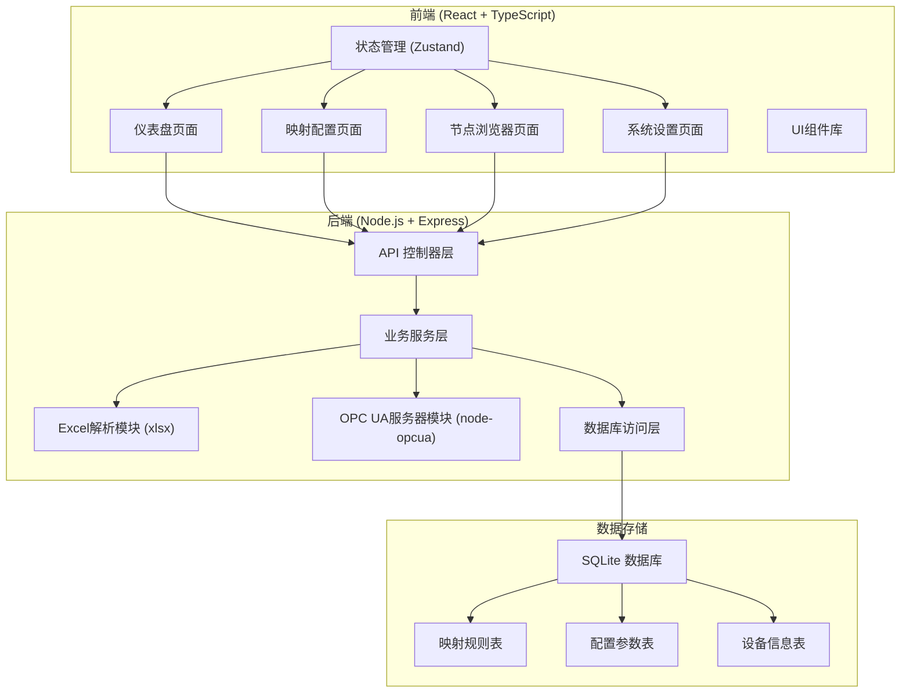
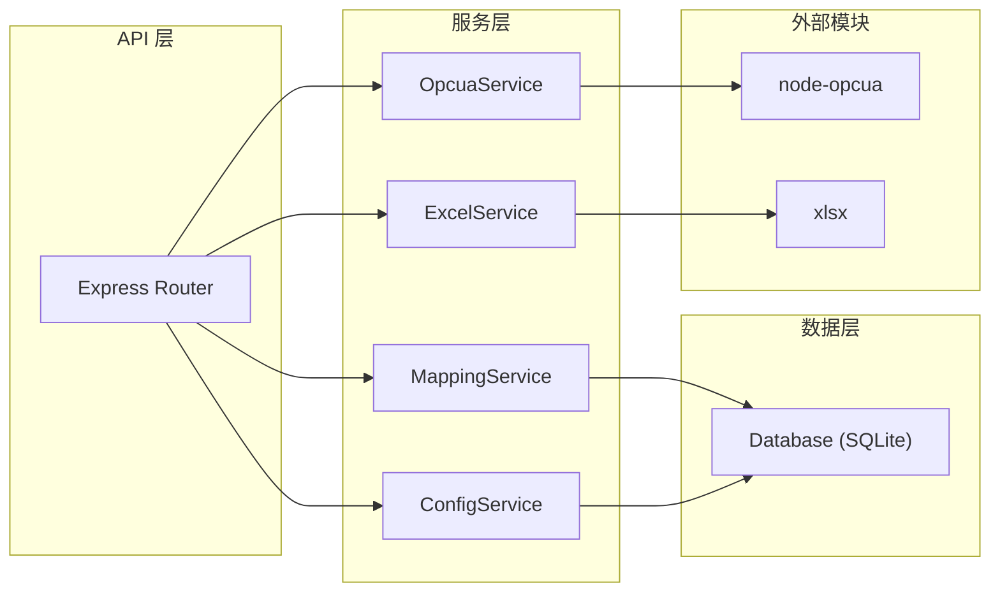
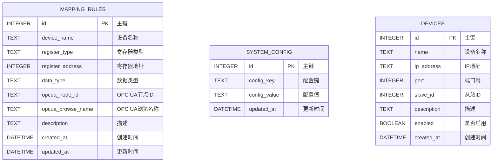

## 1. 架构设计



## 2. 技术描述

- **前端**：React@18 + TypeScript + Vite + TailwindCSS@3 + Zustand + Lucide React
- **初始化工具**：vite-init (react-express-ts模板)
- **后端**：Express@4 + TypeScript + node-opcua + xlsx + better-sqlite3
- **数据库**：SQLite (文件型数据库，便于部署)
- **核心依赖**：
  - `node-opcua`: OPC UA服务器实现
  - `xlsx`: Excel文件解析
  - `better-sqlite3`: SQLite数据库操作
  - `multer`: 文件上传处理
  - `zustand`: 前端状态管理

## 3. 路由定义

### 前端路由

| 路由 | 页面 | 用途 |
|------|------|------|
| /dashboard | 仪表盘 | 服务器状态概览和快捷操作 |
| /mapping | 映射配置 | Excel上传和映射规则编辑 |
| /browse | 节点浏览 | OPC UA地址空间树形浏览 |
| /settings | 系统设置 | 服务器和数据库配置 |

### 后端API路由

| 路由 | 方法 | 用途 |
|------|------|------|
| /api/upload | POST | 上传Excel映射文件 |
| /api/mapping | GET | 获取映射规则列表 |
| /api/mapping | POST | 保存映射规则 |
| /api/mapping/:id | PUT | 更新映射规则 |
| /api/mapping/:id | DELETE | 删除映射规则 |
| /api/opcua/nodes | GET | 获取OPC UA节点树 |
| /api/opcua/nodes/:nodeId | GET | 获取节点详情 |
| /api/opcua/server/status | GET | 获取服务器状态 |
| /api/opcua/server/start | POST | 启动OPC UA服务器 |
| /api/opcua/server/stop | POST | 停止OPC UA服务器 |
| /api/config | GET | 获取系统配置 |
| /api/config | PUT | 更新系统配置 |

## 4. API定义

### TypeScript类型定义

```typescript
// 映射规则类型
interface MappingRule {
  id: number;
  deviceName: string;
  registerType: string;
  registerAddress: number;
  dataType: string;
  opcuaNodeId: string;
  opcuaBrowseName: string;
  description: string;
  createdAt: string;
  updatedAt: string;
}

// OPC UA节点类型
interface OpcuaNode {
  nodeId: string;
  browseName: string;
  displayName: string;
  nodeClass: string;
  dataType: string;
  value: any;
  children: OpcuaNode[];
}

// 服务器状态类型
interface ServerStatus {
  running: boolean;
  endpointUrl: string;
  connectedClients: number;
  totalNodes: number;
  startTime: string | null;
}

// 系统配置类型
interface SystemConfig {
  opcuaPort: number;
  opcuaEndpoint: string;
  databasePath: string;
  autoStart: boolean;
}

// Excel解析结果
interface ExcelParseResult {
  success: boolean;
  data: MappingRule[];
  errors: string[];
}
```

## 5. 服务器架构图



## 6. 数据模型

### 6.1 数据模型定义



### 6.2 数据定义语言

```sql
-- 映射规则表
CREATE TABLE IF NOT EXISTS mapping_rules (
  id INTEGER PRIMARY KEY AUTOINCREMENT,
  device_name TEXT NOT NULL,
  register_type TEXT NOT NULL,
  register_address INTEGER NOT NULL,
  data_type TEXT NOT NULL,
  opcua_node_id TEXT NOT NULL UNIQUE,
  opcua_browse_name TEXT NOT NULL,
  description TEXT,
  created_at DATETIME DEFAULT CURRENT_TIMESTAMP,
  updated_at DATETIME DEFAULT CURRENT_TIMESTAMP
);

-- 系统配置表
CREATE TABLE IF NOT EXISTS system_config (
  id INTEGER PRIMARY KEY AUTOINCREMENT,
  config_key TEXT NOT NULL UNIQUE,
  config_value TEXT,
  updated_at DATETIME DEFAULT CURRENT_TIMESTAMP
);

-- 设备信息表
CREATE TABLE IF NOT EXISTS devices (
  id INTEGER PRIMARY KEY AUTOINCREMENT,
  name TEXT NOT NULL,
  ip_address TEXT NOT NULL,
  port INTEGER DEFAULT 502,
  slave_id INTEGER DEFAULT 1,
  description TEXT,
  enabled BOOLEAN DEFAULT 1,
  created_at DATETIME DEFAULT CURRENT_TIMESTAMP
);

-- 初始配置数据
INSERT OR IGNORE INTO system_config (config_key, config_value) VALUES
  ('opcua_port', '4840'),
  ('opcua_endpoint', '/OPCUA/Server'),
  ('database_path', './data/database.sqlite'),
  ('auto_start', 'false');
```
