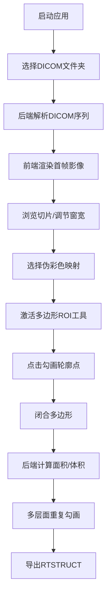

## 1. 产品概述

DICOM医学影像分析工作站，提供专业的医学影像序列浏览、伪彩色映射、感兴趣区（ROI）勾画与定量分析功能，面向放射科医生、医学物理师和科研人员。支持RTSTRUCT标准导出，便于临床工作流集成。

## 2. 核心功能

### 2.1 用户角色

| 角色 | 注册方式 | 核心权限 |
|------|----------|----------|
| 医生/物理师 | 本地应用直接使用 | 加载DICOM、勾画ROI、计算测量值、导出RTSTRUCT |

### 2.2 功能模块

1. **DICOM加载器**：选择文件夹加载DICOM序列，自动解析序列元数据
2. **影像查看器**：多切片浏览、窗宽窗位调节、缩放平移
3. **伪彩色映射**：彩虹映射、热金属映射、灰度映射切换
4. **ROI勾画工具**：多边形勾画、闭合确认、删除修改
5. **定量分析**：面积计算、体积计算、ROI列表管理
6. **RTSTRUCT导出**：生成标准DICOM RT Structure Set文件

### 2.3 页面详情

| 页面名称 | 模块名称 | 功能描述 |
|----------|----------|----------|
| 主工作台 | 顶部工具栏 | DICOM加载、伪彩色切换、ROI工具、导出按钮 |
| 主工作台 | 左侧序列面板 | 显示患者信息、序列信息、切片缩略图 |
| 主工作台 | 中央画布区 | DICOM影像显示、多边形ROI交互勾画 |
| 主工作台 | 右侧ROI面板 | ROI列表、面积/体积测量值、颜色设置 |
| 主工作台 | 底部状态栏 | 当前切片索引、窗宽窗位、鼠标坐标、像素值 |

## 3. 核心流程

用户打开应用 → 选择DICOM文件夹 → 序列加载完成 → 浏览切片 → 选择伪彩色方案 → 激活多边形工具 → 点击勾画ROI轮廓 → 闭合确认 → 自动计算面积/体积 → 多层面勾画 → 导出RTSTRUCT文件

## 4. 用户界面设计

### 4.1 设计风格

- **主色调**：深空蓝 `#0a1628` 作为背景，符合医学影像工作站的专业暗色调
- **强调色**：医学青 `#00d4ff` 用于高亮和交互元素
- **辅助色**：ROI轮廓使用高对比度彩色（红、黄、绿、紫）
- **按钮风格**：扁平化设计，细边框，hover时有轻微发光效果
- **字体**：JetBrains Mono 作为显示字体，保证像素坐标和数值的等宽显示；Inter 作为正文字体
- **布局风格**：三栏布局，左侧序列信息、中央大画布、右侧ROI管理，最大化画布显示空间
- **图标**：Lucide 线性图标，简洁专业

### 4.2 页面设计概述

| 页面名称 | 模块名称 | UI元素 |
|----------|----------|--------|
| 主工作台 | 顶部工具栏 | 深色背景，图标按钮组，下拉选择框，细分割线 |
| 主工作台 | 左侧面板 | 卡片式分组，患者信息元数据表格，缩略图网格 |
| 主工作台 | 中央画布 | 纯黑背景，影像居中显示，ROI多边形叠加层，十字准星 |
| 主工作台 | 右侧ROI面板 | 可折叠ROI条目，颜色标签，测量值数值显示，删除按钮 |
| 主工作台 | 状态栏 | 半透明深色背景，等宽字体显示坐标和数值 |

### 4.3 响应性

- 桌面端优先设计，固定最小窗口尺寸 1280x800
- 三栏布局支持拖拽调整宽度
- 画布区域随窗口大小自适应缩放
- 触控板支持双指缩放和平移

### 4.4 交互细节

- 多边形勾画时，实时显示辅助线和顶点
- 顶点悬停时高亮，支持拖拽调整
- ROI闭合时有平滑动画效果
- 伪彩色切换时，影像有渐入过渡
- 切片切换使用键盘左右箭头，支持长按快速浏览
