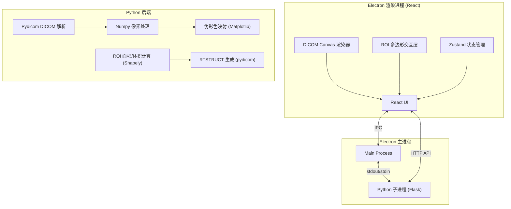
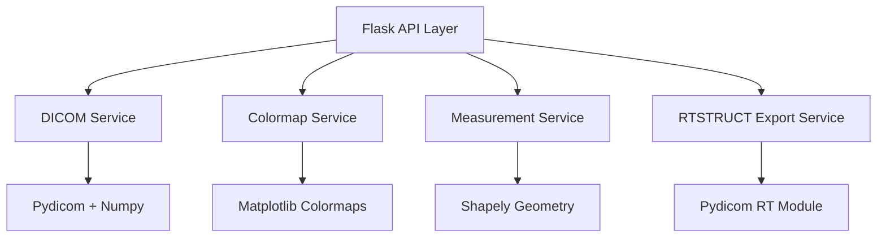

## 1. 架构设计



## 2. 技术描述

- **前端框架**：Electron 28 + React 18 + TypeScript + Vite
- **UI 样式**：TailwindCSS 3
- **状态管理**：Zustand
- **图标库**：Lucide React
- **影像渲染**：HTML5 Canvas 2D API
- **后端**：Python 3.10 + Flask
- **DICOM 处理**：pydicom, numpy, Pillow
- **几何计算**：shapely
- **伪彩色**：matplotlib colormaps
- **打包工具**：electron-builder，内嵌 Python 运行时（PyInstaller）

## 3. 路由定义

| 路由 | 用途 |
|------|------|
| / | 主工作台页面 |
| /welcome | 欢迎/加载页面 |

## 4. API 定义

### 4.1 TypeScript 类型

```typescript
interface DicomSeries {
  id: string;
  patientName: string;
  patientId: string;
  studyDate: string;
  seriesDescription: string;
  modality: string;
  slices: DicomSlice[];
  pixelSpacing: [number, number];
  sliceThickness: number;
}

interface DicomSlice {
  index: number;
  instanceUid: string;
  filepath: string;
  rows: number;
  cols: number;
  windowCenter: number;
  windowWidth: number;
  sliceLocation: number;
}

interface RoiPoint {
  x: number;
  y: number;
}

interface RoiContour {
  sliceIndex: number;
  points: RoiPoint[];
}

interface Roi {
  id: string;
  name: string;
  color: string;
  contours: RoiContour[];
  areaMm2?: number;
  volumeMm3?: number;
}

type ColormapType = 'gray' | 'rainbow' | 'hotmetal';
```

### 4.2 Python Flask API

| 方法 | 路径 | 请求 | 响应 |
|------|------|------|------|
| POST | /api/load-series | `{ folderPath: string }` | `DicomSeries` |
| GET | /api/slice/:index | `index: number, colormap?: string, window?: [number, number]` | `{ imageData: base64, minMax: [number, number] }` |
| GET | /api/thumbnail/:index | `index: number` | `{ imageData: base64 }` |
| POST | /api/calculate/area | `{ points: RoiPoint[], pixelSpacing: [number, number] }` | `{ areaMm2: number }` |
| POST | /api/calculate/volume | `{ contours: RoiContour[], pixelSpacing: [number, number], sliceThickness: number }` | `{ volumeMm3: number }` |
| POST | /api/export/rtstruct | `{ series: DicomSeries, rois: Roi[], outputPath: string }` | `{ success: boolean, filePath: string }` |

## 5. 服务器架构



## 6. 项目目录结构

```
.
├── electron/                # Electron 主进程
│   ├── main.ts             # 主进程入口
│   ├── preload.ts          # 预加载脚本
│   └── python-bridge.ts    # Python子进程管理
├── src/                     # React 渲染进程
│   ├── components/
│   │   ├── Toolbar.tsx
│   │   ├── SeriesPanel.tsx
│   │   ├── DicomCanvas.tsx
│   │   ├── RoiPanel.tsx
│   │   └── StatusBar.tsx
│   ├── hooks/
│   │   ├── useDicomLoader.ts
│   │   ├── usePolygonDrawer.ts
│   │   └── useMeasurement.ts
│   ├── store/
│   │   └── useAppStore.ts
│   ├── types/
│   │   └── dicom.ts
│   ├── utils/
│   │   ├── api.ts
│   │   └── colormap.ts
│   ├── App.tsx
│   └── main.tsx
├── python/                  # Python 后端
│   ├── app.py              # Flask 入口
│   ├── services/
│   │   ├── dicom_loader.py
│   │   ├── colormap_service.py
│   │   ├── measurement_service.py
│   │   └── rtstruct_exporter.py
│   └── requirements.txt
└── package.json
```
