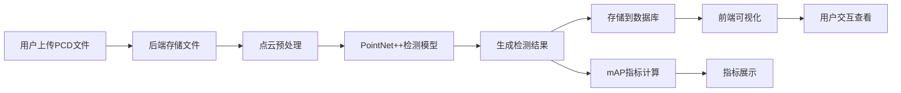

# 点云目标检测系统 PRD

## 1. 项目概述

### 1.1 项目背景
本项目是一个全栈点云目标检测系统，利用深度学习技术（PointNet++）对KITTI格式的3D点云数据进行车辆和行人检测。系统提供交互式的3D可视化界面，支持PCD文件上传、实时检测和性能指标评估。

### 1.2 项目目标
- 实现端到端的3D点云目标检测工作流
- 提供直观的3D点云可视化和检测结果展示
- 支持用户上传自定义PCD文件进行检测
- 存储检测结果并提供性能指标（mAP）计算

### 1.3 目标用户
- 自动驾驶算法工程师
- 计算机视觉研究者
- 3D点云数据处理从业者

## 2. 功能需求

### 2.1 核心功能

#### 2.1.1 点云文件上传
- 支持上传.pcd格式的点云文件
- 文件大小限制：最大100MB
- 支持批量上传

#### 2.1.2 3D点云可视化
- 使用Three.js渲染3D点云
- 支持视角控制（旋转、缩放、平移）
- 点云颜色编码（高度、强度等）

#### 2.1.3 目标检测
- 基于PointNet++的目标检测模型
- 检测类别：车辆、行人
- 输出3D包围盒（位置、尺寸、朝向）
- 置信度分数显示

#### 2.1.4 检测结果存储
- 使用SQLite数据库存储检测结果
- 记录：文件名、检测时间、检测框信息、置信度

#### 2.1.5 性能指标计算
- 计算mAP（mean Average Precision）
- 支持按类别统计AP
- 可视化PR曲线

### 2.2 用户界面需求

#### 2.2.1 主界面布局
- 左侧：文件上传区 + 历史记录列表
- 中间：3D点云可视化画布
- 右侧：检测结果面板 + 指标统计

#### 2.2.2 交互需求
- 点击检测结果可高亮显示对应的包围盒
- 支持筛选特定类别或置信度阈值
- 可切换不同的点云渲染模式

## 3. 技术需求

### 3.1 技术栈选择
- **后端**：Python Flask + Open3D + PyTorch + SQLite
- **前端**：React + Three.js + TypeScript
- **深度学习模型**：PointNet++

### 3.2 性能要求
- 单帧点云检测时间 < 5秒（CPU）/ < 1秒（GPU）
- 前端点云渲染帧率 > 30fps（10万点以内）
- API响应时间 < 200ms（除检测接口外）

### 3.3 兼容性要求
- 支持主流浏览器（Chrome、Firefox、Safari）
- 支持KITTI格式点云数据
- 支持PCD格式文件

## 4. 数据流设计

## 5. 项目里程碑

1. **阶段1**：项目架构搭建与环境配置（1天）
2. **阶段2**：后端API开发与点云处理（2天）
3. **阶段3**：前端3D可视化开发（2天）
4. **阶段4**：检测模型集成（2天）
5. **阶段5**：指标计算与数据库集成（1天）
6. **阶段6**：测试与优化（1天）
