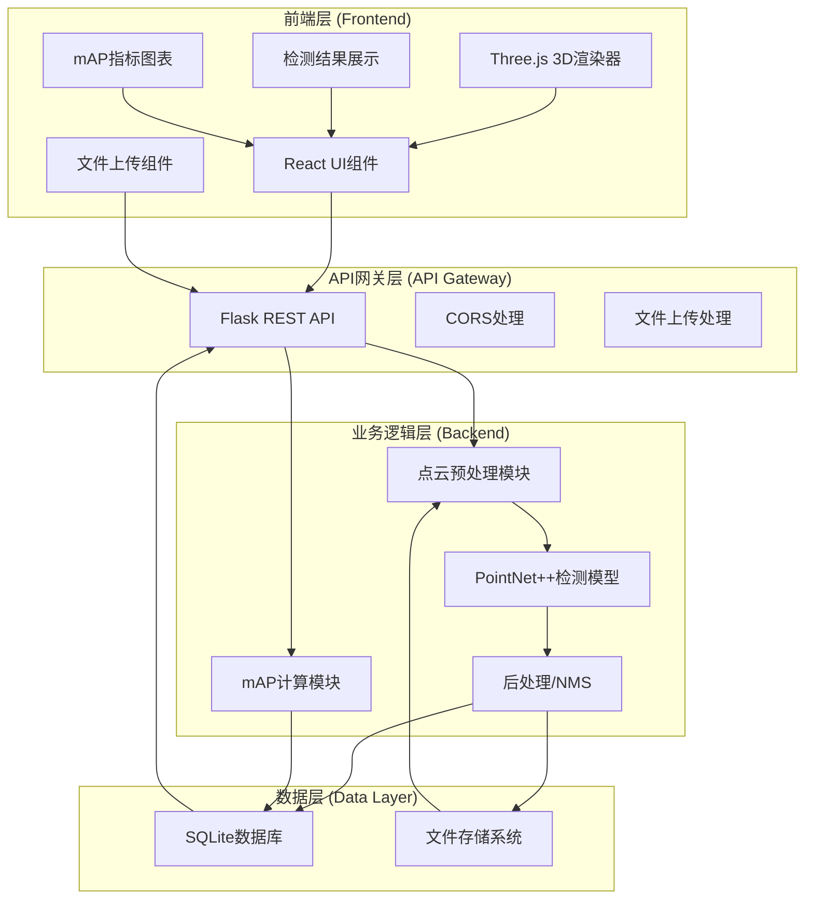

# 点云目标检测系统 - 技术架构文档

## 1. 系统架构概览

### 1.1 整体架构



### 1.2 技术栈选型

| 层级 | 技术选型 | 版本 | 说明 |
|------|----------|------|------|
| 前端框架 | React | 18.x | UI框架 |
| 前端语言 | TypeScript | 5.x | 类型安全 |
| 3D渲染 | Three.js | 0.160.x | 点云可视化 |
| 样式方案 | TailwindCSS | 3.x | 原子化CSS |
| 后端框架 | Flask | 2.3.x | Web API框架 |
| 后端语言 | Python | 3.10.x | 核心开发语言 |
| 点云处理 | Open3D | 0.17.x | 点云IO和预处理 |
| 深度学习 | PyTorch | 2.1.x | 深度学习框架 |
| 数据库 | SQLite | 3.x | 轻量级数据库 |
| 图表库 | Chart.js | 4.x | mAP可视化 |

## 2. 目录结构设计

### 2.1 项目根目录

```
p12/
├── backend/                 # 后端Python项目
│   ├── app.py              # Flask应用入口
│   ├── config.py           # 配置文件
│   ├── models/             # 数据库模型
│   ├── api/                # API路由
│   ├── services/           # 业务逻辑
│   │   ├── point_cloud.py  # 点云处理
│   │   ├── detection.py    # 目标检测
│   │   └── metrics.py      # mAP计算
│   ├── ml/                 # 机器学习模型
│   │   └── pointnet2/      # PointNet++实现
│   ├── database.py         # 数据库连接
│   ├── requirements.txt    # Python依赖
│   └── uploads/            # 上传文件存储
├── frontend/               # 前端React项目
│   ├── src/
│   │   ├── components/     # React组件
│   │   │   ├── PointCloudViewer.tsx  # 3D点云查看器
│   │   │   ├── FileUpload.tsx        # 文件上传
│   │   │   ├── DetectionList.tsx     # 检测结果列表
│   │   │   └── MetricsPanel.tsx      # 指标面板
│   │   ├── services/       # API服务
│   │   ├── types/          # TypeScript类型定义
│   │   └── App.tsx
│   ├── package.json
│   └── tailwind.config.js
├── .trae/
│   └── documents/          # 项目文档
└── README.md
```

## 3. 核心模块设计

### 3.1 后端核心模块

#### 3.1.1 点云处理模块 (point_cloud.py)

```python
# 主要功能：
# - PCD文件读取与解析
# - 点云预处理（下采样、归一化）
# - KITTI格式转换
# - 点云数据序列化
class PointCloudProcessor:
    def load_pcd(self, file_path: str) -> np.ndarray: ...
    def preprocess(self, points: np.ndarray) -> np.ndarray: ...
    def to_kitti_format(self, points: np.ndarray) -> np.ndarray: ...
```

#### 3.1.2 目标检测模块 (detection.py)

```python
# 主要功能：
# - PointNet++模型加载
# - 前向推理
# - 后处理（NMS、阈值过滤）
# - 结果格式化
class PointNetDetector:
    def __init__(self, model_path: str): ...
    def detect(self, point_cloud: np.ndarray) -> List[Detection]: ...
    def non_max_suppression(self, boxes: np.ndarray, scores: np.ndarray): ...
```

#### 3.1.3 指标计算模块 (metrics.py)

```python
# 主要功能：
# - IoU计算（3D）
# - Precision/Recall计算
# - AP计算
# - mAP统计
class MetricsCalculator:
    def calculate_iou_3d(self, box1: Box3D, box2: Box3D) -> float: ...
    def calculate_ap(self, detections: List, ground_truth: List) -> float: ...
    def calculate_map(self, results: Dict[str, List]) -> Dict[str, float]: ...
```

### 3.2 前端核心模块

#### 3.2.1 点云查看器组件 (PointCloudViewer.tsx)

```typescript
// 主要功能：
// Three.js场景初始化
// 点云渲染
// 包围盒渲染
// 相机控制
// 交互处理
interface PointCloudViewerProps {
  points: number[];
  detections: Detection[];
  onBoxSelect?: (id: string) => void;
}
```

#### 3.2.2 API服务层

```typescript
// api/detection.ts
export const uploadPCD = (file: File) => axios.post('/api/upload', formData);
export const runDetection = (fileId: string) => axios.post(`/api/detect/${fileId}`);
export const getDetectionResults = (fileId: string) => axios.get(`/api/detections/${fileId}`);
export const calculateMetrics = () => axios.get('/api/metrics/map');
```

## 4. 数据模型设计

### 4.1 数据库表结构

#### detection_results 表

| 字段 | 类型 | 说明 |
|------|------|------|
| id | INTEGER PRIMARY KEY | 主键 |
| file_id | VARCHAR(255) | 文件标识 |
| file_name | VARCHAR(255) | 文件名 |
| class_name | VARCHAR(50) | 检测类别（Car/Pedestrian） |
| confidence | FLOAT | 置信度 |
| x, y, z | FLOAT | 中心坐标 |
| w, h, l | FLOAT | 宽高长 |
| rotation_y | FLOAT | 绕Y轴旋转角 |
| created_at | TIMESTAMP | 创建时间 |

#### uploaded_files 表

| 字段 | 类型 | 说明 |
|------|------|------|
| id | VARCHAR(255) PRIMARY KEY | 文件ID |
| file_name | VARCHAR(255) | 原始文件名 |
| file_path | VARCHAR(512) | 存储路径 |
| file_size | INTEGER | 文件大小（字节） |
| point_count | INTEGER | 点数量 |
| status | VARCHAR(20) | 处理状态 |
| uploaded_at | TIMESTAMP | 上传时间 |

## 5. API接口设计

### 5.1 文件管理

| 方法 | 路径 | 说明 |
|------|------|------|
| POST | `/api/upload` | 上传PCD文件 |
| GET | `/api/files` | 获取上传文件列表 |
| GET | `/api/files/:id` | 获取文件详情 |
| DELETE | `/api/files/:id` | 删除文件 |

### 5.2 目标检测

| 方法 | 路径 | 说明 |
|------|------|------|
| POST | `/api/detect/:fileId` | 运行检测 |
| GET | `/api/detections/:fileId` | 获取检测结果 |
| DELETE | `/api/detections/:id` | 删除检测结果 |

### 5.3 指标计算

| 方法 | 路径 | 说明 |
|------|------|------|
| GET | `/api/metrics/map` | 计算mAP |
| GET | `/api/metrics/pr-curve` | 获取PR曲线数据 |

## 6. 部署与运行

### 6.1 环境要求

- Python 3.10+
- Node.js 18+
- 内存 >= 8GB
- （可选）CUDA GPU用于加速检测

### 6.2 启动方式

```bash
# 后端启动
cd backend
pip install -r requirements.txt
python app.py

# 前端启动
cd frontend
npm install
npm run dev
```

## 7. 设计决策说明

### 7.1 为什么选择PointNet++？
- 直接处理无序点云数据，无需体素化
- 支持多尺度特征提取，对小目标检测效果好
- 模型结构成熟，有大量开源实现参考

### 7.2 为什么选择Three.js？
- WebGL渲染性能优秀
- 社区活跃，文档完善
- 与React生态集成良好（@react-three/fiber）

### 7.3 为什么选择SQLite？
- 轻量级，无需额外部署数据库服务
- 足够承载中等规模的检测结果数据
- Python标准库原生支持
