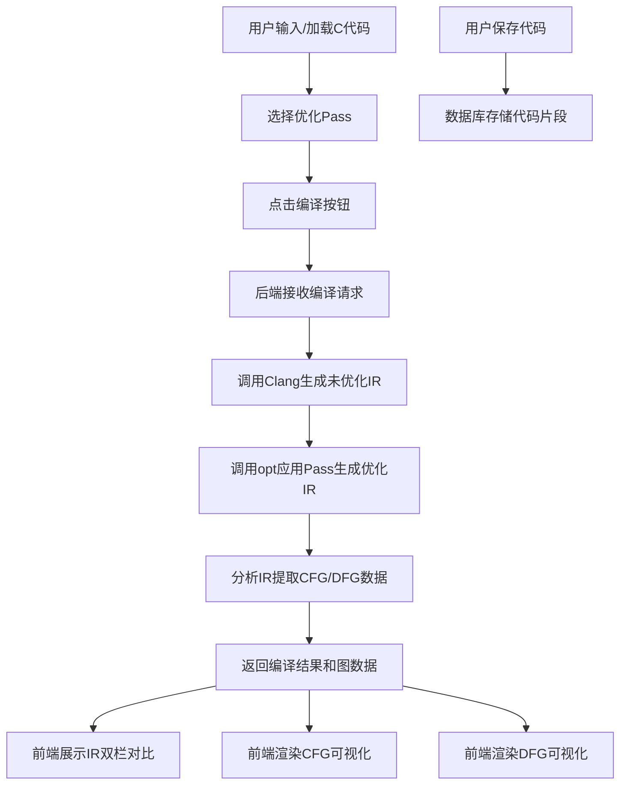

## 1. 产品概述

LLVM IR可视化分析平台，为编译器开发人员和学习者提供交互式C代码分析环境。用户可在线编辑C代码，通过后端调用Clang/LLVM工具链生成中间表示（IR），直观展示控制流图（CFG）和数据流图（DFG），支持优化Pass对比分析，所有代码片段持久化存储在数据库中。

- 核心用途：编译原理教学、代码优化分析、LLVM Pass开发调试
- 目标用户：编译器工程师、计算机专业学生、程序分析研究者
- 产品价值：降低LLVM IR学习门槛，提供可视化的代码优化对比工具

## 2. 核心功能

### 2.1 用户角色
| 角色 | 注册方式 | 核心权限 |
|------|----------|----------|
| 普通用户 | 无需注册（匿名使用） | 编辑代码、编译分析、保存/加载代码片段、使用所有Pass |

### 2.2 功能模块
1. **主编辑器页面**：C代码编辑器、优化Pass选择器、编译控制区
2. **IR对比视图**：双栏对比优化前后的LLVM IR代码
3. **控制流图（CFG）视图**：交互式函数级控制流图可视化
4. **数据流图（DFG）视图**：指令级数据流依赖关系图
5. **代码库管理**：历史代码片段的保存、加载、删除

### 2.3 页面详情
| 页面名称 | 模块名称 | 功能描述 |
|---------|----------|----------|
| 主编辑器页面 | 代码编辑区 | 支持C语法高亮、行号显示、代码折叠、快捷键支持 |
| 主编辑器页面 | Pass选择器 | 多选优化Pass（mem2reg, instcombine, dce, simplifycfg等），显示Pass说明 |
| 主编辑器页面 | 编译控制 | 一键编译、显示编译状态、错误提示 |
| IR对比视图 | 双栏对比 | 左侧显示未优化IR，右侧显示优化后IR，支持同步滚动和差异高亮 |
| CFG视图 | 图形展示 | 节点表示基本块，边表示控制流，支持缩放、拖拽、节点高亮 |
| DFG视图 | 数据流展示 | 显示指令间数据依赖，支持按值追踪、高亮显示使用链 |
| 代码库 | 列表管理 | 展示已保存的代码片段，支持按名称搜索、一键加载 |

## 3. 核心流程

用户在代码编辑器中输入或加载C代码，选择需要应用的优化Pass，点击编译按钮。后端接收请求后调用Clang生成未优化IR，再调用opt应用选择的Pass生成优化后IR，同时分析IR生成CFG和DFG数据。前端接收数据后分别展示IR对比、控制流图和数据流图。用户可保存当前代码到数据库供后续使用。

## 4. 用户界面设计

### 4.1 设计风格
- **主色调**：深色主题，深灰蓝（#0f172a）背景，搭配电光蓝（#3b82f6）和青绿色（#06b6d4）作为强调色
- **辅助色**：代码语法高亮采用Monokai配色，节点类型使用不同色系区分
- **按钮风格**：扁平化设计，圆角4px，hover状态有轻微发光效果
- **字体**：代码区使用JetBrains Mono等宽字体，界面使用Inter无衬线字体
- **布局风格**：三栏布局（左侧代码库 + 中间编辑区 + 右侧可视化区），顶部工具栏
- **图标**：使用Lucide图标库，保持线性风格统一

### 4.2 页面设计概述
| 页面名称 | 模块名称 | UI元素 |
|---------|----------|--------|
| 主编辑器 | 顶部工具栏 | Logo、保存按钮、编译按钮、Pass下拉选择器、视图切换标签 |
| 主编辑器 | 代码库侧边栏 | 搜索框、代码片段列表卡片、新建按钮、删除按钮 |
| 主编辑器 | 代码编辑区 | CodeMirror编辑器、行号、语法高亮、 minimap |
| IR对比视图 | 双栏面板 | 左右分栏各有独立编辑器、标题栏显示状态、同步滚动开关 |
| CFG视图 | 图形面板 | SVG画布、缩放控制、图例说明、函数选择下拉框、节点详情弹窗 |
| DFG视图 | 图形面板 | 力导向布局、节点拖拽、选中高亮、边标签显示操作数类型 |

### 4.3 响应式
- 桌面端：三栏完整布局，最小支持1280px宽度
- 平板端：侧边栏可折叠，可视化区与编辑区上下排列
- 移动端：简化为标签页切换模式，优先保证代码编辑功能

### 4.4 动效设计
- 页面加载：各模块淡入动画，延迟错落显示
- 编译过程：按钮loading动画，进度条指示
- 图形渲染：节点和边渐进式出现动画
- 切换标签：平滑过渡动画
- 悬停交互：按钮和卡片有轻微上浮和阴影变化
