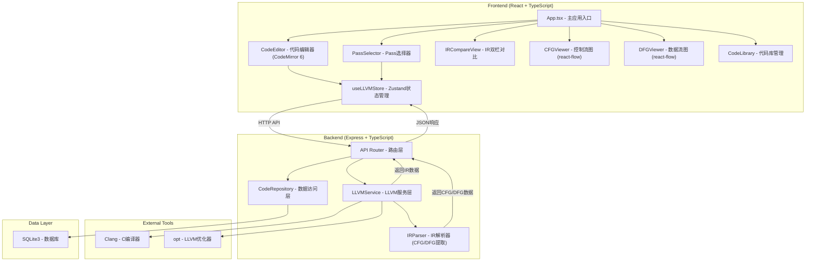
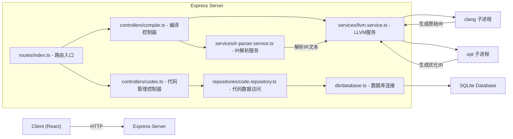
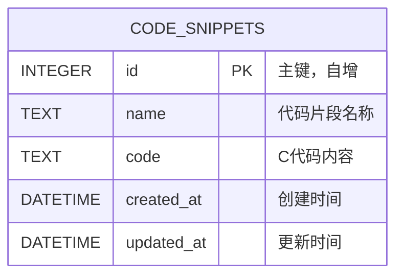

## 1. 架构设计



## 2. 技术描述

- **前端**：React@18 + TypeScript + Vite + TailwindCSS@3
- **状态管理**：Zustand
- **代码编辑**：CodeMirror 6 + @codemirror/lang-c
- **图形可视化**：reactflow（用于CFG和DFG的交互式图形展示）
- **后端**：Express@4 + TypeScript + ESM
- **数据库**：SQLite3 + better-sqlite3
- **外部工具**：Clang/LLVM工具链（clang, opt）
- **图标**：lucide-react

## 3. 路由定义

### 前端路由
| 路由 | 用途 |
|------|------|
| / | 主编辑器页面（包含所有视图标签切换） |

### 后端API路由
| 方法 | 路由 | 用途 |
|------|------|------|
| POST | /api/compile | 编译C代码生成IR和CFG/DFG数据 |
| GET | /api/passes | 获取可用的优化Pass列表 |
| GET | /api/codes | 获取所有保存的代码片段 |
| GET | /api/codes/:id | 获取单个代码片段 |
| POST | /api/codes | 保存新的代码片段 |
| PUT | /api/codes/:id | 更新代码片段 |
| DELETE | /api/codes/:id | 删除代码片段 |

## 4. API定义

### TypeScript类型定义
```typescript
// 代码片段
interface CodeSnippet {
  id: number;
  name: string;
  code: string;
  createdAt: string;
  updatedAt: string;
}

// 优化Pass
interface OptimizePass {
  name: string;
  description: string;
  category: 'transform' | 'analysis' | 'utility';
}

// 编译请求
interface CompileRequest {
  code: string;
  passes: string[];
}

// 基本块（CFG节点）
interface BasicBlock {
  id: string;
  label: string;
  instructions: string[];
  predecessors: string[];
  successors: string[];
  position?: { x: number; y: number };
}

// 控制流图
interface ControlFlowGraph {
  functionName: string;
  blocks: BasicBlock[];
  edges: { source: string; target: string; type: 'unconditional' | 'conditional' }[];
  entryBlock: string;
}

// 数据流图节点
interface DFGNode {
  id: string;
  instruction: string;
  type: 'instruction' | 'argument' | 'constant';
  valueName?: string;
}

// 数据流图
interface DataFlowGraph {
  nodes: DFGNode[];
  edges: { source: string; target: string; operandIndex: number }[];
}

// 编译响应
interface CompileResponse {
  success: boolean;
  error?: string;
  originalIR: string;
  optimizedIR: string;
  cfgs: ControlFlowGraph[];
  dfg: DataFlowGraph;
}
```

### 请求/响应示例
```typescript
// POST /api/compile Request
{
  code: "int main() { int x = 1; return x; }",
  passes: ["mem2reg", "instcombine"]
}

// POST /api/compile Response
{
  success: true,
  originalIR: "; ModuleID = 'test'\n...",
  optimizedIR: "; ModuleID = 'test'\n...",
  cfgs: [{
    functionName: "main",
    blocks: [...],
    edges: [...],
    entryBlock: "entry"
  }],
  dfg: {
    nodes: [...],
    edges: [...]
  }
}
```

## 5. 服务器架构图



## 6. 数据模型

### 6.1 数据模型定义


### 6.2 数据定义语言
```sql
-- 创建代码片段表
CREATE TABLE IF NOT EXISTS code_snippets (
    id INTEGER PRIMARY KEY AUTOINCREMENT,
    name TEXT NOT NULL,
    code TEXT NOT NULL,
    created_at DATETIME DEFAULT CURRENT_TIMESTAMP,
    updated_at DATETIME DEFAULT CURRENT_TIMESTAMP
);

-- 创建索引
CREATE INDEX IF NOT EXISTS idx_code_snippets_name ON code_snippets(name);
CREATE INDEX IF NOT EXISTS idx_code_snippets_updated_at ON code_snippets(updated_at DESC);

-- 初始化示例数据
INSERT INTO code_snippets (name, code) VALUES 
('Hello World', '#include <stdio.h>\n\nint main() {\n    printf("Hello, World!\\n");\n    return 0;\n}'),
('简单函数', 'int add(int a, int b) {\n    return a + b;\n}\n\nint main() {\n    int result = add(3, 5);\n    return result;\n}'),
('分支结构', 'int max(int a, int b) {\n    if (a > b) {\n        return a;\n    } else {\n        return b;\n    }\n}\n\nint main() {\n    return max(10, 20);\n}'),
('循环结构', 'int sum(int n) {\n    int total = 0;\n    for (int i = 1; i <= n; i++) {\n        total += i;\n    }\n    return total;\n}\n\nint main() {\n    return sum(10);\n}');
```
