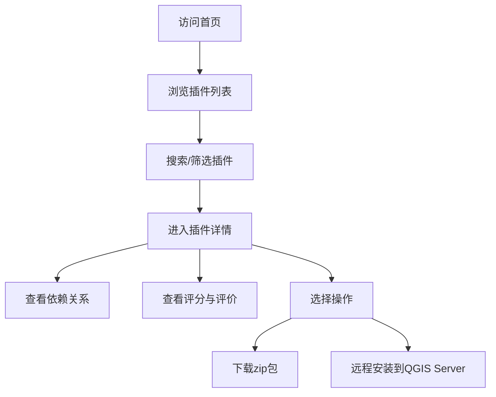
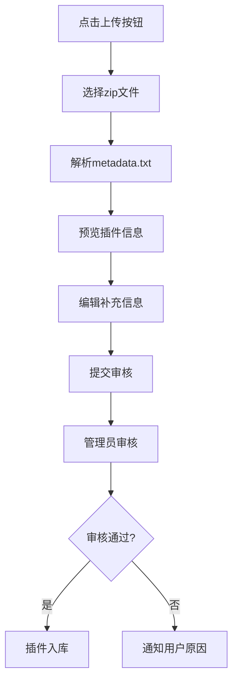
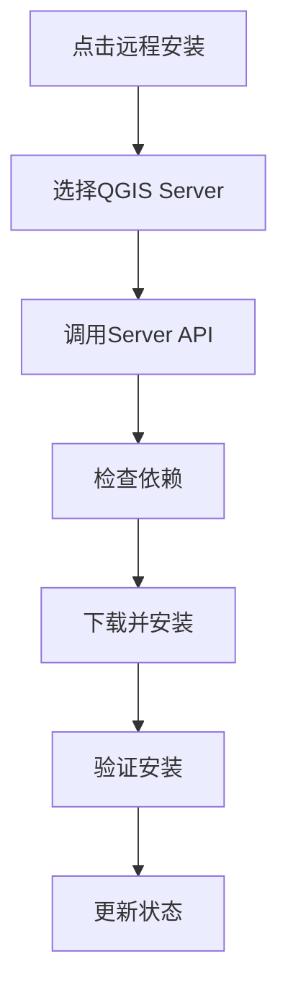

## 1. 产品概述

QGIS插件仓库管理系统是一个Web应用，用于管理QGIS插件的XML仓库，支持通过QGIS Server API进行远程安装和卸载。本系统为QGIS用户提供插件浏览、依赖查看、评分和自定义插件上传功能，为管理员提供完整的插件生命周期管理能力。

## 2. 核心功能

### 2.1 用户角色

| 角色 | 注册方式 | 核心权限 |
|------|----------|----------|
| 普通用户 | 无需注册（公开访问） | 浏览插件列表、查看插件详情、查看依赖关系、查看评分、下载插件 |
| 注册用户 | 邮箱注册 | 上传自定义zip插件、对插件进行评分、管理已上传的插件 |
| 管理员 | 系统预置 | 审核插件、删除插件、管理QGIS Server连接、远程安装/卸载插件 |

### 2.2 功能模块

1. **插件列表页**：插件卡片展示、搜索筛选、分类过滤、排序
2. **插件详情页**：插件信息、版本历史、依赖关系、评分展示、下载按钮、远程操作按钮
3. **插件上传页**：zip包上传、插件元数据编辑、版本说明
4. **评分组件**：星级评分、评分统计、用户评分记录
5. **XML仓库生成**：动态生成符合QGIS标准的plugins.xml
6. **QGIS Server集成**：远程安装、远程卸载、状态查询

### 2.3 页面详情

| 页面名称 | 模块名称 | 功能描述 |
|----------|----------|----------|
| 插件列表页 | 导航栏 | Logo、搜索框、分类筛选、上传按钮、用户菜单 |
| 插件列表页 | 插件网格 | 插件卡片（图标、名称、作者、版本、评分、下载量）、悬停动画 |
| 插件列表页 | 筛选侧边栏 | 分类筛选、评分筛选、版本兼容筛选 |
| 插件详情页 | 头部信息 | 插件图标、名称、版本、作者、评分、操作按钮（下载/安装/卸载） |
| 插件详情页 | 元数据标签 | 描述、关键词、许可证、主页、代码仓库 |
| 插件详情页 | 依赖关系 | 依赖树展示、依赖版本要求、冲突检测 |
| 插件详情页 | 版本历史 | 历史版本列表、更新日志 |
| 插件详情页 | 评分区域 | 星级评分组件、评分分布、用户评论 |
| 插件上传页 | 上传表单 | zip文件拖拽上传、元数据自动解析、手动编辑 |
| 插件上传页 | 预览区域 | 上传后预览插件信息、确认提交 |

## 3. 核心流程

### 3.1 插件浏览与下载流程
用户访问首页 → 浏览插件列表 → 使用搜索/筛选找到目标插件 → 点击进入详情页 → 查看依赖和评分 → 点击下载或远程安装

### 3.2 插件上传流程
用户点击上传按钮 → 拖拽zip文件或选择文件 → 系统自动解析元数据 → 用户确认/编辑信息 → 提交审核 → 管理员审核通过 → 插件入库

### 3.3 远程安装流程
用户在详情页点击"远程安装" → 选择目标QGIS Server → 系统调用QGIS Server API → 安装完成 → 更新插件状态

## 4. 用户界面设计

### 4.1 设计风格

**设计定位**：专业地理信息工具风格，简洁现代，技术感强
- **主色调**：深蓝色 (#1e3a5f)，代表专业与可信赖
- **辅助色**：青绿色 (#2dd4bf)，用于强调交互元素
- **背景色**：深灰蓝色 (#0f172a)，暗色主题减轻视觉疲劳
- **警告色**：橙色 (#f97316)，用于依赖冲突等提示
- **成功色**：绿色 (#10b981)，用于安装成功等状态

**按钮样式**：
- 圆角中等 (6px)，扁平化设计
- 主按钮：深蓝色背景 + 白色文字，悬停时轻微上浮
- 次要按钮：边框样式，悬停时背景填充
- 危险操作：橙色边框 + 橙色文字

**字体**：
- 标题：JetBrains Mono，等宽字体体现技术感
- 正文：Inter，清晰易读
- 代码/版本号：JetBrains Mono

**布局风格**：
- 顶部导航栏 + 主体内容区 + 可选侧边栏
- 卡片式布局，插件卡片带有微妙的渐变边框
- 充足的留白，信息层次分明

**图标风格**：
- 使用SVG图标，线条简洁
- 插件图标保持圆形或方形圆角
- 状态指示使用统一的图标语言

### 4.2 页面设计概述

| 页面名称 | 模块名称 | UI元素 |
|----------|----------|--------|
| 插件列表页 | 导航栏 | 深色背景、Logo带渐变效果、搜索框带圆角、分类标签 |
| 插件列表页 | 插件网格 | 卡片悬停上浮+阴影、评分星标、下载量徽章、分类标签 |
| 插件列表页 | 筛选侧边栏 | 折叠式筛选组、复选框样式、滑块控件 |
| 插件详情页 | 头部信息 | 大尺寸插件图标、渐变分隔线、操作按钮组 |
| 插件详情页 | 依赖关系 | 树形结构展示、连接线动画、状态颜色标记 |
| 插件详情页 | 评分区域 | 交互式星级评分、评分分布柱状图 |
| 插件上传页 | 上传区域 | 虚线边框拖拽区、文件图标、进度条 |
| 插件上传页 | 表单区域 | 分组表单、自动填充标识、验证提示 |

### 4.3 响应性

- **桌面优先**：优化1280px以上分辨率，多列布局
- **平板适配**：两列布局，侧边栏可折叠
- **手机适配**：单列布局，底部导航，筛选改为弹窗
- **触摸优化**：按钮最小44x44px，列表项增加点击区域

### 4.4 动效设计

- 页面加载：元素淡入，错开延迟
- 卡片悬停：轻微上浮 + 阴影加深
- 按钮点击：缩放反馈
- 依赖树展开：平滑过渡动画
- 上传进度：流畅的进度条动画
- 评分交互：星星点亮动画
