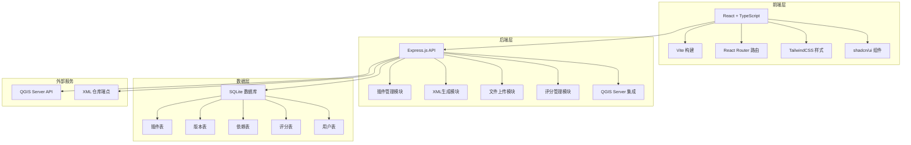
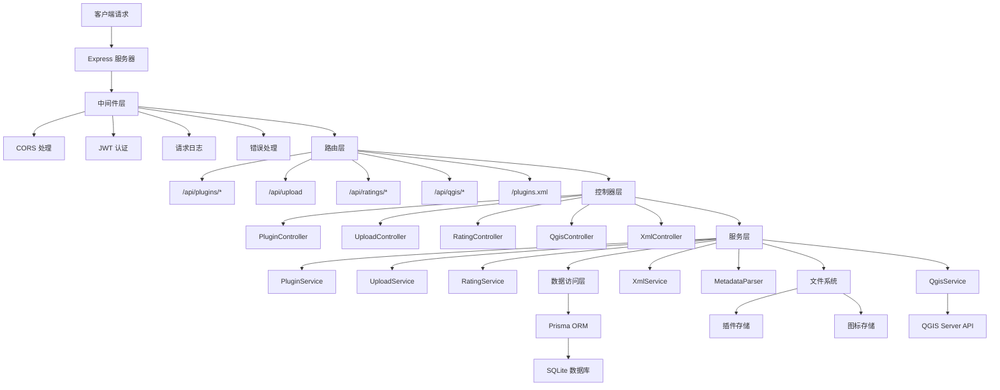
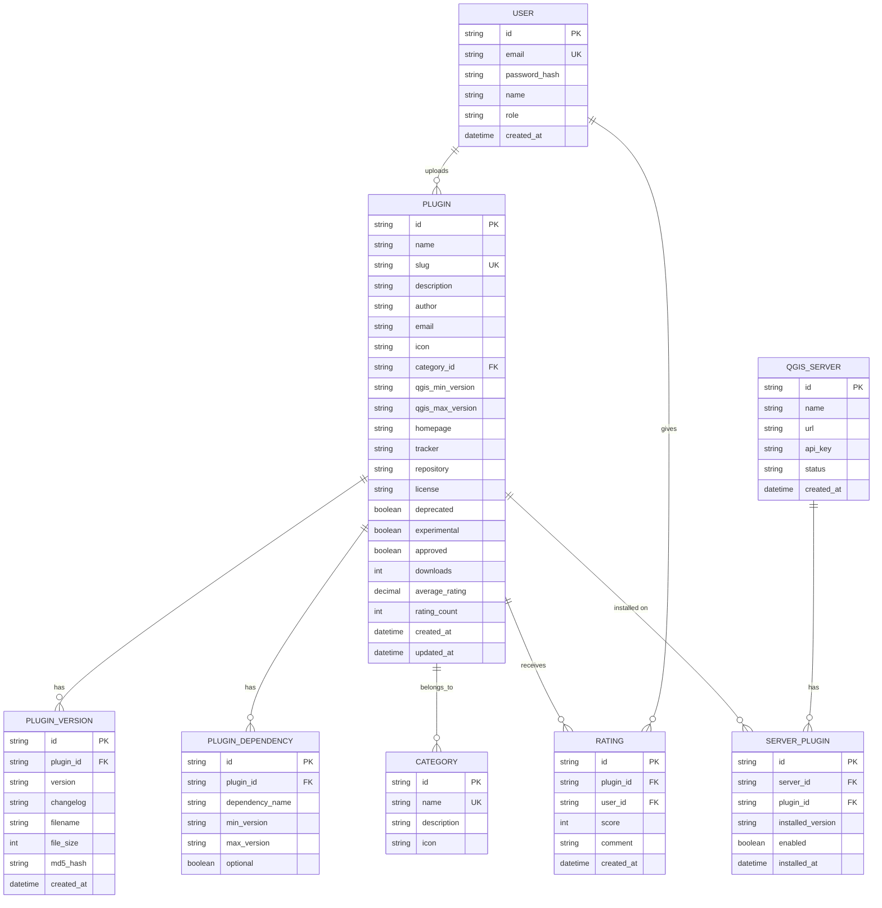

## 1. 架构设计



## 2. 技术描述

### 2.1 技术栈选型

| 层级 | 技术 | 版本 | 说明 |
|------|------|------|------|
| 前端 | React | 18.x | UI框架 |
| 前端 | TypeScript | 5.x | 类型安全 |
| 前端 | Vite | 5.x | 构建工具 |
| 前端 | React Router | 6.x | 路由管理 |
| 前端 | TailwindCSS | 3.x | 样式框架 |
| 前端 | shadcn/ui | - | UI组件库 |
| 前端 | Lucide React | - | 图标库 |
| 后端 | Node.js | 20.x | 运行环境 |
| 后端 | Express.js | 4.x | Web框架 |
| 后端 | TypeScript | 5.x | 类型安全 |
| 数据库 | SQLite3 | - | 嵌入式数据库 |
| 数据库 | Prisma | 5.x | ORM框架 |
| 文件处理 | Multer | 1.x | 文件上传 |
| 文件处理 | Adm-Zip | 0.5.x | ZIP解析 |
| XML处理 | xmlbuilder2 | 3.x | XML生成 |
| 认证 | JWT | 9.x | Token认证 |

### 2.2 项目目录结构

```
p131/
├── client/                          # 前端应用
│   ├── src/
│   │   ├── components/              # 通用组件
│   │   │   ├── ui/                  # shadcn/ui组件
│   │   │   ├── PluginCard.tsx       # 插件卡片
│   │   │   ├── RatingStars.tsx      # 评分组件
│   │   │   ├── DependencyTree.tsx   # 依赖树
│   │   │   └── FileUpload.tsx       # 文件上传
│   │   ├── pages/                   # 页面组件
│   │   │   ├── PluginList.tsx       # 插件列表
│   │   │   ├── PluginDetail.tsx     # 插件详情
│   │   │   └── PluginUpload.tsx     # 插件上传
│   │   ├── services/                # API服务
│   │   │   ├── api.ts               # API客户端
│   │   │   ├── plugins.ts           # 插件API
│   │   │   └── qgis-server.ts       # QGIS Server API
│   │   ├── types/                   # 类型定义
│   │   ├── hooks/                   # 自定义Hooks
│   │   ├── App.tsx
│   │   └── main.tsx
│   ├── package.json
│   └── vite.config.ts
├── server/                          # 后端应用
│   ├── src/
│   │   ├── controllers/             # 控制器
│   │   │   ├── plugin.controller.ts
│   │   │   ├── rating.controller.ts
│   │   │   ├── upload.controller.ts
│   │   │   └── qgis.controller.ts
│   │   ├── services/                # 业务逻辑
│   │   │   ├── plugin.service.ts
│   │   │   ├── xml.service.ts
│   │   │   ├── upload.service.ts
│   │   │   └── qgis.service.ts
│   │   ├── repositories/            # 数据访问
│   │   ├── middleware/              # 中间件
│   │   ├── types/                   # 类型定义
│   │   ├── utils/                   # 工具函数
│   │   │   ├── metadata-parser.ts   # 元数据解析
│   │   │   └── xml-generator.ts     # XML生成
│   │   ├── prisma/                  # Prisma配置
│   │   │   └── schema.prisma
│   │   ├── config/                  # 配置
│   │   └── server.ts                # 入口
│   ├── package.json
│   └── tsconfig.json
├── storage/                         # 文件存储
│   ├── plugins/                     # 插件zip文件
│   └── icons/                       # 插件图标
├── package.json                     # 根package (monorepo)
└── docker-compose.yml               # Docker配置
```

## 3. 路由定义

### 3.1 前端路由

| 路由 | 页面 | 说明 |
|------|------|------|
| `/` | 插件列表页 | 展示所有插件，支持搜索筛选 |
| `/plugin/:id` | 插件详情页 | 展示插件详情、依赖、评分 |
| `/upload` | 插件上传页 | 上传zip插件 |
| `/plugins.xml` | XML仓库 | 动态生成QGIS插件仓库XML |

### 3.2 后端API路由

| 方法 | 路由 | 说明 | 认证 |
|------|------|------|------|
| GET | `/api/plugins` | 获取插件列表 | 否 |
| GET | `/api/plugins/:id` | 获取插件详情 | 否 |
| POST | `/api/plugins` | 创建插件（上传后） | 是 |
| PUT | `/api/plugins/:id` | 更新插件信息 | 是 |
| DELETE | `/api/plugins/:id` | 删除插件 | 是（管理员） |
| GET | `/api/plugins/:id/versions` | 获取版本历史 | 否 |
| GET | `/api/plugins/:id/download` | 下载插件zip | 否 |
| POST | `/api/upload` | 上传zip文件 | 是 |
| POST | `/api/plugins/:id/rate` | 提交评分 | 是 |
| GET | `/api/plugins/:id/ratings` | 获取评分列表 | 否 |
| GET | `/plugins.xml` | 获取XML仓库 | 否 |
| GET | `/api/qgis/servers` | 获取QGIS Server列表 | 是（管理员） |
| POST | `/api/qgis/servers` | 添加QGIS Server | 是（管理员） |
| POST | `/api/qgis/:serverId/install/:pluginId` | 远程安装插件 | 是（管理员） |
| POST | `/api/qgis/:serverId/uninstall/:pluginId` | 远程卸载插件 | 是（管理员） |
| GET | `/api/qgis/:serverId/plugins` | 查询Server已装插件 | 是（管理员） |

## 4. API 类型定义

```typescript
// 插件类型
interface Plugin {
  id: string;
  name: string;
  slug: string;
  version: string;
  description: string;
  author: string;
  email: string;
  icon: string;
  category: string;
  tags: string[];
  qgisMinimumVersion: string;
  qgisMaximumVersion: string;
  homepage: string;
  tracker: string;
  repository: string;
  license: string;
  deprecated: boolean;
  experimental: boolean;
  downloads: number;
  averageRating: number;
  ratingCount: number;
  createdAt: Date;
  updatedAt: Date;
}

// 插件版本
interface PluginVersion {
  id: string;
  pluginId: string;
  version: string;
  changelog: string;
  filename: string;
  fileSize: number;
  md5: string;
  createdAt: Date;
}

// 依赖关系
interface PluginDependency {
  id: string;
  pluginId: string;
  dependencyPluginId: string;
  dependencyName: string;
  minimumVersion: string;
  maximumVersion: string;
  optional: boolean;
}

// 评分
interface Rating {
  id: string;
  pluginId: string;
  userId: string;
  score: number;
  comment: string;
  createdAt: Date;
}

// QGIS Server
interface QgisServer {
  id: string;
  name: string;
  url: string;
  apiKey: string;
  status: 'online' | 'offline';
  createdAt: Date;
}

// API响应
interface ApiResponse<T> {
  success: boolean;
  data?: T;
  error?: string;
  message?: string;
}

interface PaginatedResponse<T> extends ApiResponse<T> {
  data: {
    items: T[];
    total: number;
    page: number;
    pageSize: number;
  };
}
```

## 5. 服务器架构图



## 6. 数据模型

### 6.1 ER 图



### 6.2 Prisma Schema (DDL)

```prisma
generator client {
  provider = "prisma-client-js"
}

datasource db {
  provider = "sqlite"
  url      = env("DATABASE_URL")
}

model User {
  id            String   @id @default(uuid())
  email         String   @unique
  passwordHash  String
  name          String
  role          String   @default("user")
  plugins       Plugin[]
  ratings       Rating[]
  createdAt     DateTime @default(now())
}

model Category {
  id          String   @id @default(uuid())
  name        String   @unique
  description String?
  icon        String?
  plugins     Plugin[]
}

model Plugin {
  id                String              @id @default(uuid())
  name              String
  slug              String              @unique
  description       String
  author            String
  email             String?
  icon              String?
  categoryId        String?
  category          Category?           @relation(fields: [categoryId], references: [id])
  qgisMinVersion    String
  qgisMaxVersion    String?
  homepage          String?
  tracker           String?
  repository        String?
  license           String?
  deprecated        Boolean             @default(false)
  experimental      Boolean             @default(false)
  approved          Boolean             @default(false)
  downloads         Int                 @default(0)
  averageRating     Decimal             @default(0) @db.Decimal(2, 1)
  ratingCount       Int                 @default(0)
  versions          PluginVersion[]
  dependencies      PluginDependency[]
  ratings           Rating[]
  serverInstalls    ServerPlugin[]
  uploadedBy        User?               @relation(fields: [uploadedById], references: [id])
  uploadedById      String?
  createdAt         DateTime            @default(now())
  updatedAt         DateTime            @updatedAt
}

model PluginVersion {
  id         String   @id @default(uuid())
  pluginId   String
  plugin     Plugin   @relation(fields: [pluginId], references: [id], onDelete: Cascade)
  version    String
  changelog  String?
  filename   String
  fileSize   Int
  md5Hash    String
  createdAt  DateTime @default(now())
  @@unique([pluginId, version])
}

model PluginDependency {
  id               String  @id @default(uuid())
  pluginId         String
  plugin           Plugin  @relation(fields: [pluginId], references: [id], onDelete: Cascade)
  dependencyName   String
  minVersion       String?
  maxVersion       String?
  optional         Boolean @default(false)
}

model Rating {
  id         String   @id @default(uuid())
  pluginId   String
  plugin     Plugin   @relation(fields: [pluginId], references: [id], onDelete: Cascade)
  userId     String
  user       User     @relation(fields: [userId], references: [id], onDelete: Cascade)
  score      Int
  comment    String?
  createdAt  DateTime @default(now())
  @@unique([pluginId, userId])
}

model QgisServer {
  id            String         @id @default(uuid())
  name          String
  url           String
  apiKey        String
  status        String         @default("offline")
  installedPlugins ServerPlugin[]
  createdAt     DateTime       @default(now())
}

model ServerPlugin {
  id               String      @id @default(uuid())
  serverId         String
  server           QgisServer  @relation(fields: [serverId], references: [id], onDelete: Cascade)
  pluginId         String
  plugin           Plugin      @relation(fields: [pluginId], references: [id], onDelete: Cascade)
  installedVersion String
  enabled          Boolean     @default(true)
  installedAt      DateTime    @default(now())
  @@unique([serverId, pluginId])
}
```

### 6.3 初始化数据

```sql
-- 初始化分类
INSERT INTO Category (id, name, description, icon) VALUES
('cat-1', '矢量处理', '矢量数据处理工具', 'vector'),
('cat-2', '栅格处理', '栅格数据分析工具', 'raster'),
('cat-3', '数据库', '数据库连接与管理', 'database'),
('cat-4', '网络分析', '网络分析与路径规划', 'network'),
('cat-5', '制图输出', '地图排版与输出', 'cartography'),
('cat-6', '数据获取', '在线数据获取与导入', 'acquisition'),
('cat-7', '其他', '其他类型插件', 'other');

-- 初始化管理员用户 (密码: admin123)
INSERT INTO User (id, email, passwordHash, name, role) VALUES
('user-admin', 'admin@qgis.com', '$2b$10$...hashed_password...', '管理员', 'admin');
```
