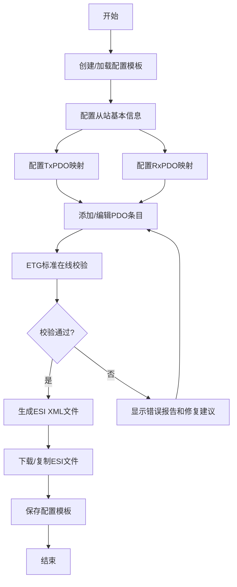

## 1. 产品概述
EtherCAT PDO配置工具是一个专业的工业自动化配置软件，用于可视化配置EtherCAT从站的PDO（过程数据对象）映射，生成符合ETG标准的ESI（EtherCAT Slave Information）XML文件，并提供在线校验功能。

- 主要用途：帮助自动化工程师快速、准确地配置EtherCAT从站设备的TxPDO和RxPDO映射
- 解决的问题：手动编写ESI文件容易出错，缺乏可视化配置和标准校验工具
- 目标用户：工业自动化工程师、EtherCAT设备开发者、系统集成商
- 产品价值：提高配置效率，降低错误率，确保符合ETG标准

## 2. 核心功能

### 2.1 用户角色
| 角色 | 注册方式 | 核心权限 |
|------|----------|----------|
| 工程师 | 本地应用 | PDO配置、ESI生成、标准校验、模板管理 |

### 2.2 功能模块
1. **PDO配置页面**：TxPDO/RxPDO映射配置、对象字典管理、条目拖放排序
2. **ESI生成页面**：XML预览、文件下载、从站基本信息配置
3. **在线校验页面**：ETG标准合规性检查、错误报告、修复建议
4. **模板管理页面**：配置模板保存、加载、删除、导入导出

### 2.3 页面详情
| 页面名称 | 模块名称 | 功能描述 |
|----------|----------|----------|
| PDO配置 | 对象字典列表 | 展示可用的EtherCAT对象，支持搜索筛选 |
| PDO配置 | TxPDO配置区 | 可视化配置TxPDO映射条目，支持增删改 |
| PDO配置 | RxPDO配置区 | 可视化配置RxPDO映射条目，支持增删改 |
| PDO配置 | PDO条目编辑 | 配置索引、子索引、名称、数据类型、位长度 |
| ESI生成 | 从站信息表单 | 配置厂商ID、产品代码、版本号、从站名称 |
| ESI生成 | XML预览 | 实时预览生成的ESI XML代码，支持语法高亮 |
| ESI生成 | 文件操作 | 下载ESI文件、复制XML内容 |
| 在线校验 | 校验引擎 | 检查XML是否符合ETG.2000标准 |
| 在线校验 | 错误报告 | 显示错误位置、错误类型、严重程度 |
| 在线校验 | 修复建议 | 提供具体的修复方案和示例 |
| 模板管理 | 模板列表 | 展示已保存的配置模板 |
| 模板管理 | 模板操作 | 保存当前配置、加载模板、删除模板 |
| 模板管理 | 导入导出 | 批量导入导出JSON格式配置模板 |

## 3. 核心流程

用户从PDO配置开始，添加对象字典条目到TxPDO或RxPDO映射中，配置相关参数。完成配置后，可以预览和下载ESI XML文件。在生成文件前后，都可以进行ETG标准校验。常用配置可以保存为模板，下次使用时直接加载。

## 4. 用户界面设计

### 4.1 设计风格
- **主色调**：工业蓝（#165DFF）- 代表专业、技术、可靠
- **辅助色**：成功绿（#00B42A）、警告橙（#FF7D00）、错误红（#F53F3F）
- **中性色**：深灰（#1D2129）、中灰（#4E5969）、浅灰（#C9CDD4）、背景（#F2F3F5）
- **按钮风格**：圆角8px，悬停有轻微上浮效果和阴影变化
- **字体**：主要使用Inter，代码区域使用JetBrains Mono等宽字体
- **布局风格**：左右分栏布局，左侧导航，右侧内容区，卡片式模块
- **图标风格**：线性图标，统一24px尺寸，颜色与主题一致

### 4.2 页面设计概述
| 页面名称 | 模块名称 | UI元素 |
|----------|----------|--------|
| PDO配置 | 对象字典 | 搜索框、筛选标签、可拖拽列表项、复选框选择 |
| PDO配置 | PDO映射区 | 分区标题栏、条目卡片、操作按钮组、拖放指示 |
| PDO配置 | 条目编辑 | 模态对话框、表单输入、下拉选择、数据验证提示 |
| ESI生成 | 从站信息 | 两列表单、输入验证、自动填充建议 |
| ESI生成 | XML预览 | 代码编辑器样式、行号、语法高亮、滚动条美化 |
| 在线校验 | 校验结果 | 状态徽章、错误列表、展开详情、修复代码块 |
| 模板管理 | 模板列表 | 网格布局卡片、缩略图预览、悬停操作按钮 |

### 4.3 响应式
- 桌面优先设计，适配1280px及以上分辨率
- 平板设备：左右分栏改为上下布局，导航折叠为侧边栏
- 移动端：单列布局，底部导航栏，简化操作
- 触摸优化：增大可点击区域，最小44x44px

### 4.4 交互细节
- PDO条目支持拖放排序，拖放时有视觉反馈
- 表单输入实时验证，错误提示即时显示
- XML预览支持代码折叠、行号显示
- 校验结果支持错误定位，点击跳转到对应代码行
- 页面切换有平滑过渡动画
- 操作成功/失败有Toast提示
