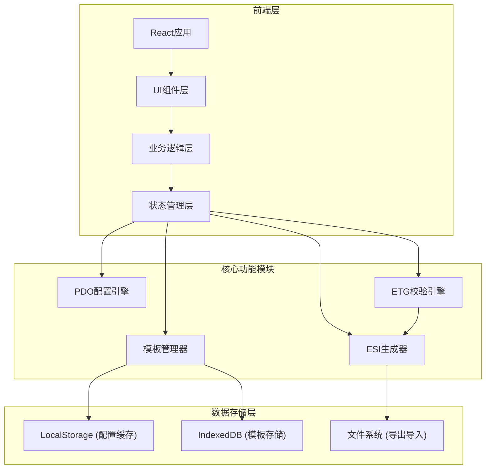
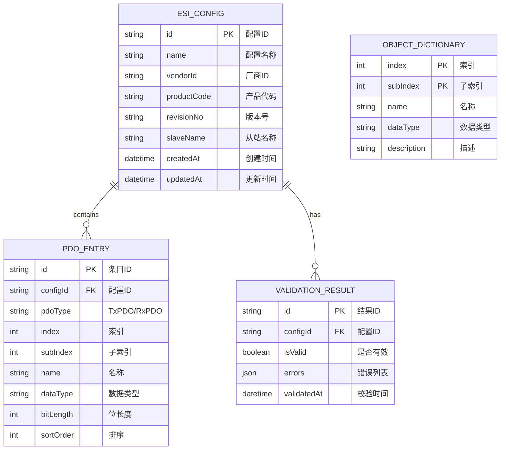

## 1. 架构设计



## 2. 技术描述

- **前端框架**: React@18 + TypeScript
- **构建工具**: Vite@5
- **样式方案**: TailwindCSS@3
- **状态管理**: Zustand
- **UI组件库**: Ant Design
- **拖拽功能**: @dnd-kit
- **代码高亮**: react-syntax-highlighter
- **XML处理**: fast-xml-parser
- **图标**: @ant-design/icons
- **数据库**: IndexedDB (本地存储配置模板)

## 3. 路由定义

| 路由 | 页面组件 | 用途 |
|------|----------|------|
| / | PdoConfigPage | PDO映射配置主页面 |
| /esi-generator | EsiGeneratorPage | ESI XML生成与预览 |
| /validation | ValidationPage | ETG标准在线校验 |
| /templates | TemplateManagerPage | 配置模板管理 |

## 4. 数据模型

### 4.1 数据模型定义



### 4.2 核心TypeScript类型定义

```typescript
// PDO条目类型
interface PdoEntry {
  id: string;
  index: number;
  subIndex: number;
  name: string;
  dataType: DataType;
  bitLength: number;
}

// PDO映射类型
type PdoType = 'TxPDO' | 'RxPDO';

interface PdoMapping {
  id: string;
  type: PdoType;
  entries: PdoEntry[];
}

// ESI配置类型
interface EsiConfig {
  id: string;
  name: string;
  vendorId: string;
  productCode: string;
  revisionNo: string;
  slaveName: string;
  txPdO: PdoEntry[];
  rxPdO: PdoEntry[];
  createdAt: Date;
  updatedAt: Date;
}

// 数据类型枚举
enum DataType {
  BOOL = 'BOOL',
  INT8 = 'INT8',
  INT16 = 'INT16',
  INT32 = 'INT32',
  INT64 = 'INT64',
  UINT8 = 'UINT8',
  UINT16 = 'UINT16',
  UINT32 = 'UINT32',
  UINT64 = 'UINT64',
  FLOAT32 = 'FLOAT32',
  FLOAT64 = 'FLOAT64',
  STRING = 'STRING',
}

// 校验结果类型
interface ValidationError {
  id: string;
  severity: 'error' | 'warning' | 'info';
  code: string;
  message: string;
  location?: {
    line?: number;
    column?: number;
    xpath?: string;
  };
  suggestion?: string;
}

interface ValidationResult {
  isValid: boolean;
  errors: ValidationError[];
  warnings: ValidationError[];
  timestamp: Date;
}

// 模板类型
interface ConfigTemplate {
  id: string;
  name: string;
  description: string;
  config: EsiConfig;
  createdAt: Date;
  updatedAt: Date;
}
```

## 5. 核心功能模块

### 5.1 PDO配置引擎
- 管理TxPDO和RxPDO的条目增删改查
- 支持拖放排序
- 计算PDO总位长度
- 验证条目合法性

### 5.2 ESI生成器
- 根据ETG.2000标准生成XML结构
- 支持实时预览
- 提供文件下载功能

### 5.3 ETG校验引擎
- 验证XML结构合法性
- 检查PDO映射规则合规性
- 提供详细的错误报告和修复建议

### 5.4 模板管理器
- 使用IndexedDB本地存储配置模板
- 支持模板的CRUD操作
- 支持JSON格式导入导出

## 6. 目录结构

```
src/
├── components/           # 可复用UI组件
│   ├── layout/          # 布局组件
│   ├── pdo/             # PDO相关组件
│   ├── esi/             # ESI相关组件
│   ├── validation/      # 校验相关组件
│   └── templates/       # 模板相关组件
├── pages/               # 页面组件
├── store/               # 状态管理
├── hooks/               # 自定义Hooks
├── utils/               # 工具函数
│   ├── esiGenerator.ts  # ESI生成工具
│   ├── validator.ts     # 校验工具
│   └── xmlParser.ts     # XML解析工具
├── types/               # TypeScript类型定义
├── data/                # 静态数据（对象字典等）
├── services/            # 服务层
│   └── templateService.ts # 模板存储服务
├── styles/              # 全局样式
└── App.tsx              # 应用入口
```
