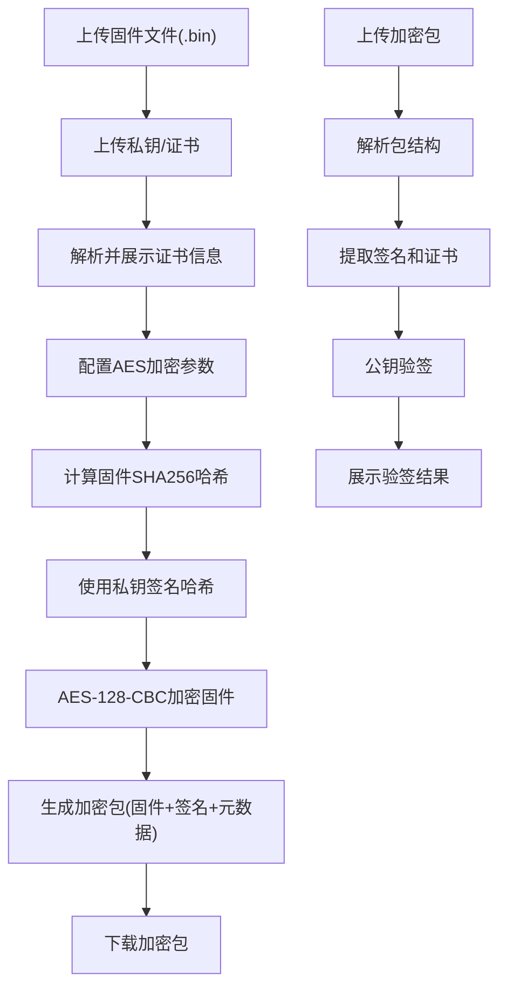

## 1. 产品概述

STM32固件签名加密工具，用于对STM32单片机固件文件（BIN格式）进行数字签名和AES加密，生成安全的可烧录加密包，保护固件知识产权和烧录过程的安全性。

- 主要用途：嵌入式设备固件安全加固，防止固件篡改和逆向工程
- 目标用户：嵌入式开发工程师、固件安全工程师、物联网设备厂商
- 核心价值：提供可视化的固件签名加密流程，确保固件完整性和机密性

## 2. 核心特性

### 2.1 功能模块

| 序号 | 功能模块 | 核心功能 |
|------|----------|----------|
| 1 | 固件上传 | 支持BIN格式固件文件上传，显示文件大小、名称等信息 |
| 2 | 密钥管理 | 上传X.509私钥文件（PEM格式），解析并展示证书信息 |
| 3 | 数字签名 | 使用RSA/SHA256对固件进行数字签名，生成签名数据 |
| 4 | AES加密 | 使用AES-128-CBC算法加密固件，支持自定义密钥和IV |
| 5 | 加密包生成 | 将签名、加密后的固件和元数据打包成可烧录格式 |
| 6 | 验签功能 | 验证加密包的数字签名，确保固件完整性和来源可靠性 |
| 7 | 证书展示 | 解析并展示X.509证书详细信息（颁发者、有效期、公钥信息等） |

### 2.2 页面详情

| 页面名称 | 模块名称 | 功能描述 |
|----------|----------|----------|
| 主工作台 | 固件上传区 | 拖拽或点击上传BIN固件文件，显示文件信息 |
| 主工作台 | 密钥管理区 | 上传私钥和证书文件，解析展示证书详情 |
| 主工作台 | 加密配置区 | 配置AES密钥、IV等加密参数 |
| 主工作台 | 签名加密区 | 执行签名加密流程，显示进度和结果 |
| 主工作台 | 验签区 | 上传加密包进行验签，显示验签结果 |
| 主工作台 | 下载区 | 下载生成的加密包和相关文件 |

## 3. 核心流程

### 3.1 签名加密流程

1. 用户上传STM32固件文件（BIN格式）
2. 用户上传X.509私钥文件和证书文件
3. 系统解析证书并展示证书详情
4. 用户配置AES加密参数（密钥、IV）
5. 系统计算固件哈希值
6. 系统使用私钥对哈希进行数字签名
7. 系统使用AES-128-CBC加密固件
8. 系统将加密固件、签名、证书信息打包成加密包
9. 用户下载加密包用于烧录

### 3.2 验签流程

1. 用户上传待验证的加密包
2. 系统解析加密包结构，提取固件、签名、证书
3. 系统使用证书公钥验证签名有效性
4. 系统展示验签结果（通过/失败）及详细信息

### 3.3 流程图

## 4. 用户界面设计

### 4.1 设计风格

- **设计理念**：技术硬核、专业可信、深色科技风
- **主色调**：深海军蓝 (#0a1628) 作为背景，配合科技蓝 (#00d4ff) 和警告橙 (#ff6b35)
- **辅助色**：成功绿 (#00ff88)、错误红 (#ff4757)、中性灰 (#1e2a3a)
- **字体**：
  - 标题：Orbitron - 科技感等宽字体，强化技术属性
  - 正文：JetBrains Mono - 程序员友好的等宽字体，适合显示十六进制和代码
- **布局风格**：卡片式分区布局，清晰的功能模块划分，左侧导航+右侧主工作区
- **图标风格**：线性技术图标，使用Font Awesome
- **动效**：科技感扫描线、数据流动画、渐变边框、脉冲指示

### 4.2 页面设计

| 页面 | 模块 | UI元素 |
|------|------|--------|
| 主工作台 | 顶部导航 | Logo、系统标题、用户信息、帮助按钮 |
| 主工作台 | 左侧功能栏 | 6个功能模块图标按钮，当前激活状态高亮 |
| 主工作台 | 固件上传区 | 大尺寸拖拽区域，文件图标动画，文件信息卡片 |
| 主工作台 | 密钥管理区 | 双文件上传（私钥/证书），证书信息展示面板 |
| 主工作台 | 加密配置区 | 密钥输入框（显示/隐藏）、IV输入框、随机生成按钮 |
| 主工作台 | 执行区 | 大型渐变按钮、进度条、步骤指示器、日志输出 |
| 主工作台 | 验签区 | 文件上传、验签按钮、结果展示面板 |
| 主工作台 | 下载区 | 文件列表卡片、下载按钮、文件大小信息 |

### 4.3 证书信息展示

证书信息以结构化卡片形式展示：
- 证书主题（Subject）
- 颁发者（Issuer）
- 有效期（Valid From / Valid To）
- 序列号（Serial Number）
- 签名算法（Signature Algorithm）
- 公钥信息（Public Key Algorithm、Key Size）
- 指纹信息（SHA1、SHA256 Fingerprint）

### 4.4 响应式设计

- 桌面端（默认）：三栏布局，左侧导航 + 中间主工作区 + 右侧信息面板
- 平板端：两栏布局，左侧折叠导航 + 主工作区
- 移动端：单栏布局，顶部导航菜单，模块垂直堆叠

### 4.5 交互细节

- 文件上传拖拽区域有悬浮动画和边框高亮
- 签名加密过程显示步骤进度条和实时日志
- 证书信息支持展开/折叠详情
- 加密密钥支持一键随机生成
- 操作结果有明确的成功/失败状态提示
- 十六进制数据支持格式化显示
