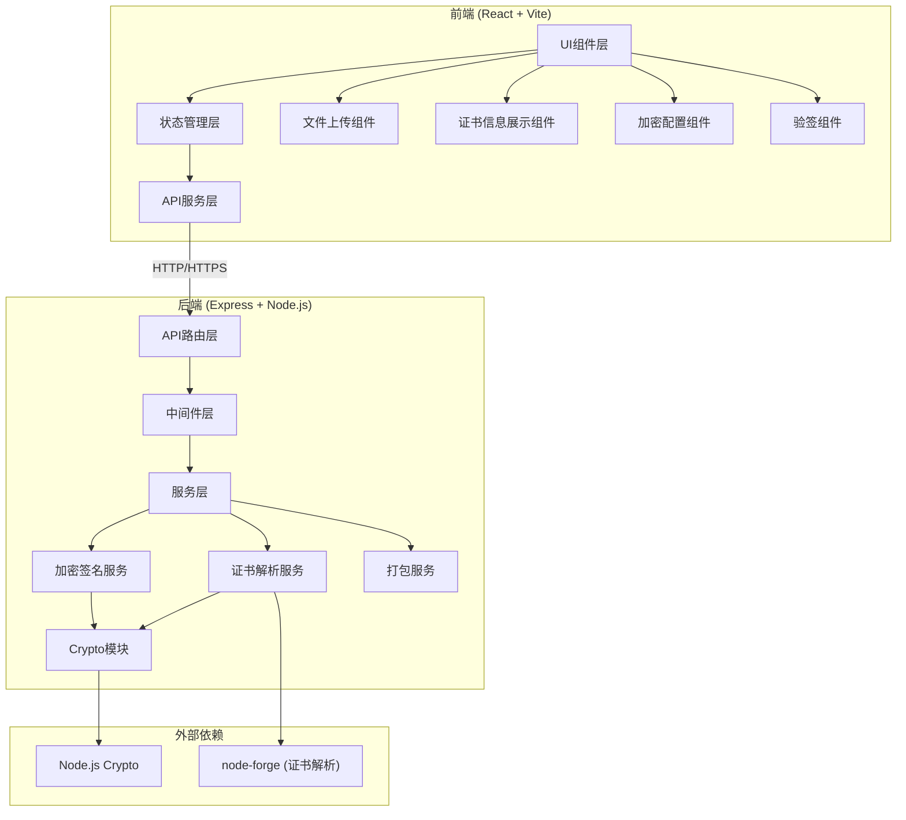
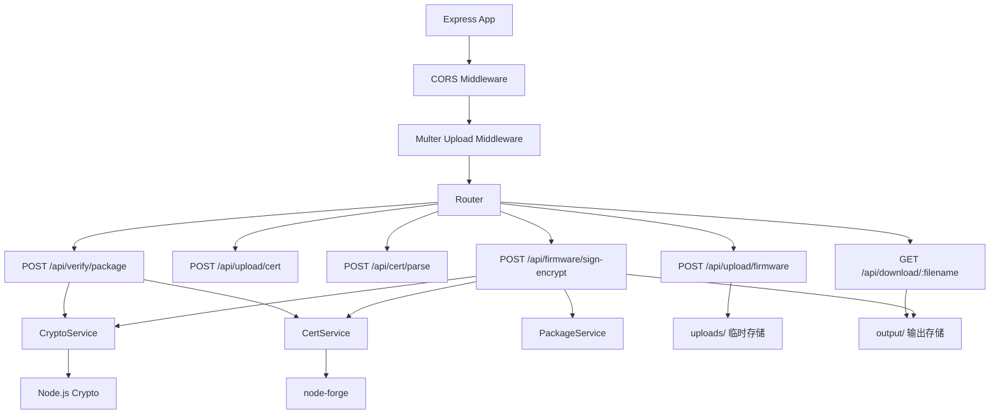

## 1. 架构设计



## 2. 技术选型说明

### 2.1 前端技术栈
- **框架**: React 18 + TypeScript
- **构建工具**: Vite 5
- **样式方案**: TailwindCSS 3 + CSS变量
- **状态管理**: React Hooks (useState, useContext)
- **HTTP客户端**: Axios
- **图标**: Font Awesome 6
- **动画**: Framer Motion

### 2.2 后端技术栈
- **框架**: Express 4
- **运行时**: Node.js 18+
- **加密核心**: Node.js内置Crypto模块
- **证书解析**: node-forge
- **文件上传**: multer
- **CORS**: cors中间件

### 2.3 加密算法
- **签名算法**: RSA-SHA256
- **加密算法**: AES-128-CBC
- **哈希算法**: SHA-256
- **密钥长度**: AES 128位 (16字节), IV 16字节
- **填充方式**: PKCS7

## 3. 目录结构

```
p136/
├── client/                          # 前端项目
│   ├── src/
│   │   ├── components/              # UI组件
│   │   │   ├── FileUpload.tsx       # 文件上传组件
│   │   │   ├── CertInfo.tsx         # 证书信息展示
│   │   │   ├── EncryptConfig.tsx    # 加密配置
│   │   │   ├── SignEncrypt.tsx      # 签名加密执行
│   │   │   ├── Verify.tsx           # 验签组件
│   │   │   └── DownloadPanel.tsx    # 下载面板
│   │   ├── services/                # API服务
│   │   │   └── api.ts               # API调用封装
│   │   ├── types/                   # TypeScript类型
│   │   │   └── index.ts
│   │   ├── hooks/                   # 自定义Hooks
│   │   │   └── useFileUpload.ts
│   │   ├── App.tsx                  # 主应用
│   │   ├── main.tsx                 # 入口
│   │   └── index.css                # 全局样式
│   ├── package.json
│   ├── tsconfig.json
│   ├── vite.config.ts
│   └── tailwind.config.js
└── server/                          # 后端项目
    ├── src/
    │   ├── routes/                  # API路由
    │   │   ├── firmware.ts          # 固件相关路由
    │   │   ├── cert.ts              # 证书相关路由
    │   │   └── verify.ts            # 验签路由
    │   ├── services/                # 业务服务
    │   │   ├── cryptoService.ts     # 加密签名服务
    │   │   ├── certService.ts       # 证书解析服务
    │   │   └── packageService.ts    # 打包服务
    │   ├── middleware/              # 中间件
    │   │   └── upload.ts            # 文件上传中间件
    │   ├── types/                   # 类型定义
    │   │   └── index.ts
    │   └── app.ts                   # Express应用
    ├── uploads/                     # 上传文件临时目录
    ├── output/                      # 输出文件目录
    ├── package.json
    └── tsconfig.json
```

## 4. 路由定义

### 4.1 前端路由
| 路由 | 页面 | 说明 |
|------|------|------|
| / | 主工作台 | 所有功能模块集中展示 |

### 4.2 后端API路由
| 方法 | 路由 | 功能 |
|------|------|------|
| POST | /api/upload/firmware | 上传固件文件 |
| POST | /api/upload/cert | 上传私钥和证书 |
| POST | /api/cert/parse | 解析证书信息 |
| POST | /api/firmware/sign | 对固件进行签名 |
| POST | /api/firmware/encrypt | 加密固件 |
| POST | /api/firmware/package | 生成加密包 |
| POST | /api/firmware/sign-encrypt | 签名加密一键执行 |
| POST | /api/verify/package | 验证加密包签名 |
| GET | /api/download/:filename | 下载生成的文件 |
| DELETE | /api/files | 清空临时文件 |

## 5. API接口定义

### 5.1 类型定义
```typescript
// 证书信息
interface CertInfo {
  subject: {
    CN: string;
    O: string;
    OU: string;
    C: string;
  };
  issuer: {
    CN: string;
    O: string;
    OU: string;
    C: string;
  };
  validFrom: string;
  validTo: string;
  serialNumber: string;
  signatureAlgorithm: string;
  publicKeyAlgorithm: string;
  keySize: number;
  fingerprintSHA1: string;
  fingerprintSHA256: string;
}

// 加密配置
interface EncryptConfig {
  aesKey: string;        // 16字节 hex
  aesIv: string;         // 16字节 hex
}

// 签名结果
interface SignResult {
  success: boolean;
  hash: string;          // SHA256 hash hex
  signature: string;     // 签名 hex
  algorithm: string;
}

// 加密结果
interface EncryptResult {
  success: boolean;
  encryptedData: string; // 加密后数据 hex
  originalSize: number;
  encryptedSize: number;
}

// 加密包结构
interface FirmwarePackage {
  version: string;       // 包格式版本
  firmwareSize: number;  // 原始固件大小
  encryptedFirmware: Buffer;
  signature: Buffer;
  certInfo: CertInfo;
  encryptConfig: {
    algorithm: string;   // AES-128-CBC
    keySize: number;
    iv: string;          // hex
  };
  timestamp: number;
  checksum: string;      // 整个包的校验和
}

// 验签结果
interface VerifyResult {
  success: boolean;
  valid: boolean;
  message: string;
  firmwareHash?: string;
  certInfo?: CertInfo;
  timestamp?: number;
}

// 加密包格式 (二进制)
// |-- 魔数(4字节) --| 版本(2字节) --| 头长度(4字节) --|
// |-- 签名长度(4字节) --| 签名数据 --|
// |-- 加密固件长度(4字节) --| 加密固件数据 --|
// |-- IV(16字节) --|
// |-- JSON格式元数据(含证书信息)长度(4字节) --| 元数据 --|
// |-- 整个包SHA256校验和(32字节) --|
```

### 5.2 请求/响应示例

**POST /api/firmware/sign-encrypt**
```typescript
// 请求 (multipart/form-data)
{
  firmware: File,        // BIN文件
  privateKey: File,      // PEM私钥
  certificate: File,     // PEM证书
  aesKey: string,        // 可选，不传则随机生成
  aesIv: string          // 可选，不传则随机生成
}

// 响应
{
  success: true,
  data: {
    packageFilename: "firmware_20240101_120000.enc",
    packageSize: 123456,
    signResult: SignResult,
    encryptResult: EncryptResult,
    certInfo: CertInfo,
    encryptConfig: EncryptConfig
  }
}
```

**POST /api/verify/package**
```typescript
// 请求 (multipart/form-data)
{
  package: File,         // .enc加密包
  certificate?: File     // 可选，不传入则使用包内证书
}

// 响应
{
  success: true,
  data: VerifyResult
}
```

## 6. 服务器架构



## 7. 数据模型

### 7.1 加密包二进制格式

| 偏移 | 长度 | 字段 | 说明 |
|------|------|------|------|
| 0x00 | 4 | 魔数 | 固定为 0x53544D33 ("STM3") |
| 0x04 | 2 | 版本 | 包格式版本，当前为 0x0001 |
| 0x06 | 4 | 头长度 | 头部总长度（到元数据结束） |
| 0x0A | 4 | 签名长度 | RSA签名字节数 |
| 0x0E | N | 签名数据 | RSA-SHA256签名 |
| 0x0E+N | 4 | 加密固件长度 | 加密后固件字节数 |
| 0x12+N | M | 加密固件 | AES-128-CBC加密的固件数据 |
| 0x12+N+M | 16 | IV | AES初始化向量 |
| 0x22+N+M | 4 | 元数据长度 | JSON元数据字节数 |
| 0x26+N+M | K | 元数据 | JSON格式，含证书信息、时间戳等 |
| 0x26+N+M+K | 32 | 校验和 | 整个包（除校验和外）的SHA256 |

### 7.2 元数据JSON格式
```json
{
  "version": "1.0",
  "timestamp": 1704067200000,
  "firmwareInfo": {
    "originalName": "firmware.bin",
    "originalSize": 65536,
    "sha256": "abc123..."
  },
  "signature": {
    "algorithm": "RSA-SHA256",
    "hash": "abc123..."
  },
  "encryption": {
    "algorithm": "AES-128-CBC",
    "keySize": 128
  },
  "certificate": {
    "subject": { "CN": "STM32 Signer" },
    "issuer": { "CN": "STM32 CA" },
    "validFrom": "2024-01-01T00:00:00.000Z",
    "validTo": "2025-01-01T00:00:00.000Z",
    "serialNumber": "1234567890abcdef",
    "fingerprintSHA256": "abc123..."
  }
}
```
