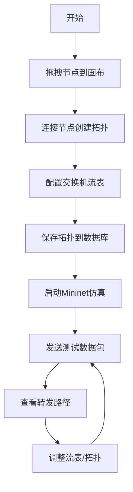

# Mininet网络仿真Web应用 - 产品需求文档

## 1. 产品概述

Mininet网络仿真Web应用是一个基于Web的SDN（软件定义网络）仿真平台，允许用户通过可视化方式创建网络拓扑、配置OpenFlow流表规则，并实时查看数据包转发路径。

- 主要目的：提供一个直观的网络仿真环境，帮助网络工程师、研究人员和学生学习和测试SDN网络
- 目标用户：网络工程师、SDN研究人员、计算机网络专业学生
- 产品价值：降低Mininet使用门槛，通过可视化界面简化网络仿真实验流程

## 2. 核心功能

### 2.1 用户角色

| 角色 | 注册方式 | 核心权限 |
|------|---------|---------|
| 普通用户 | 无需注册 | 创建拓扑、配置流表、运行仿真、查看结果 |

### 2.2 功能模块

1. **拓扑编辑器**：拖拽创建网络拓扑，支持交换机、主机节点，连接管理
2. **流表配置**：OpenFlow流表规则配置（匹配字段+动作）
3. **仿真控制**：启动/停止Mininet仿真，发送测试数据包
4. **路径可视化**：实时展示数据包转发路径，流表命中情况
5. **拓扑管理**：保存/加载网络拓扑到数据库

### 2.3 页面详情

| 页面名称 | 模块名称 | 功能描述 |
|---------|---------|---------|
| 主工作区 | 拓扑编辑器画布 | SVG画布，支持节点拖拽、连线、缩放 |
| 左侧面板 | 节点工具栏 | 交换机/主机节点组件库，拖拽添加 |
| 右侧面板 | 流表配置 | 选择交换机，添加/编辑/删除流表规则 |
| 顶部工具栏 | 仿真控制 | 启动/停止仿真，发送测试包，保存/加载拓扑 |
| 底部面板 | 路径展示 | 显示数据包转发路径，流表匹配日志 |

## 3. 核心流程

### 3.1 用户操作流程

用户从左侧工具栏拖拽节点到画布，连接节点创建网络拓扑，为每个交换机配置流表规则，启动Mininet仿真，发送测试数据包，在底部面板查看转发路径和流表匹配情况。

## 4. 用户界面设计

### 4.1 设计风格

- **主题色**：深蓝科技风，主色 #1e3a8a，辅助色 #3b82f6，强调色 #10b981
- **按钮风格**：圆角设计，悬浮动效，渐变背景
- **字体**：JetBrains Mono（代码/数据），Inter（界面文字）
- **布局风格**：三栏布局，左侧工具栏、中央画布、右侧属性面板
- **图标风格**：线性简约图标，网络设备专用图标

### 4.2 页面设计概览

| 页面名称 | 模块名称 | UI元素 |
|---------|---------|--------|
| 主工作区 | 拓扑画布 | SVG网格背景，节点可拖拽，连线动画 |
| 左侧面板 | 节点库 | 卡片式节点预览，拖拽手柄，分类标签 |
| 右侧面板 | 流表配置 | 表格布局，下拉选择，表单输入，实时验证 |
| 顶部工具栏 | 控制栏 | 图标按钮，状态指示器，进度条 |
| 底部面板 | 路径展示 | 时间线布局，高亮动画，日志输出 |

### 4.3 响应式设计

- 桌面端优先设计，支持1920x1080及以上分辨率
- 画布区域自适应窗口大小
- 侧边栏支持折叠以扩大画布空间
- 不支持移动端（专业工具，桌面端使用）

### 4.4 交互动效

- 节点拖拽：半透明预览，磁吸对齐
- 连线：贝塞尔曲线，箭头指示，流量动画
- 路径高亮：脉冲动画，颜色渐变
- 流表匹配：闪烁效果，计数更新
