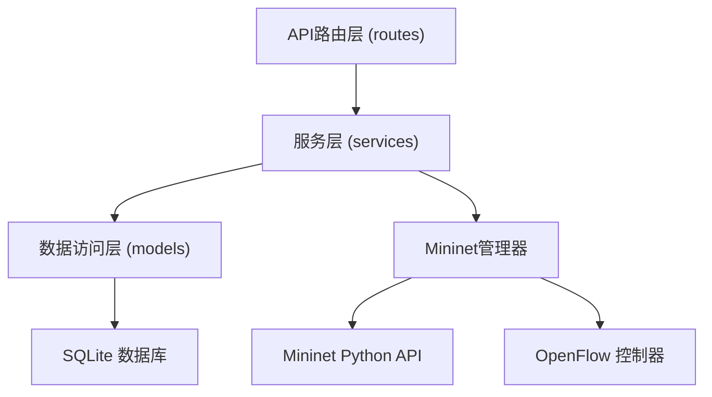
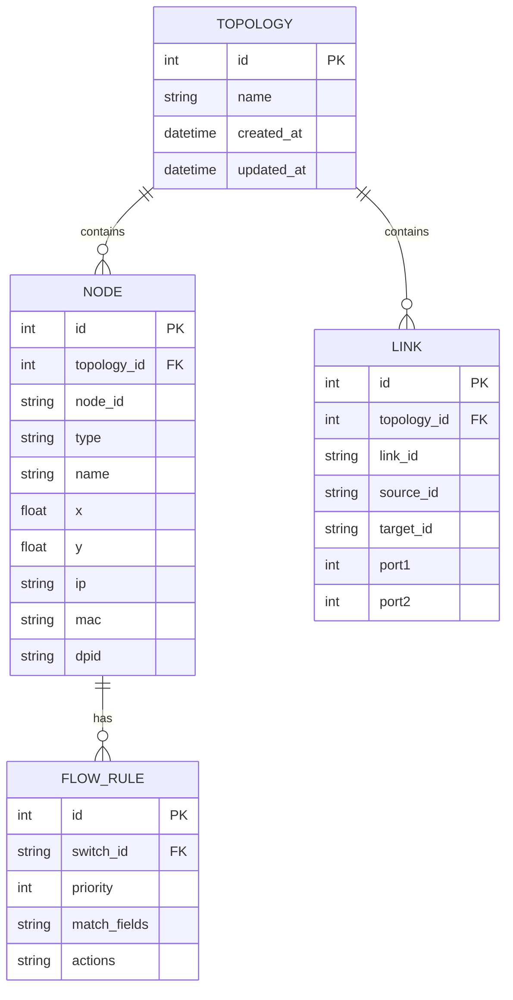

# Mininet网络仿真Web应用 - 技术架构文档

## 1. 架构设计


## 2. 技术栈描述

### 前端技术栈
- **框架**: React 18 + TypeScript
- **构建工具**: Vite
- **样式**: TailwindCSS 3
- **拓扑可视化**: react-flow (拖拽编辑) + SVG
- **状态管理**: Zustand
- **HTTP客户端**: Axios

### 后端技术栈
- **框架**: Flask (Python)
- **网络仿真**: Mininet + Open vSwitch
- **REST API**: Flask-RESTX
- **CORS**: flask-cors

### 数据库
- **数据库**: SQLite (开发) / PostgreSQL (生产)
- **ORM**: SQLAlchemy

## 3. 前端路由定义

| 路由 | 页面/组件 | 功能描述 |
|------|----------|---------|
| `/` | 主工作台 | 拓扑编辑器 + 流表配置 + 控制面板 |

## 4. API 定义

### 4.1 拓扑管理 API

```typescript
// 拓扑节点
interface TopologyNode {
  id: string;
  type: 'switch' | 'host';
  name: string;
  x: number;
  y: number;
  ip?: string;
  mac?: string;
  dpid?: string;
}

// 拓扑连接
interface TopologyLink {
  id: string;
  source: string;
  target: string;
  port1: number;
  port2: number;
}

// 流表规则
interface FlowRule {
  id: string;
  switchId: string;
  priority: number;
  match: {
    in_port?: number;
    eth_src?: string;
    eth_dst?: string;
    eth_type?: number;
    ip_src?: string;
    ip_dst?: string;
    ip_proto?: number;
    tp_src?: number;
    tp_dst?: number;
  };
  actions: Array<{
    type: 'OUTPUT' | 'DROP' | 'MODIFY' | 'FORWARD';
    port?: number;
    field?: string;
    value?: string;
  }>;
}
```

### 4.2 API 端点

| 方法 | 路径 | 功能 | 请求体 | 响应 |
|------|------|------|--------|------|
| GET | `/api/topologies` | 获取所有拓扑列表 | - | `Topology[]` |
| POST | `/api/topologies` | 保存新拓扑 | `{name, nodes, links}` | `Topology` |
| GET | `/api/topologies/:id` | 获取指定拓扑 | - | `Topology` |
| PUT | `/api/topologies/:id` | 更新拓扑 | `{nodes, links}` | `Topology` |
| DELETE | `/api/topologies/:id` | 删除拓扑 | - | - |
| POST | `/api/simulation/start` | 启动仿真 | `{topologyId}` | `{status, message}` |
| POST | `/api/simulation/stop` | 停止仿真 | - | `{status}` |
| GET | `/api/simulation/status` | 获取仿真状态 | - | `{running, stats}` |
| POST | `/api/flowrules` | 添加流表规则 | `FlowRule` | `FlowRule` |
| GET | `/api/flowrules/:switchId` | 获取交换机流表 | - | `FlowRule[]` |
| DELETE | `/api/flowrules/:id` | 删除流表规则 | - | - |
| POST | `/api/packet/send` | 发送测试包 | `{src, dst, type}` | `{packetId}` |
| GET | `/api/packet/:id/path` | 获取转发路径 | - | `{path, hops, matchedRules}` |

## 5. 后端架构



### 目录结构

```
backend/
├── app.py
├── config.py
├── requirements.txt
├── routes/
│   ├── topology.py
│   ├── simulation.py
│   ├── flowtable.py
│   └── packet.py
├── services/
│   ├── mininet_service.py
│   ├── topology_service.py
│   └── flow_service.py
├── models/
│   ├── topology.py
│   ├── flow_rule.py
│   └── database.py
└── utils/
    └── mininet_wrapper.py
```

## 6. 数据模型

### 6.1 ER图



### 6.2 DDL 语句

```sql
-- 拓扑表
CREATE TABLE topology (
    id INTEGER PRIMARY KEY AUTOINCREMENT,
    name VARCHAR(255) NOT NULL,
    created_at TIMESTAMP DEFAULT CURRENT_TIMESTAMP,
    updated_at TIMESTAMP DEFAULT CURRENT_TIMESTAMP
);

-- 节点表
CREATE TABLE node (
    id INTEGER PRIMARY KEY AUTOINCREMENT,
    topology_id INTEGER REFERENCES topology(id) ON DELETE CASCADE,
    node_id VARCHAR(50) NOT NULL,
    type VARCHAR(20) NOT NULL CHECK (type IN ('switch', 'host')),
    name VARCHAR(100) NOT NULL,
    x FLOAT NOT NULL DEFAULT 0,
    y FLOAT NOT NULL DEFAULT 0,
    ip VARCHAR(20),
    mac VARCHAR(20),
    dpid VARCHAR(30)
);

-- 连接表
CREATE TABLE link (
    id INTEGER PRIMARY KEY AUTOINCREMENT,
    topology_id INTEGER REFERENCES topology(id) ON DELETE CASCADE,
    link_id VARCHAR(50) NOT NULL,
    source_id VARCHAR(50) NOT NULL,
    target_id VARCHAR(50) NOT NULL,
    port1 INTEGER,
    port2 INTEGER
);

-- 流表规则表
CREATE TABLE flow_rule (
    id INTEGER PRIMARY KEY AUTOINCREMENT,
    rule_id VARCHAR(50) NOT NULL,
    switch_id VARCHAR(50) NOT NULL,
    priority INTEGER DEFAULT 100,
    match_fields TEXT NOT NULL,
    actions TEXT NOT NULL,
    created_at TIMESTAMP DEFAULT CURRENT_TIMESTAMP
);
```
