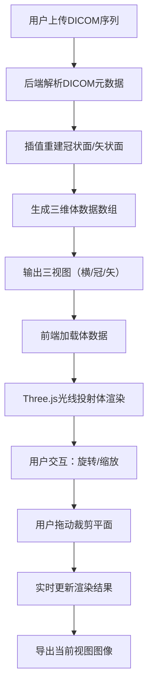

## 1. 产品概述

DICOM 3D 体渲染可视化平台，提供医学影像的三维重建与交互式分析功能。
- 面向医学研究者、放射科医生和医疗AI开发者，支持DICOM序列的读取、多平面重建和3D体渲染
- 核心价值：将二维DICOM切片转化为直观的三维可视化模型，支持交互式裁剪和图像导出

## 2. 核心功能

### 2.1 用户角色
| 角色 | 注册方式 | 核心权限 |
|------|---------|---------|
| 普通用户 | 无需注册，本地使用 | 上传DICOM序列、查看3D重建、调整裁剪平面、导出图像 |

### 2.2 功能模块
1. **首页/主界面**：DICOM上传区、3D体渲染画布、控制面板
2. **多平面查看器**：横断面、冠状面、矢状面三视图同步显示
3. **3D交互模块**：体渲染显示、可拖动裁剪平面、视角控制
4. **导出模块**：当前视图图像导出、裁剪平面截图

### 2.3 页面详情
| 页面名称 | 模块名称 | 功能描述 |
|---------|---------|---------|
| 主界面 | DICOM上传区 | 支持拖拽上传DICOM文件夹或多文件，显示上传进度和序列信息 |
| 主界面 | 3D体渲染画布 | Three.js光线投射体渲染，支持旋转、缩放、平移 |
| 主界面 | 裁剪平面控制 | 三轴可拖动裁剪平面（X/Y/Z），实时更新渲染结果 |
| 主界面 | 多平面视图 | 显示冠状面、矢状面、横断面重建图像，支持点击定位 |
| 主界面 | 渲染参数面板 | 调节窗宽窗位、传输函数、不透明度阈值 |
| 主界面 | 导出工具栏 | 导出PNG图像、保存裁剪平面截图 |

## 3. 核心流程

用户上传DICOM序列 → 后端解析并进行插值重建 → 生成体数据和三视图 → 前端加载体数据进行3D体渲染 → 用户交互调整裁剪平面和渲染参数 → 导出图像

## 4. 用户界面设计

### 4.1 设计风格
- 主色调：深空蓝 (#0a1628) 作为背景，医疗蓝 (#2563eb) 作为主色，青色 (#06b6d4) 作为强调色
- 辅助色：语义绿 (#10b981)、警告橙 (#f59e0b)、错误红 (#ef4444)
- 按钮风格：扁平化设计，圆角4px，悬停时轻微上浮效果
- 字体：JetBrains Mono 作为等宽字体用于数据显示，Inter 作为界面字体
- 布局：左侧控制面板 + 中央3D画布 + 右侧多平面视图三栏布局
- 图标：Lucide 图标库，线性风格，统一16px/20px尺寸

### 4.2 页面设计概述
| 页面名称 | 模块名称 | UI 元素 |
|---------|---------|---------|
| 主界面 | 3D画布区 | 深色背景、居中渲染、坐标轴指示器、十字准星、悬浮工具提示 |
| 主界面 | 左侧控制面板 | 分组折叠面板、滑块控件、颜色选择器、开关按钮 |
| 主界面 | 右侧多平面视图 | 三个等分布局的2D视图、同步十字线、切片索引滑块 |
| 主界面 | 顶部工具栏 | 上传按钮、视图预设、导出按钮、帮助按钮 |
| 主界面 | 底部状态栏 | 当前序列信息、体素尺寸、内存占用、FPS显示 |

### 4.3 响应式
- 桌面端优先（1920×1080+），三栏固定布局
- 平板端：左右面板可折叠，中央画布自适应
- 移动端：简化为单栏布局，3D画布全屏，控制面板抽屉式显示
- 触摸支持：双指缩放、单指旋转、三指平移

### 4.4 3D场景指导
- 环境：纯黑背景，无HDRI，突出医学影像本身
- 光照：双向光源，前上方主光 + 后下方补光，避免过强阴影
- 相机：透视相机，初始距离为体数据对角线的2倍，看向场景中心
- 交互：TrackballControls 支持自由旋转，禁用滚屏
- 后处理：FXAA抗锯齿，轻微对比度增强
- 性能目标：60 FPS，体数据最大支持 512×512×256
- 裁剪平面：三个半透明平面，可通过鼠标拖动调整位置，平面边缘高亮显示
