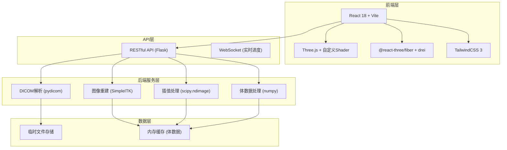
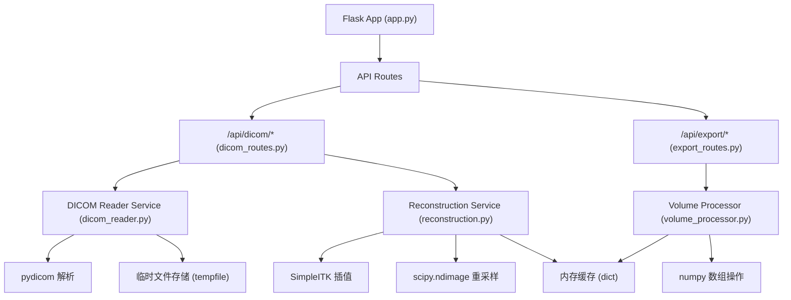

## 1. 架构设计



## 2. 技术描述

- **前端**：React 18 + Vite 5 + TailwindCSS 3 + TypeScript
- **3D渲染**：Three.js r160 + @react-three/fiber 8 + @react-three/drei 9
- **后端**：Python 3.10 + Flask 3.0
- **医学影像处理**：pydicom 2.4 + SimpleITK 2.3 + scipy 1.11 + numpy 1.26
- **数据传输**：JSON + 二进制ArrayBuffer（体数据）
- **跨域**：Flask-CORS

## 3. 目录结构

```
p140/
├── backend/                    # Python 后端
│   ├── app.py                 # Flask 主应用
│   ├── requirements.txt       # Python 依赖
│   ├── services/
│   │   ├── dicom_reader.py    # DICOM 解析服务
│   │   ├── reconstruction.py  # 多平面重建服务
│   │   └── volume_processor.py # 体数据处理
│   └── api/
│       ├── dicom_routes.py    # DICOM 相关路由
│       └── export_routes.py   # 导出相关路由
├── frontend/                   # React 前端
│   ├── src/
│   │   ├── components/
│   │   │   ├── VolumeRenderer.tsx    # 3D体渲染组件
│   │   │   ├── ClipPlane.tsx         # 裁剪平面组件
│   │   │   ├── MultiPlanarView.tsx   # 多平面视图
│   │   │   ├── ControlPanel.tsx      # 控制面板
│   │   │   └── DicomUploader.tsx     # DICOM上传组件
│   │   ├── shaders/
│   │   │   ├── raycast.vert          # 光线投射顶点着色器
│   │   │   └── raycast.frag          # 光线投射片元着色器
│   │   ├── services/
│   │   │   └── api.ts                # API调用封装
│   │   ├── store/
│   │   │   └── useVolumeStore.ts     # 状态管理
│   │   └── types/
│   │       └── index.ts              # TypeScript类型定义
│   ├── package.json
│   └── vite.config.ts
└── .trae/documents/           # 项目文档
```

## 4. 路由定义

| 前端路由 | 页面/组件 | 功能 |
|---------|----------|------|
| / | App.tsx | 主应用页面 |

## 5. API 定义

### 5.1 TypeScript 类型定义

```typescript
// 体数据元信息
interface VolumeMeta {
  dimensions: { x: number; y: number; z: number };
  spacing: { x: number; y: number; z: number };
  origin: { x: number; y: number; z: number };
  minValue: number;
  maxValue: number;
  patientInfo: {
    name: string;
    id: string;
    studyDate: string;
  };
}

// 多平面图像数据
interface MultiPlanarData {
  axial: { data: Uint8Array; width: number; height: number };
  sagittal: { data: Uint8Array; width: number; height: number };
  coronal: { data: Uint8Array; width: number; height: number };
}

// 渲染参数
interface RenderParams {
  windowWidth: number;
  windowLevel: number;
  opacityThreshold: number;
  sampleDistance: number;
}

// 裁剪平面状态
interface ClipPlaneState {
  x: { enabled: boolean; position: number };
  y: { enabled: boolean; position: number };
  z: { enabled: boolean; position: number };
}
```

### 5.2 REST API 接口

| 方法 | 路径 | 请求 | 响应 | 说明 |
|-----|------|------|------|------|
| POST | /api/dicom/upload | multipart/form-data (files) | `{ sessionId: string; meta: VolumeMeta }` | 上传DICOM序列 |
| GET | /api/dicom/:sessionId/volume | - | `ArrayBuffer` (原始体数据) | 获取三维体数据 |
| GET | /api/dicom/:sessionId/mpr | `?axial=N&sagittal=N&coronal=N` | `MultiPlanarData` | 获取多平面重建图像 |
| GET | /api/dicom/:sessionId/meta | - | `VolumeMeta` | 获取体数据元信息 |
| POST | /api/export/image | `{ sessionId, viewMatrix, projectionMatrix }` | `{ imageUrl: string }` | 导出当前视图图像 |
| POST | /api/export/slice | `{ sessionId, plane, index }` | `{ imageUrl: string }` | 导出指定平面截图 |

### 5.3 体数据传输格式

- 体数据以 16-bit 无符号整数 (Uint16Array) 二进制形式传输
- 数据顺序：z轴优先（slice by slice），每个slice内为行优先
- 前16字节为头部信息：dimensions (3×uint32) + spacing (3×float32)

## 6. 服务器架构



## 7. 核心技术实现要点

### 7.1 后端 - DICOM 处理与重建

1. **DICOM 序列读取**：使用 pydicom 批量读取，按 InstanceNumber 排序，处理不同厂商的私有标签
2. **插值重建**：
   - 冠状面(Coronal)：沿Y轴方向提取并使用三线性插值
   - 矢状面(Sagittal)：沿X轴方向提取并使用三线性插值
   - 使用 SimpleITK 的 Resample 滤波器进行各向同性重采样
3. **体数据标准化**：将CT值(HU)映射到 0-4095 范围，去除空气和金属伪影
4. **窗宽窗位处理**：支持预设（肺窗、纵隔窗、骨窗）和自定义调整

### 7.2 前端 - Three.js 体渲染

1. **光线投射算法 (Ray Casting)**：
   - 自定义片元着色器实现体绘制
   - 使用 3D Texture 存储体数据
   - 等面绘制 (MIP/VR/ISO) 支持
2. **裁剪平面实现**：
   - 三个正交平面，可通过 TransformControls 拖动
   - Shader 中 discard 被裁剪区域的片元
   - 平面边缘高亮显示当前位置
3. **传输函数 (Transfer Function)**：
   - 可编辑的不透明度和颜色映射
   - 实时更新 1D Texture 传给着色器

### 8. 性能优化

- **后端**：使用 lru_cache 缓存重建结果，多线程处理大体积数据
- **前端**：
  - 体数据分块加载（若超过512³）
  - 自适应采样距离（交互时降低质量）
  - WebWorker 处理数据解码
  - 设备像素比限制 (max 1.5)
