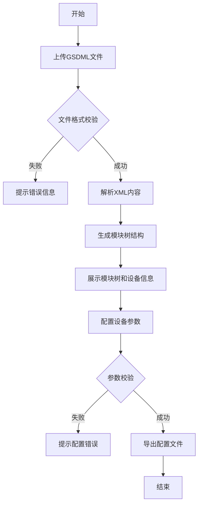

# GSDML文件解析与PROFINET设备配置系统 产品需求文档

## 1. 产品概述
GSDML文件解析与PROFINET设备配置系统是一个面向工业自动化工程师的Web工具，用于解析PROFINET设备的GSDML描述文件，可视化展示设备模块结构，并生成可导出的设备配置文件。
- 解决工业现场PROFINET设备配置繁琐、易出错的问题
- 提升设备调试效率，降低配置错误率

## 2. 核心功能

### 2.1 用户角色
| 角色 | 注册方式 | 核心权限 |
|------|---------|---------|
| 工程师 | 无需注册，直接使用 | 上传GSDML文件、解析查看模块结构、配置设备参数、导出配置文件 |

### 2.2 功能模块
1. **主页面**: GSDML文件上传区、模块树展示区、设备配置区
2. **文件上传**: 支持拖拽上传GSDML XML文件，文件格式验证
3. **模块树展示**: 层级展示设备、模块、子模块、IO数据点
4. **设备配置**: 设备名称、IP地址、子网掩码、网关等参数配置
5. **配置导出**: 支持导出JSON/XML格式的设备配置文件

### 2.3 页面详情
| 页面名称 | 模块名称 | 功能描述 |
|---------|---------|---------|
| 主页面 | 文件上传区 | 拖拽上传、点击选择、文件格式校验、上传状态反馈 |
| 主页面 | 模块树展示 | 可展开/折叠的树形结构、模块信息详情、IO数据展示 |
| 主页面 | 设备配置区 | 设备名称、IP地址、子网掩码、网关配置表单、实时验证 |
| 主页面 | 导出功能区 | 选择导出格式、预览配置、下载文件 |

## 3. 核心流程

## 4. 用户界面设计

### 4.1 设计风格
- **主色调**: 工业蓝 (#165DFF)，体现专业、可靠的工业软件特质
- **辅助色**: 成功绿 (#00B42A)、警告橙 (#FF7D00)、错误红 (#F53F3F)
- **按钮风格**: 圆角设计，悬停时有轻微上浮和阴影效果
- **字体**: 采用 Roboto Mono 作为代码展示字体，Inter 作为界面字体
- **布局风格**: 三栏布局（左侧模块树、中间配置区、右侧详情）
- **图标风格**: 使用线性图标，简洁专业

### 4.2 页面设计概述
| 页面名称 | 模块名称 | UI元素 |
|---------|---------|--------|
| 主页面 | 文件上传区 | 拖拽区域、虚线边框、上传图标、文件格式提示、进度条 |
| 主页面 | 模块树展示 | 树形控件、展开/折叠动画、选中高亮、模块图标区分 |
| 主页面 | 设备配置区 | 表单输入框、IP地址格式验证、实时错误提示、保存按钮 |
| 主页面 | 导出功能区 | 下拉选择格式、预览按钮、下载按钮、成功动画 |

### 4.3 响应式
- Desktop-first设计，优先保证桌面端体验
- 平板端：左右两栏布局，详情区折叠为抽屉
- 移动端：单栏垂直布局，模块树可折叠收起

### 4.4 交互动效
- 模块树展开/折叠使用平滑的高度过渡动画
- 文件拖拽进入区域时有边框高亮和轻微缩放效果
- 配置保存成功时有短暂的成功提示动画
- 按钮悬停时使用轻微的上浮效果和阴影加深
