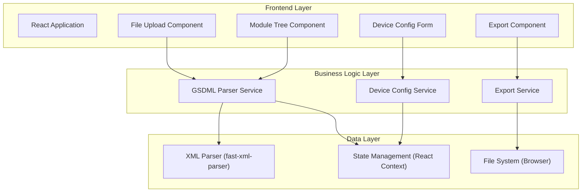

# GSDML文件解析与PROFINET设备配置系统 技术架构文档

## 1. 架构设计


## 2. 技术选型

| 类别 | 技术栈 | 版本 | 说明 |
|------|--------|------|------|
| 前端框架 | React | 18.x | 组件化UI框架 |
| 构建工具 | Vite | 5.x | 快速构建和开发服务器 |
| 语言 | TypeScript | 5.x | 类型安全 |
| 样式 | TailwindCSS | 3.x | 原子化CSS框架 |
| XML解析 | fast-xml-parser | 4.x | 高性能XML解析器 |
| 图标 | lucide-react | 0.x | 轻量级图标库 |

## 3. 目录结构

```
src/
├── components/
│   ├── FileUpload/         # 文件上传组件
│   ├── ModuleTree/         # 模块树组件
│   ├── DeviceConfig/       # 设备配置表单
│   ├── ExportPanel/        # 导出面板
│   └── common/             # 通用组件
├── services/
│   ├── gsdmlParser.ts      # GSDML解析服务
│   ├── configService.ts    # 配置服务
│   └── exportService.ts    # 导出服务
├── types/
│   └── gsdml.ts            # 类型定义
├── context/
│   └── AppContext.tsx      # 应用状态管理
├── hooks/
│   └── useGSDML.ts         # 自定义Hook
├── utils/
│   └── validators.ts       # 验证工具
├── App.tsx                 # 主应用组件
└── main.tsx                # 入口文件
```

## 4. 核心数据模型

### 4.1 GSDML设备数据结构

```typescript
interface GSDMLDevice {
  vendorId: string;
  vendorName: string;
  deviceId: string;
  deviceName: string;
  familyName: string;
  productId: string;
  version: string;
  modules: Module[];
}

interface Module {
  id: string;
  name: string;
  type: 'module' | 'submodule' | 'io';
  description?: string;
  submodules?: Submodule[];
  ioData?: IOData[];
}

interface Submodule {
  id: string;
  name: string;
  description?: string;
  ioData?: IOData[];
}

interface IOData {
  id: string;
  name: string;
  direction: 'input' | 'output';
  length: number;
  unit?: string;
}
```

### 4.2 设备配置数据结构

```typescript
interface DeviceConfig {
  deviceName: string;
  ipAddress: string;
  subnetMask: string;
  gateway: string;
  stationName: string;
  selectedModules: string[];
  createdAt: string;
  updatedAt: string;
}
```

## 5. 核心API定义

### 5.1 GSDML解析服务

```typescript
interface IGSDMLParserService {
  parse(xmlContent: string): Promise<GSDMLDevice>;
  validate(xmlContent: string): boolean;
  getModuleTree(device: GSDMLDevice): TreeNode[];
}
```

### 5.2 配置服务

```typescript
interface IConfigService {
  createDefaultConfig(device: GSDMLDevice): DeviceConfig;
  validateConfig(config: DeviceConfig): ValidationResult;
  updateConfig(config: DeviceConfig, updates: Partial<DeviceConfig>): DeviceConfig;
}
```

### 5.3 导出服务

```typescript
interface IExportService {
  exportToJSON(config: DeviceConfig, device: GSDMLDevice): string;
  exportToXML(config: DeviceConfig, device: GSDMLDevice): string;
  downloadFile(content: string, filename: string, format: 'json' | 'xml'): void;
}
```

## 6. 关键技术点

### 6.1 XML解析策略
- 使用 fast-xml-parser 进行XML到JSON的转换
- 实现GSDML特定结构的解析器，提取模块、子模块、IO数据
- 支持多种GSDML版本兼容

### 6.2 模块树渲染
- 递归组件实现树形结构
- 虚拟滚动优化大数据量渲染
- 展开/折叠动画效果

### 6.3 IP地址验证
- 正则表达式验证IP格式
- 子网掩码合法性检查
- 网关与IP网段一致性验证

### 6.4 文件导出
- Blob对象实现浏览器端文件下载
- 支持JSON和XML两种格式
- 导出内容包含完整设备信息和配置
