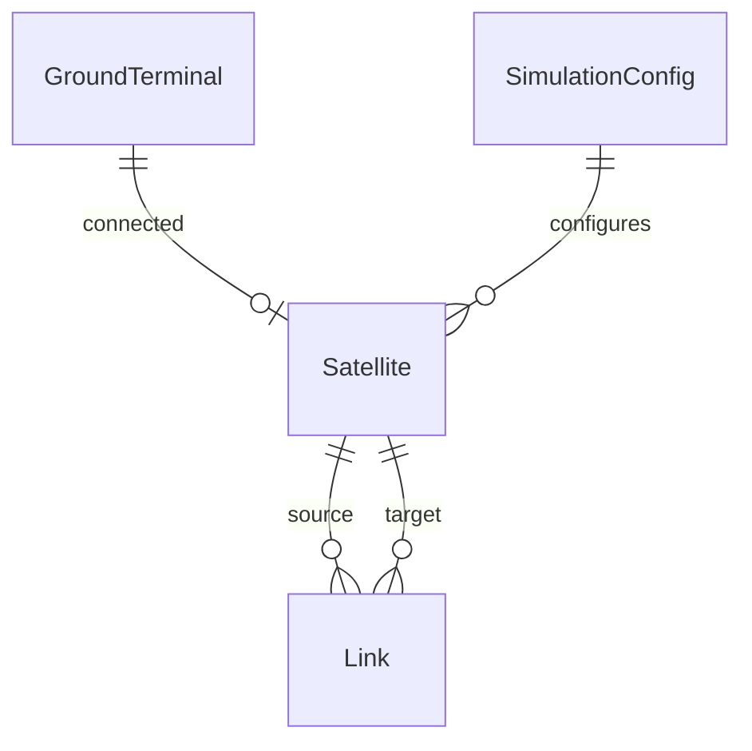

## 1. 架构设计

```mermaid
flowchart TD
    subgraph "前端 (React + Three.js)"
        "3D渲染层 (Earth, Satellites, Links)"
        "UI控制层 (ControlPanel, DataPanel)"
        "状态管理层 (Zustand)"
    end
    subgraph "后端 (Express + TypeScript)"
        "API路由层 (Routes)"
        "计算服务层 (OrbitPropagation, LinkCalculation)"
        "数据模型层 (Satellite, Link, Terminal)"
    end
    subgraph "通信"
        "REST API (参数配置)"
        "WebSocket (实时数据推送)"
    end
    "前端" <--> "通信"
    "通信" <--> "后端"
```

## 2. 技术说明

- **前端**：React 18 + TypeScript + Vite + Three.js + @react-three/fiber + @react-three/drei + @react-three/postprocessing + Zustand + TailwindCSS
- **初始化工具**：vite-init
- **后端**：Express 4 + TypeScript + WebSocket (ws)
- **数据库**：无需持久化，使用内存数据结构

## 3. 路由定义

| 路由 | 用途 |
|------|------|
| / | 主页面，3D星座可视化+控制面板+数据面板 |
| /api/satellites | 获取卫星列表及位置数据 |
| /api/links | 获取星间链路拓扑数据 |
| /api/calculate/propagation-delay | 计算指定链路的传播延迟 |
| /api/calculate/doppler | 计算指定链路的多普勒频移 |
| /ws | WebSocket实时数据推送通道 |

## 4. API定义

### 4.1 类型定义

```typescript
interface Satellite {
  id: string
  name: string
  orbitPlane: number
  orbitAltitude: number  // km
  orbitInclination: number  // degrees
  orbitPhase: number  // degrees
  position: { x: number, y: number, z: number }  // ECI coordinates
  velocity: { vx: number, vy: number, vz: number }
}

interface Link {
  id: string
  sourceId: string
  targetId: string
  distance: number  // km
  propagationDelay: number  // ms
  dopplerShift: number  // kHz
  status: 'active' | 'inactive'
}

interface GroundTerminal {
  id: string
  name: string
  latitude: number
  longitude: number
  connectedSatelliteId: string | null
}

interface SimulationConfig {
  satelliteCount: number
  orbitAltitude: number  // km
  orbitInclination: number  // degrees
  planeCount: number
  timeSpeed: number  // 1x ~ 1000x
  linkThreshold: number  // km
}
```

### 4.2 请求/响应模式

**GET /api/satellites**
```typescript
// Response
{
  satellites: Satellite[]
  timestamp: number
}
```

**POST /api/calculate/propagation-delay**
```typescript
// Request
{ sourceId: string, targetId: string }

// Response
{
  sourceId: string
  targetId: string
  distance: number
  propagationDelay: number
  timestamp: number
}
```

**POST /api/calculate/doppler**
```typescript
// Request
{ sourceId: string, targetId: string, frequency: number }

// Response
{
  sourceId: string
  targetId: string
  frequency: number
  dopplerShift: number
  relativeVelocity: number
  timestamp: number
}
```

## 5. 服务端架构图

```mermaid
flowchart TD
    "路由层 (Routes)" --> "控制器层 (Controllers)"
    "控制器层" --> "服务层 (Services)"
    "服务层" --> "计算层 (Calculators)"
    "服务层" --> "状态层 (StateManager)"
    "计算层" --> "轨道传播 (OrbitPropagator)"
    "计算层" --> "延迟计算 (DelayCalculator)"
    "计算层" --> "多普勒计算 (DopplerCalculator)"
    "计算层" --> "拓扑管理 (TopologyManager)"
    "状态层" --> "内存存储 (InMemoryStore)"
```

## 6. 数据模型

### 6.1 数据模型定义



### 6.2 内存数据结构

```typescript
// 卫星状态存储
const satellites: Map<string, Satellite> = new Map()

// 链路状态存储
const links: Map<string, Link> = new Map()

// 地面终端存储
const groundTerminals: Map<string, GroundTerminal> = new Map()

// 仿真配置
let simulationConfig: SimulationConfig = defaultConfig
```