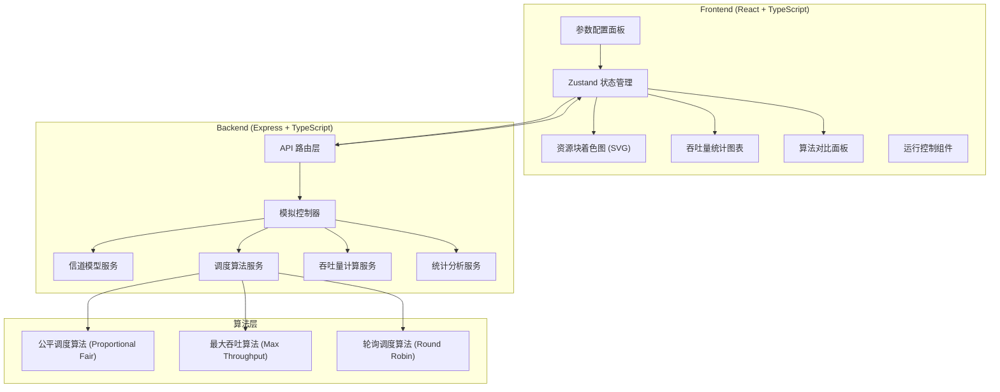
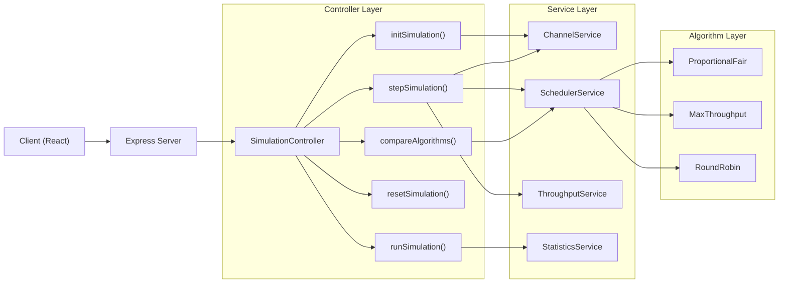
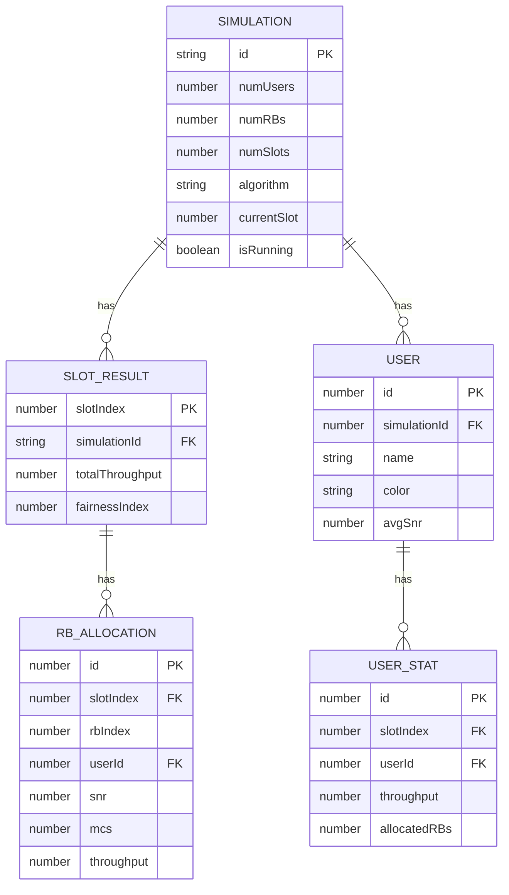

## 1. 架构设计



## 2. 技术描述

- **前端**：React@18 + TypeScript + Vite + TailwindCSS@3 + Zustand + Recharts
- **后端**：Express@4 + TypeScript
- **初始化工具**：vite-init (react-express-ts 模板)
- **数据通信**：RESTful API + JSON
- **可视化**：原生 SVG 绘制资源块网格，Recharts 绘制统计图表

## 3. 路由定义

| 路由 | 方法 | 用途 |
|-------|------|---------|
| `/` | GET | 模拟器主页 |
| `/api/simulation/init` | POST | 初始化模拟，创建用户和信道 |
| `/api/simulation/step` | POST | 执行一个时隙的调度 |
| `/api/simulation/run` | POST | 运行指定数量的时隙 |
| `/api/simulation/reset` | POST | 重置模拟状态 |
| `/api/simulation/result` | GET | 获取当前模拟结果和统计数据 |
| `/api/algorithm/compare` | POST | 对比两种算法在相同场景下的性能 |

## 4. API 类型定义

```typescript
// 共享类型定义 (shared/types.ts)

export interface User {
  id: number;
  name: string;
  color: string;
  snr: number;           // 当前信噪比 (dB)
  avgSnr: number;        // 平均信噪比
  throughput: number;    // 当前时隙吞吐量
  totalThroughput: number; // 累计吞吐量
  allocatedRBs: number[]; // 当前分配的RB索引
}

export interface ChannelModel {
  type: 'AWGN' | 'Rayleigh' | 'Rician';
  kFactor?: number;      // Rician K因子
  dopplerFreq: number;   // 多普勒频移
  speed: number;         // 用户移动速度 (km/h)
}

export interface SimulationConfig {
  numUsers: number;       // 用户数量 (2-20)
  numRBs: number;         // 资源块数量 (4-100)
  numSlots: number;       // 总时隙数 (10-1000)
  snrMin: number;         // 最小SNR (dB)
  snrMax: number;         // 最大SNR (dB)
  channelModel: ChannelModel;
  algorithm: 'fair' | 'maxThroughput' | 'roundRobin';
  compareMode: boolean;   // 是否开启算法对比模式
}

export interface RBAllocation {
  rbIndex: number;
  userId: number;
  snr: number;
  mcs: number;            // 调制编码方案
  throughput: number;     // 该RB上的吞吐量
}

export interface SlotResult {
  slotIndex: number;
  allocations: RBAllocation[];
  userStats: {
    userId: number;
    throughput: number;
    allocatedRB: number;
  }[];
  totalThroughput: number;
  fairnessIndex: number;  // Jain's公平性指数
}

export interface SimulationResult {
  config: SimulationConfig;
  currentSlot: number;
  isRunning: boolean;
  slotResults: SlotResult[];
  summary: {
    totalThroughput: number;
    avgThroughput: number;
    userThroughputs: { userId: number; total: number; avg: number }[];
    fairnessIndex: number;
  };
  compareResult?: {
    algorithm1: { name: string; summary: SimulationResult['summary'] };
    algorithm2: { name: string; summary: SimulationResult['summary'] };
  };
}

// API 请求/响应类型
export type InitRequest = SimulationConfig;
export interface StepResponse {
  success: boolean;
  result: SlotResult;
  currentSlot: number;
}
export interface RunRequest {
  numSlots?: number;      // 运行的时隙数，默认到结束
}
export interface RunResponse {
  success: boolean;
  result: SimulationResult;
}
```

## 5. 服务器架构图



## 6. 数据模型

### 6.1 核心数据模型



### 6.2 核心算法说明

**1. 最大吞吐算法 (Max Throughput)**
- 每个RB分配给当前SNR最高的用户
- 目标：最大化系统总吞吐量
- 缺点：可能导致信道差的用户"饿死"

**2. 公平调度算法 (Proportional Fair)**
- 优先级 = 当前吞吐量 / 历史平均吞吐量
- 平衡系统吞吐量和用户间公平性
- 公式：`priority_i = R_i(t) / T_i(t)`

**3. 轮询调度 (Round Robin)**
- 按顺序循环分配RB给各用户
- 完全公平，但不考虑信道状态
- 作为对比基准

**4. 吞吐量计算 (香农公式)**
- `throughput = RB_bandwidth * log2(1 + SNR_linear)`
- SNR_linear = 10^(SNR_dB / 10)
- MCS等级根据SNR映射
