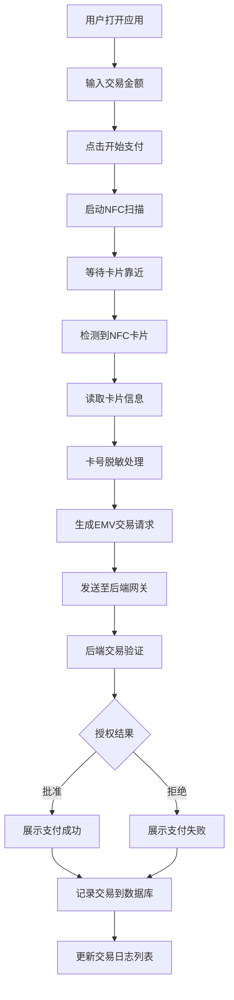

## 1. 产品概述

WebNFC非接支付模拟应用，通过Web NFC技术模拟真实的银行卡非接支付流程。用户使用支持NFC的手机贴近NFC卡片或标签，应用模拟生成EMV交易请求，后端模拟银行网关返回授权结果，展示完整的交易日志并对卡号进行脱敏处理。

- 解决的问题：提供安全的支付流程演示与测试环境，帮助开发者和测试人员理解EMV非接支付流程
- 目标用户：支付行业开发者、测试人员、技术培训人员
- 产品价值：降低支付系统开发测试成本，提供直观的支付流程可视化演示

## 2. 核心功能

### 2.1 用户角色
无需登录认证，所有用户均可使用全部功能。

### 2.2 功能模块
1. **支付首页**：NFC读卡触发区域、交易金额输入、支付状态展示
2. **交易日志页**：历史交易记录列表、交易详情查看
3. **交易详情弹窗**：完整EMV数据包展示、授权结果详情、卡号脱敏显示

### 2.3 页面详情
| 页面名称 | 模块名称 | 功能描述 |
|-----------|-------------|---------------------|
| 支付首页 | NFC读卡区域 | 点击触发NFC扫描，检测NFC支持状态，监听卡片靠近事件 |
| 支付首页 | 金额输入 | 支持手动输入交易金额，预设快捷金额按钮 |
| 支付首页 | 支付动画 | 读卡过程动画、授权中状态动画、成功/失败结果展示 |
| 支付首页 | 卡号展示 | 读取到卡号后进行脱敏显示（如6222 **** **** 1234） |
| 交易日志页 | 交易列表 | 按时间倒序展示所有交易记录，包含金额、状态、时间 |
| 交易日志页 | 筛选功能 | 按交易状态（成功/失败）筛选记录 |
| 交易详情弹窗 | EMV数据展示 | 展示完整的交易请求数据和响应数据结构 |
| 交易详情弹窗 | 授权详情 | 展示授权码、响应码、交易参考号等信息 |

## 3. 核心流程

用户在手机上打开应用，输入交易金额后点击"开始支付"按钮，应用启动NFC扫描。用户将NFC卡片贴近手机背面NFC区域，应用读取卡片信息后生成EMV交易请求数据包，发送至后端模拟银行网关。后端进行交易验证后返回授权结果（批准/拒绝），前端展示最终结果并将交易记录存入数据库。

## 4. 用户界面设计

### 4.1 设计风格
- **主色调**：深邃蓝色 (#0F172A) 作为主背景，搭配科技感青色 (#22D3EE) 作为主色调，金色 (#FBBF24) 作为成功状态色，红色 (#EF4444) 作为失败状态色
- **按钮风格**：圆角胶囊型按钮，带微发光效果，按下时有按压动效
- **字体**：使用 Space Mono 作为数字字体（金额、卡号），Inter 作为正文字体，营造金融科技感
- **布局风格**：卡片式布局，玻璃拟态效果（backdrop-filter），层次感分明
- **图标风格**：线性简洁图标，搭配微动画效果

### 4.2 页面设计概述
| 页面名称 | 模块名称 | UI Elements |
|-----------|-------------|-------------|
| 支付首页 | NFC读卡区域 | 居中圆形NFC图标，脉冲波纹动画，渐变背景，玻璃拟态卡片 |
| 支付首页 | 金额输入 | 大号数字输入框，千分位格式化，快捷金额按钮组 |
| 支付首页 | 状态展示 | 状态文字配合图标动画，成功/失败时全屏遮罩过渡效果 |
| 支付首页 | 卡号展示 | 等宽字体，中间星号占位，卡片样式展示 |
| 交易日志页 | 交易列表 | 左侧时间线，右侧交易信息卡片，悬停高亮效果 |
| 交易日志页 | 筛选栏 | 标签式筛选器，选中态有下划线动画 |
| 交易详情弹窗 | EMV数据 | JSON格式化展示，可折叠展开，语法高亮 |
| 交易详情弹窗 | 授权详情 | 网格布局，标签值对，关键信息高亮 |

### 4.3 响应性
采用 **mobile-first** 设计策略，针对手机端优化：
- 视口适配：使用 viewport meta 标签，禁止缩放
- 触控优化：按钮最小高度 48px，触控区域充足
- 布局：单列垂直流式布局，关键操作区域位于屏幕下半部分便于拇指操作
- 横屏适配：关键信息保持可见，支付区域居中显示
- NFC区域：位于页面上半部分，与手机NFC天线位置对应

### 4.4 动效设计
- **NFC扫描动画**：圆形波纹向外扩散，透明度渐变，循环播放
- **读卡成功**：卡片信息从下向上滑入，配合弹性缓动
- **授权过程**：三点加载动画，文字"授权处理中..."逐字显现
- **结果展示**：成功时金色勾形图标绘制动画，失败时红色叉形图标抖动效果
- **页面切换**：左右滑入过渡，模拟原生App切换效果
