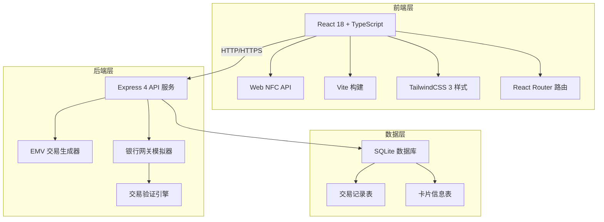
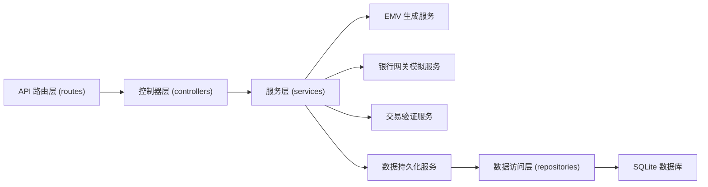
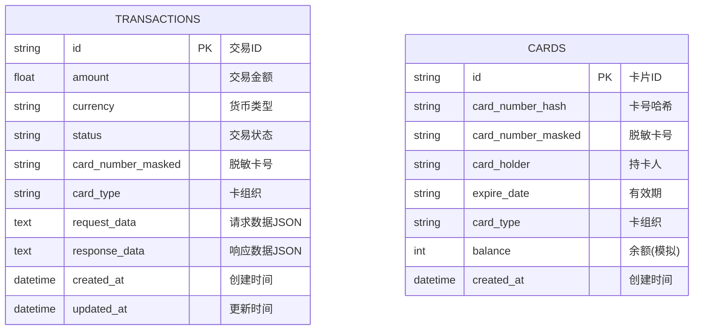

## 1. 架构设计



## 2. 技术描述

- **前端**：React@18 + TypeScript + TailwindCSS@3 + Vite
- **初始化工具**：npm create vite@latest
- **后端**：Express@4 + TypeScript
- **数据库**：SQLite（通过 better-sqlite3 驱动）
- **NFC支持**：Web NFC API (NDEFReader)，提供降级模拟方案
- **状态管理**：React Context + useReducer

## 3. 路由定义

| 路由 | 页面组件 | 用途 |
|-------|---------|-------|
| / | PaymentPage | 支付首页，NFC读卡、金额输入、支付流程 |
| /transactions | TransactionsPage | 交易日志列表页 |
| /transactions/:id | TransactionDetailPage | 交易详情页 |

## 4. API 定义

### TypeScript 类型定义
```typescript
// 交易状态枚举
enum TransactionStatus {
  PENDING = 'pending',
  APPROVED = 'approved',
  DECLINED = 'declined',
  FAILED = 'failed'
}

// 卡片信息
interface CardInfo {
  cardNumber: string;
  cardNumberMasked: string;
  cardHolder: string;
  expireDate: string;
  cardType: 'VISA' | 'MASTERCARD' | 'UNIONPAY';
}

// EMV交易请求
interface EMVTransactionRequest {
  amount: number;
  currency: string;
  timestamp: string;
  cardInfo: CardInfo;
  terminalInfo: {
    terminalId: string;
    merchantId: string;
    merchantName: string;
  };
  emvData: {
    tag9F02: string; // 授权金额
    tag9F03: string; // 其他金额
    tag9F1A: string; // 终端国家代码
    tag95: string;   // 终端验证结果
    tag9A: string;   // 交易日期
    tag9C: string;   // 交易类型
    tag9F37: string; // 不可预测数
  };
}

// 银行网关响应
interface BankGatewayResponse {
  transactionId: string;
  status: TransactionStatus;
  responseCode: string;
  responseMessage: string;
  authorizationCode: string;
  retrievalReferenceNumber: string;
  timestamp: string;
  riskScore?: number;
}

// 交易记录
interface TransactionRecord {
  id: string;
  amount: number;
  currency: string;
  status: TransactionStatus;
  cardNumberMasked: string;
  cardType: string;
  requestData: EMVTransactionRequest;
  responseData: BankGatewayResponse;
  createdAt: string;
  updatedAt: string;
}
```

### API 接口

| 方法 | 路径 | 描述 | 请求体 | 响应体 |
|------|------|------|--------|--------|
| POST | /api/transactions | 创建交易（模拟银行授权） | `EMVTransactionRequest` | `BankGatewayResponse` |
| GET | /api/transactions | 获取交易列表 | Query: `status`, `limit`, `offset` | `{ total: number; items: TransactionRecord[] }` |
| GET | /api/transactions/:id | 获取交易详情 | - | `TransactionRecord` |

## 5. 后端服务架构



### 模块划分
- `src/server/routes/` - API 路由定义
- `src/server/controllers/` - 请求处理与响应
- `src/server/services/` - 业务逻辑处理
  - `emv.service.ts` - EMV 数据生成
  - `bank-gateway.service.ts` - 银行网关模拟
  - `transaction.service.ts` - 交易管理
- `src/server/repositories/` - 数据访问层
- `src/server/models/` - 数据库模型定义
- `src/server/utils/` - 工具函数

## 6. 数据模型

### 6.1 ER 图


### 6.2 DDL 语句
```sql
-- 交易记录表
CREATE TABLE IF NOT EXISTS transactions (
  id TEXT PRIMARY KEY,
  amount REAL NOT NULL,
  currency TEXT NOT NULL DEFAULT 'CNY',
  status TEXT NOT NULL DEFAULT 'pending',
  card_number_masked TEXT NOT NULL,
  card_type TEXT NOT NULL,
  request_data TEXT,
  response_data TEXT,
  created_at DATETIME DEFAULT CURRENT_TIMESTAMP,
  updated_at DATETIME DEFAULT CURRENT_TIMESTAMP
);

CREATE INDEX idx_transactions_status ON transactions(status);
CREATE INDEX idx_transactions_created_at ON transactions(created_at);

-- 卡片信息表（模拟用）
CREATE TABLE IF NOT EXISTS cards (
  id TEXT PRIMARY KEY,
  card_number_hash TEXT UNIQUE NOT NULL,
  card_number_masked TEXT NOT NULL,
  card_holder TEXT NOT NULL,
  expire_date TEXT NOT NULL,
  card_type TEXT NOT NULL,
  balance INTEGER DEFAULT 1000000,
  created_at DATETIME DEFAULT CURRENT_TIMESTAMP
);

-- 初始化模拟卡片数据
INSERT OR IGNORE INTO cards (id, card_number_hash, card_number_masked, card_holder, expire_date, card_type, balance) VALUES
('card_001', 'hash_622202******1234', '6222 **** **** 1234', 'ZHANG SAN', '12/28', 'UNIONPAY', 500000),
('card_002', 'hash_411111******1111', '4111 **** **** 1111', 'JOHN DOE', '06/27', 'VISA', 1000000),
('card_003', 'hash_555555******4444', '5555 **** **** 4444', 'JANE SMITH', '03/29', 'MASTERCARD', 300000);
```

### 6.3 银行网关模拟规则
- **批准条件**（70%概率）：
  - 金额 <= 卡片余额
  - 卡片未过期
  - 风险评分 < 80
  
- **拒绝条件**：
  - 余额不足 → 响应码 `51`
  - 卡片过期 → 响应码 `54`
  - 金额超限 → 响应码 `61`
  - 风险过高 → 响应码 `62`
  - 随机拒绝(30%概率) → 响应码 `05`

- **授权码生成规则**：6位随机大写字母+数字，如 `A3F29X`
- **交易参考号**：12位数字，系统时间戳后12位
