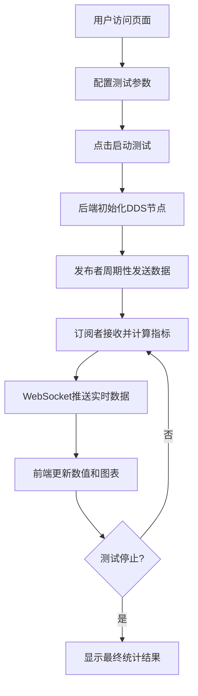

## 1. 产品概述

DDS性能测试Web应用是一个用于数据分发服务（DDS）通信性能测试与监控的工具。用户可通过Web界面配置DDS发布者和订阅者参数，实时监控吞吐量和延迟数据，生成性能分析图表。

- 解决DDS系统性能验证和调优问题，帮助开发者快速评估不同配置下的通信表现
- 目标用户为DDS系统开发者、系统架构师、性能测试工程师

## 2. 核心功能

### 2.1 用户角色

| 角色 | 注册方式 | 核心权限 |
|------|----------|----------|
| 普通用户 | 无需注册 | 配置测试参数、运行测试、查看性能数据和图表 |

### 2.2 功能模块

1. **配置面板**：Payload大小设置、QoS策略配置（可靠性/耐久性）
2. **控制区域**：启动/停止测试按钮、测试状态显示
3. **实时监控**：吞吐量（Mbps）、端到端延迟（微秒）实时数值展示
4. **数据可视化**：吞吐量曲线图、延迟曲线图
5. **统计信息**：最小/最大/平均值统计

### 2.3 页面详情

| 页面名称 | 模块名称 | 功能描述 |
|----------|----------|----------|
| 主页面 | 配置面板 | Payload大小滑块输入、QoS可靠性选择、QoS耐久性选择 |
| 主页面 | 控制区域 | 启动/停止按钮、连接状态指示器、运行时间显示 |
| 主页面 | 实时指标卡 | 吞吐量数值卡片、延迟数值卡片，带实时更新动画 |
| 主页面 | 性能图表 | 吞吐量曲线图、延迟曲线图，支持时间范围切换 |
| 主页面 | 统计面板 | 最小/最大/平均吞吐量和延迟统计表格 |

## 3. 核心流程

用户在配置面板设置Payload大小和QoS参数，点击启动按钮后，后端初始化DDS发布者和订阅者并开始发送测试数据。系统实时计算吞吐量和延迟指标，通过WebSocket推送到前端展示，同时更新曲线图数据。

## 4. 用户界面设计

### 4.1 设计风格

- **主色调**：深蓝色系（#0F172A、#1E40AF），体现科技感和专业性
- **辅助色**：青色（#06B6D4）用于数据高亮，绿色（#10B981）表示正常状态，红色（#EF4444）表示警告
- **按钮风格**：圆角矩形，渐变背景，悬停时有缩放和阴影效果
- **字体**：使用Space Grotesk作为标题字体，JetBrains Mono作为数据显示字体
- **布局风格**：卡片式布局，深色主题，网格结构
- **图标风格**：简约线性图标，使用Font Awesome或Heroicons

### 4.2 页面设计概述

| 页面名称 | 模块名称 | UI元素 |
|----------|----------|--------|
| 主页面 | 配置面板 | 渐变背景卡片、滑块组件、下拉选择器、标签切换 |
| 主页面 | 实时指标卡 | 大号数字显示、单位标注、趋势箭头、脉冲动画效果 |
| 主页面 | 性能图表 | 平滑曲线图、渐变色填充、坐标轴标签、tooltip提示 |
| 主页面 | 控制区域 | 大尺寸主按钮、状态指示灯、计时显示 |
| 主页面 | 统计面板 | 数据表格、交替行背景、数值高亮 |

### 4.3 响应性

- 桌面端：三栏布局（配置面板 + 指标卡片 + 图表区域）
- 平板端：两栏布局，配置面板移至顶部
- 移动端：单列垂直布局，图表自适应宽度
- 触摸优化：按钮最小尺寸44x44px，滑块增加触摸区域

### 4.4 动效设计

- 页面加载：元素渐入动画，错落延迟
- 数据更新：数值变化时的平滑过渡动画
- 实时指示器：呼吸灯效果表示活跃状态
- 图表绘制：数据点的平滑过渡和轨迹动画
