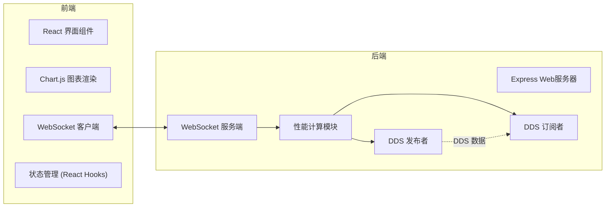
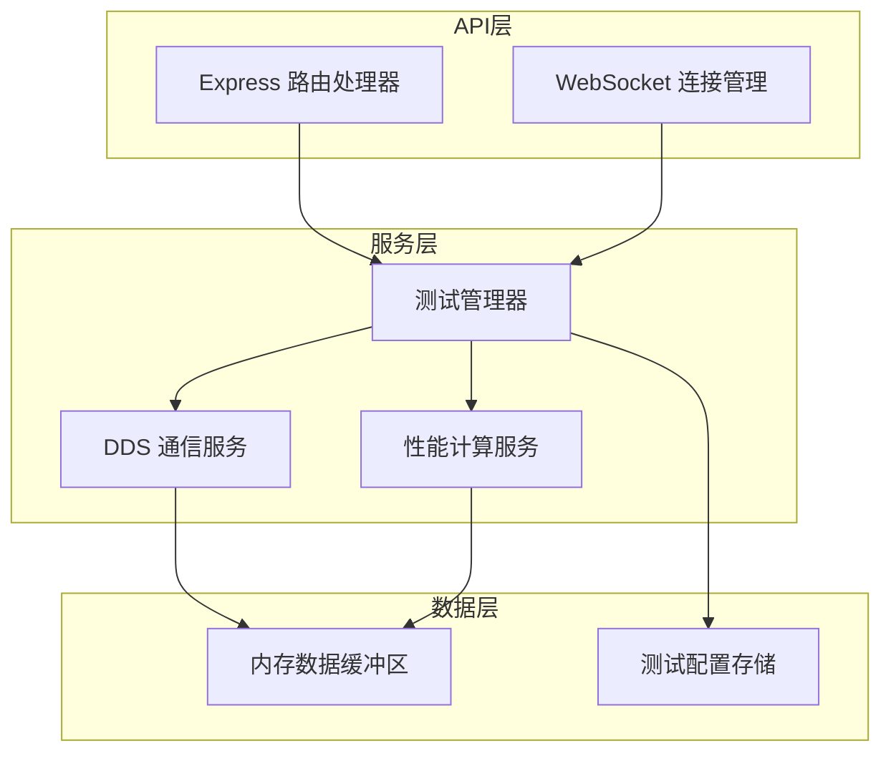

## 1. 架构设计



## 2. 技术描述

- **前端**：React@18 + TypeScript + Vite + TailwindCSS@3 + Chart.js
- **初始化工具**：Vite 脚手架
- **后端**：Express@4 + Node.js + WebSocket + CycloneDDS
- **实时通信**：ws 库实现 WebSocket 双向通信
- **图表库**：chart.js + react-chartjs-2

## 3. 路由定义

| 路由 | 用途 |
|------|------|
| / | 主页面，包含配置、监控和图表 |
| /api/config | 获取/更新测试配置 |
| /api/start | 启动测试 |
| /api/stop | 停止测试 |
| /ws | WebSocket 实时数据推送 |

## 4. API 定义

### 4.1 TypeScript 类型定义

```typescript
// 测试配置
interface TestConfig {
  payloadSize: number;      // Payload大小 (字节)
  reliability: 'BEST_EFFORT' | 'RELIABLE';
  durability: 'VOLATILE' | 'TRANSIENT_LOCAL' | 'TRANSIENT' | 'PERSISTENT';
  publishRate: number;      // 发布频率 (Hz)
}

// 实时性能数据
interface PerformanceMetrics {
  timestamp: number;
  throughputMbps: number;   // 吞吐量 (Mbps)
  latencyUs: number;        // 端到端延迟 (微秒)
  messagesSent: number;
  messagesReceived: number;
}

// 统计数据
interface Statistics {
  avgThroughput: number;
  maxThroughput: number;
  minThroughput: number;
  avgLatency: number;
  maxLatency: number;
  minLatency: number;
  totalMessages: number;
  duration: number;
}

// WebSocket 消息
interface WSMessage {
  type: 'metrics' | 'status' | 'statistics' | 'error';
  data: PerformanceMetrics | Statistics | string;
}
```

### 4.2 REST API 接口

```typescript
// GET /api/config
// Response: { config: TestConfig }

// POST /api/config
// Request: TestConfig
// Response: { success: boolean, config: TestConfig }

// POST /api/start
// Request: TestConfig
// Response: { success: boolean, message: string }

// POST /api/stop
// Response: { success: boolean, statistics: Statistics }

// GET /api/status
// Response: { running: boolean, config: TestConfig }
```

## 5. 服务端架构图



## 6. DDS 模拟实现

由于DDS中间件可能需要特定环境依赖，本项目采用两种模式：
1. **真实DDS模式**：使用CycloneDDS或OpenDDS库
2. **模拟模式**：后端模拟DDS通信，用于演示和无DDS环境测试

### 6.1 DDS 数据类型

```typescript
// DDS 测试数据类型
interface TestMessage {
  id: string;
  sequence: number;
  timestamp: number;        // 发送时间戳
  payload: Uint8Array;      // 负载数据
}
```

### 6.2 性能计算逻辑

- **吞吐量计算**：`(消息数 × Payload大小 × 8) / 时间窗口 / 1,000,000` Mbps
- **端到端延迟**：`接收时间戳 - 发送时间戳` 微秒
- **数据采样**：每100ms采样一次，保留最近60秒数据用于图表展示
