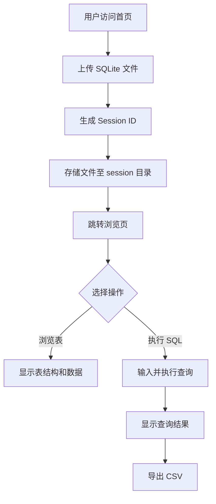

## 1. 产品概述
SQLite 数据库在线管理工具，用户可上传 .db/.sqlite 文件，在线浏览表结构、执行 SQL 查询，并将查询结果导出为 CSV。采用 Session 隔离机制确保不同用户的数据互不可见。
- 主要用途：无需安装客户端即可在线管理 SQLite 数据库文件
- 目标用户：开发者、数据分析师、需要快速查看 SQLite 数据的用户
- 核心价值：轻量化、即开即用、多用户安全隔离

## 2. 核心功能

### 2.1 功能模块
1. **文件上传页**：拖拽/点击上传 SQLite 数据库文件，显示上传状态
2. **数据库浏览页**：展示当前 session 已上传的数据库，左侧表结构树，右侧表数据预览
3. **SQL 查询页**：SQL 编辑器（带语法高亮），执行按钮，结果表格展示，支持导出 CSV

### 2.2 页面详情
| 页面名称 | 模块名称 | 功能描述 |
|---------|---------|---------|
| 上传页 | 文件上传区 | 拖拽或点击上传 .db/.sqlite 文件，限制单文件 50MB，上传后自动解析并跳转至浏览页 |
| 浏览页 | 侧边栏 | 展示数据库名、表名列表，点击表名加载数据 |
| 浏览页 | 数据预览区 | 分页展示所选表的前 100 条数据，显示列名和类型 |
| 查询页 | SQL 编辑器 | Monaco 编辑器，支持 SQLite 语法高亮、Ctrl+Enter 执行 |
| 查询页 | 结果展示 | 表格展示查询结果，列宽自适应，支持横向滚动 |
| 查询页 | CSV 导出 | 一键将查询结果导出为 CSV 文件下载 |

## 3. 核心流程
用户访问首页 → 上传 SQLite 数据库文件 → 系统生成唯一 session ID 并存储文件 → 跳转至浏览页查看表结构和数据 → 切换至查询页执行自定义 SQL → 将结果导出为 CSV

## 4. 用户界面设计
### 4.1 设计风格
- 主色调：深色主题 `#0d1117`，强调色 `#58a6ff`（蓝色），成功色 `#3fb950`，警告色 `#f85149`
- 按钮风格：圆角 6px，hover 有轻微发光效果
- 字体：JetBrains Mono（代码/数据）、Inter（UI 文字）
- 布局：三栏布局（左侧数据库/表列表，中间 SQL 编辑器或数据预览，右侧可选的查询历史）
- 图标：lucide-react 图标库

### 4.2 页面设计概览
| 页面名称 | 模块名称 | UI 元素 |
|---------|---------|---------|
| 上传页 | 文件上传区 | 居中卡片，虚线边框拖拽区，悬停变蓝 |
| 浏览页 | 侧边栏 | 深色背景，树形结构，展开动画 |
| 浏览页 | 数据预览区 | 斑马纹表格，固定表头，横向滚动 |
| 查询页 | SQL 编辑器 | Monaco 编辑器，深色主题，行号，语法高亮 |
| 查询页 | 结果展示 | 紧凑表格，斑马纹，列宽自适应 |

### 4.3 响应式
桌面优先设计，最小支持宽度 1024px。侧边栏可折叠。
