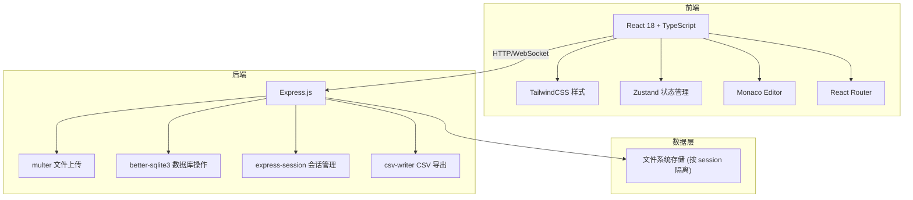
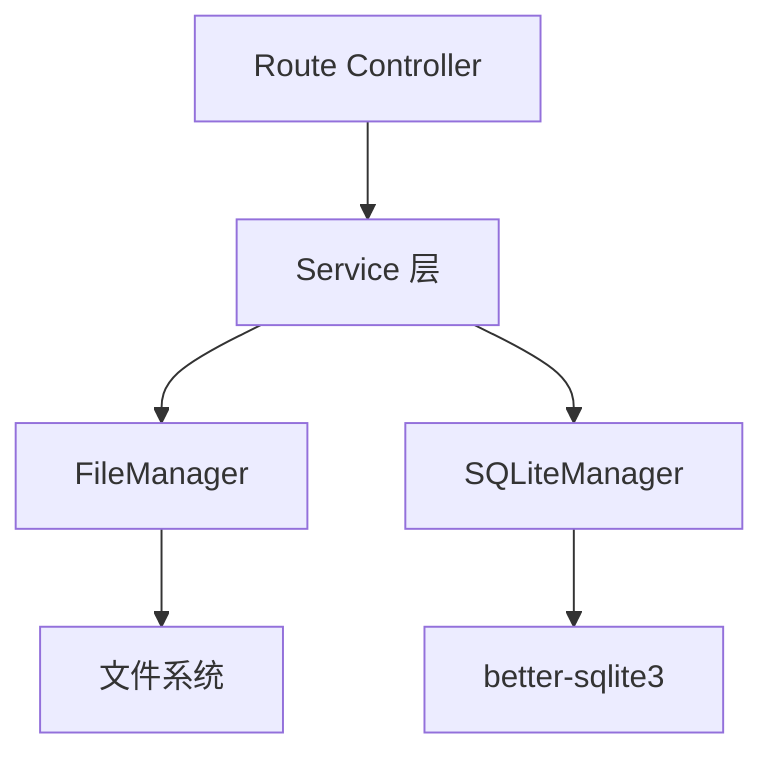

## 1. 架构设计


## 2. 技术说明
- 前端：React 18 + TypeScript + TailwindCSS 3 + Vite
- 初始化工具：vite-init
- 模板：react-express-ts
- 后端：Express 4 + better-sqlite3 + express-session + multer
- 数据存储：文件系统（按 session ID 分目录存储上传的数据库文件）

## 3. 路由定义
| 路由 | 用途 |
|-----|------|
| / | 首页（上传页） |
| /browse | 数据库浏览页 |
| /query | SQL 查询页 |

## 4. API 定义
```typescript
// 上传 SQLite 文件
POST /api/upload
Request: multipart/form-data { file: File }
Response: { success: true, databaseId: string, tables: TableInfo[] }

// 获取当前 session 的数据库列表
GET /api/databases
Response: { databases: DatabaseInfo[] }

// 获取表列表和结构
GET /api/database/:dbId/tables
Response: { tables: TableInfo[] }

// 获取表数据
GET /api/database/:dbId/table/:tableName?limit=100&offset=0
Response: { columns: string[], rows: any[][], total: number }

// 执行 SQL 查询
POST /api/database/:dbId/query
Request: { sql: string }
Response: { columns: string[], rows: any[][], affectedRows?: number, error?: string }

// 导出 CSV
GET /api/database/:dbId/export?sql=...
Response: CSV 文件流 (text/csv)

// 删除数据库
DELETE /api/database/:dbId
Response: { success: true }
```

### 类型定义
```typescript
interface TableInfo {
  name: string;
  columns: ColumnInfo[];
  rowCount: number;
}

interface ColumnInfo {
  name: string;
  type: string;
  notNull: boolean;
  defaultValue: string | null;
  pk: boolean;
}

interface DatabaseInfo {
  id: string;
  name: string;
  uploadedAt: string;
  size: number;
  tableCount: number;
}
```

## 5. 服务端架构图


## 6. 数据模型
本项目无独立数据库，所有数据存储于用户上传的 SQLite 文件和服务器文件系统中。

### 目录结构
```
uploads/
  {sessionId}/
    {dbId}.db
```

### Session 数据
```typescript
interface SessionData {
  databases: {
    id: string;
    fileName: string;
    uploadedAt: Date;
  }[];
}
```
