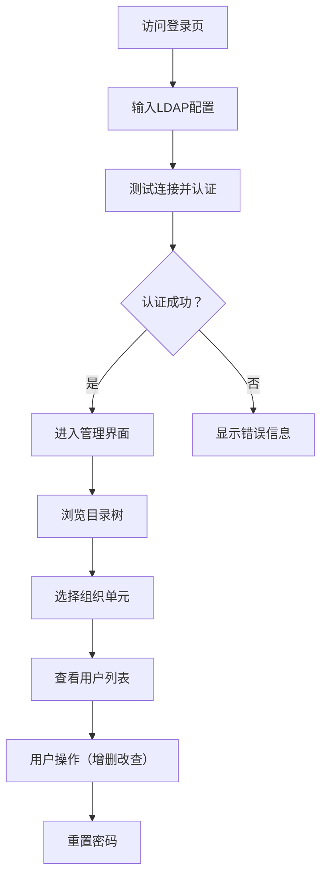

## 1. 产品概述
OpenLDAP Web管理工具，用于可视化管理LDAP目录服务，支持用户和组织的增删改查操作。
- 主要用途：通过Web界面简化LDAP目录管理，降低运维复杂度
- 目标用户：系统管理员、DevOps工程师、企业IT运维人员

## 2. 核心功能

### 2.1 用户角色
| 角色 | 认证方式 | 核心权限 |
|------|----------|----------|
| LDAP管理员 | LDAP绑定认证 | 完整的目录管理权限（增删改查、重置密码） |

### 2.2 功能模块
1. **登录页面**: LDAP服务器配置、管理员认证
2. **主管理页面**: 目录树导航、用户列表、操作面板
3. **用户详情/编辑**: 用户属性查看与编辑、密码重置

### 2.3 页面详情
| 页面名称 | 模块名称 | 功能描述 |
|-----------|-------------|---------------------|
| 登录页面 | 服务器配置 | 输入LDAP服务器地址、端口、Base DN、管理员DN、密码 |
| 登录页面 | 连接测试 | 测试LDAP连接是否成功 |
| 主管理页面 | 目录树 | 以树形结构展示OU（组织单元）和用户DN |
| 主管理页面 | 用户列表 | 展示选中OU下的所有用户信息 |
| 主管理页面 | 操作工具栏 | 新增用户、删除用户、刷新按钮 |
| 用户编辑弹窗 | 表单编辑 | 编辑用户属性（cn、sn、uid、mail、telephoneNumber等） |
| 用户编辑弹窗 | 密码重置 | 输入新密码并确认，修改用户密码 |

## 3. 核心流程
用户通过登录页面配置LDAP服务器信息并认证，成功后进入管理界面。在目录树中选择组织单元查看用户列表，可对用户进行增删改查和密码重置操作。

## 4. 用户界面设计
### 4.1 设计风格
- 主色调：深蓝（#1e3a5f）代表专业和信任
- 辅助色：青色（#0ea5e9）用于操作按钮和高亮
- 中性色：深灰背景、浅色文字、白色卡片
- 按钮风格：圆角、轻微阴影、hover状态变化
- 字体：现代无衬线字体（JetBrains Mono用于DN展示，Inter用于正文）
- 布局风格：三栏布局（左侧目录树、中间用户列表、右侧详情面板）
- 图标风格：简约线性图标

### 4.2 页面设计概述
| 页面名称 | 模块名称 | UI元素 |
|-----------|-------------|-------------|
| 登录页面 | 表单卡片 | 玻璃拟态效果、渐变边框、输入框动画 |
| 主管理页面 | 目录树 | 可折叠节点、连接线、选中高亮 |
| 主管理页面 | 用户列表 | 表格布局、行hover效果、操作按钮 |
| 编辑弹窗 | 模态框 | 模糊背景、滑入动画、表单验证 |

### 4.3 响应性
- Desktop-first设计
- 平板设备：目录树可折叠，用户列表自适应
- 移动设备：单列布局，底部操作栏

