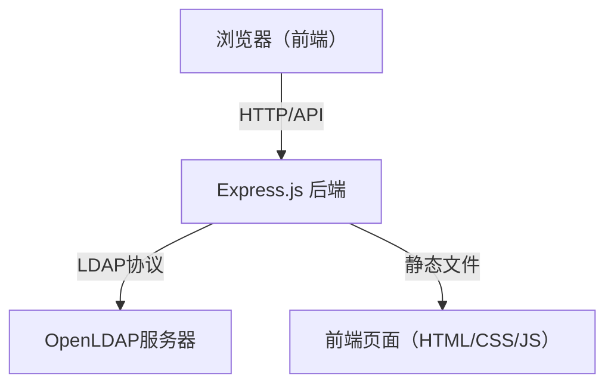
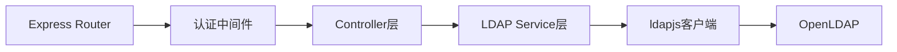

## 1. 架构设计


## 2. 技术描述
- 前端：原生HTML + CSS + JavaScript（单页应用，无构建工具）
- 后端：Express.js 4.x
- LDAP客户端：ldapjs 3.x
- 会话管理：express-session
- 其他依赖：body-parser、cors、dotenv

## 3. 目录结构
```
p157/
├── package.json
├── .env.example
├── server.js                 # Express服务器入口
├── config/
│   └── ldap.js               # LDAP配置
├── routes/
│   ├── auth.js               # 认证路由
│   ├── directory.js          # 目录树路由
│   └── users.js              # 用户CRUD路由
├── services/
│   └── ldapService.js        # LDAP操作服务
├── middleware/
│   └── auth.js               # 认证中间件
└── public/
    ├── index.html            # 管理界面
    ├── css/
    │   └── style.css         # 样式文件
    └── js/
        └── app.js            # 前端逻辑
```

## 4. 路由定义
| 路由 | 方法 | 用途 |
|-------|------|---------|
| / | GET | 管理界面首页 |
| /api/auth/login | POST | LDAP认证登录 |
| /api/auth/logout | POST | 登出 |
| /api/directory/tree | GET | 获取目录树 |
| /api/users | GET | 获取用户列表 |
| /api/users | POST | 创建新用户 |
| /api/users/:dn | GET | 获取用户详情 |
| /api/users/:dn | PUT | 更新用户信息 |
| /api/users/:dn | DELETE | 删除用户 |
| /api/users/:dn/password | PUT | 重置用户密码 |

## 5. API定义
### 5.1 认证接口
**POST /api/auth/login**
```typescript
interface LoginRequest {
  host: string;
  port: number;
  baseDn: string;
  adminDn: string;
  password: string;
}

interface LoginResponse {
  success: boolean;
  message: string;
  sessionId: string;
}
```

### 5.2 用户接口
**GET /api/users?ou=xxx**
```typescript
interface User {
  dn: string;
  cn: string;
  sn: string;
  uid: string;
  mail: string;
  telephoneNumber?: string;
  givenName?: string;
  objectClass: string[];
}

interface UserListResponse {
  success: boolean;
  users: User[];
}
```

**POST /api/users**
```typescript
interface CreateUserRequest {
  ou: string;
  uid: string;
  cn: string;
  sn: string;
  givenName?: string;
  mail: string;
  telephoneNumber?: string;
  userPassword: string;
}
```

**PUT /api/users/:dn/password**
```typescript
interface ResetPasswordRequest {
  newPassword: string;
}
```

## 6. 数据模型
### 6.1 LDAP对象类
```
inetOrgPerson (RFC 2798)
  ├── MUST: cn, sn
  └── MAY: uid, givenName, mail, telephoneNumber, userPassword, ...
```

### 6.2 会话存储
会话数据包含LDAP连接配置，存储在服务端session中：
```typescript
interface LdapSession {
  host: string;
  port: number;
  baseDn: string;
  adminDn: string;
  adminPassword: string;
  connected: boolean;
}
```

## 7. 服务器架构


