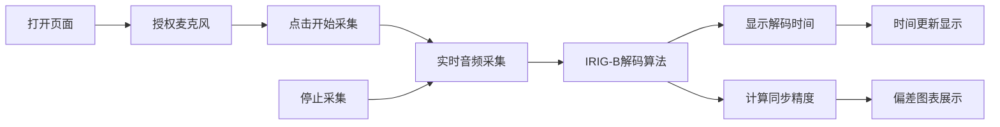

## 1. 产品概述

IRIG-B时间码解码器Web应用，通过浏览器麦克风采集IRIG-B直流电平/音频信号，纯前端JavaScript解码出年月日时分秒信息，实时显示时间并校验同步精度。无需后端参与，所有处理在浏览器端完成。

- 主要用途：时间同步设备测试、IRIG-B信号解码分析、教育演示
- 目标用户：时间同步工程师、实验室研究人员、电子工程学生

## 2. 核心功能

### 2.1 用户角色

| 角色 | 注册方式 | 核心权限 |
|------|----------|----------|
| 访客用户 | 无需注册 | 使用所有解码功能，查看解码结果 |

### 2.2 功能模块

1. **主页面**：麦克风控制、信号波形可视化、解码时间显示、同步精度分析

### 2.3 页面详情

| 页面名称 | 模块名称 | 功能描述 |
|-----------|-------------|---------------------|
| 主页面 | 麦克风控制 | 开始/停止录音，选择音频输入设备，显示录音状态 |
| 主页面 | 波形可视化 | 实时显示采集的音频波形，标记IRIG-B脉冲边沿 |
| 主页面 | 时间显示 | 大字体显示解码后的年月日时分秒，显示信号质量指示 |
| 主页面 | 同步精度校验 | 计算与本地系统时间的偏差，显示偏差统计图表 |
| 主页面 | 原始数据面板 | 显示解码的原始二进制数据、帧结构解析 |

## 3. 核心流程

用户打开页面 → 授权麦克风权限 → 点击开始采集 → 系统实时采集音频 → IRIG-B解码算法处理信号 → 显示解码时间和同步精度 → 用户可暂停/停止采集

## 4. 用户界面设计

### 4.1 设计风格

- **主色调**：科技蓝 (#0066FF) 作为主色，深灰 (#1A1A2E) 背景
- **辅助色**：绿色 (#00FF88) 表示正常/锁定，红色 (#FF4444) 表示异常，黄色 (#FFAA00) 表示警告
- **按钮风格**：圆角矩形，悬浮时有发光效果，点击有缩放反馈
- **字体**：使用 JetBrains Mono 等宽字体显示时间数据，Roboto 作为界面字体
- **布局风格**：卡片式布局，深色科技感主题，玻璃拟态效果
- **图标风格**：线性简约图标，使用 Lucide Icons

### 4.2 页面设计概述

| 页面名称 | 模块名称 | UI 元素 |
|-----------|-------------|-------------|
| 主页面 | 头部 | Logo、标题、状态指示灯 |
| 主页面 | 控制面板 | 开始/停止按钮、设备选择下拉框、音量指示 |
| 主页面 | 波形显示区 | Canvas绘制的实时波形图、时间轴、电平指示 |
| 主页面 | 时间显示区 | 超大号数字时钟、日期显示、信号锁定状态 |
| 主页面 | 精度分析区 | 偏差数值显示、历史偏差折线图、统计数据 |
| 主页面 | 原始数据区 | 二进制数据流、帧结构解析表格 |

### 4.3 响应式

- 桌面端优先，采用左右分栏布局
- 移动端自适应为上下堆叠布局
- 波形图和图表在小屏幕上自动调整尺寸
- 触控设备优化按钮大小

## 5. 非功能需求

### 5.1 性能要求

- 音频采集延迟 < 100ms
- 解码响应时间 < 50ms
- 波形渲染帧率 ≥ 30fps
- 支持长时间连续运行（≥1小时）

### 5.2 兼容性要求

- 支持 Chrome、Firefox、Edge 现代浏览器
- 支持采样率：44.1kHz、48kHz
- 支持单声道/立体声输入

### 5.3 精度要求

- 时间解码精度：毫秒级
- 同步偏差测量精度：1ms
