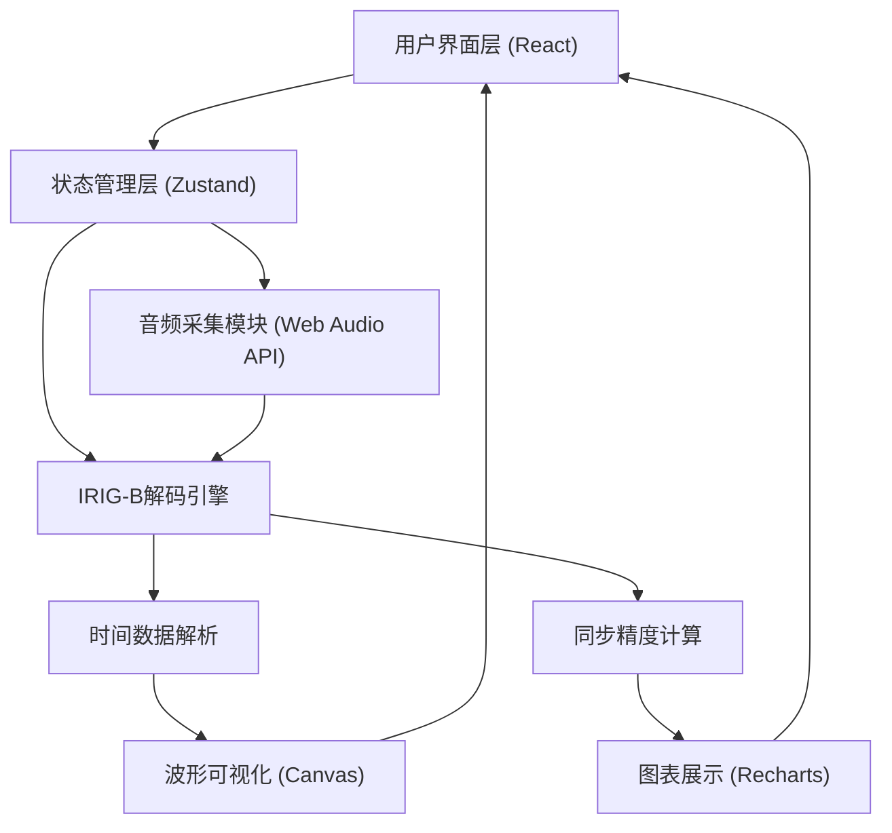

## 1. 架构设计



## 2. 技术描述

- **前端框架**: React@18 + TypeScript
- **构建工具**: Vite@5
- **样式方案**: TailwindCSS@3
- **状态管理**: Zustand (轻量级状态管理)
- **图表库**: Recharts (同步精度图表)
- **图标库**: Lucide React
- **音频处理**: Web Audio API (原生)
- **后端**: 无，纯前端处理

## 3. 目录结构

```
src/
├── components/
│   ├── AudioControl.tsx      # 麦克风控制组件
│   ├── WaveformDisplay.tsx   # 波形显示组件
│   ├── TimeDisplay.tsx       # 时间显示组件
│   ├── AccuracyPanel.tsx     # 精度分析面板
│   └── RawDataPanel.tsx      # 原始数据面板
├── hooks/
│   ├── useAudioCapture.ts    # 音频采集Hook
│   └── useIRIGBDecoder.ts    # IRIG-B解码Hook
├── utils/
│   ├── irigbDecoder.ts       # IRIG-B解码核心算法
│   └── timeUtils.ts          # 时间处理工具
├── store/
│   └── useAppStore.ts        # 应用状态管理
├── types/
│   └── index.ts              # TypeScript类型定义
├── App.tsx
└── main.tsx
```

## 4. 核心模块设计

### 4.1 音频采集模块

**功能**:
- 通过 `navigator.mediaDevices.getUserMedia` 获取麦克风权限
- 使用 `AudioContext` 创建音频处理链
- 通过 `ScriptProcessorNode` 或 `AudioWorklet` 获取原始PCM数据
- 支持采样率：44.1kHz, 48kHz

**关键参数**:
- 缓冲区大小：2048 samples
- 单声道处理
- 实时音频回调

### 4.2 IRIG-B解码算法

**IRIG-B格式说明**:
- 每秒1帧，每帧100个码元
- 每个码元10ms
- 脉冲宽度定义：
  - 2ms: 二进制 '0'
  - 5ms: 二进制 '1'
  - 8ms: 位置识别位 (P)
- 帧结构包含：天、时、分、秒、年等信息

**解码流程**:
1. 信号归一化和阈值检测
2. 脉冲边沿检测
3. 脉冲宽度测量
4. 码元识别 (0/1/P)
5. 帧同步查找
6. BCD码解析
7. 时间字段提取

### 4.3 同步精度计算

**方法**:
- 记录解码时间戳与本地系统时间的差值
- 计算平均偏差、最大偏差、最小偏差
- 生成偏差历史图表
- 计算标准偏差评估稳定性

## 5. TypeScript类型定义

```typescript
// IRIG-B解码结果
interface IRIGBTime {
  year: number;      // 年份 (00-99)
  dayOfYear: number; // 年内天数 (001-366)
  hour: number;      // 小时 (00-23)
  minute: number;    // 分钟 (00-59)
  second: number;    // 秒 (00-59)
  milliseconds: number;
  timestamp: number; // 解码时的系统时间戳
  signalQuality: number; // 信号质量 0-100
}

// 音频采集状态
interface AudioState {
  isRecording: boolean;
  sampleRate: number;
  volume: number;
  deviceId: string | null;
  devices: MediaDeviceInfo[];
}

// 同步精度数据
interface AccuracyData {
  deviation: number;      // 当前偏差 (ms)
  avgDeviation: number;   // 平均偏差
  maxDeviation: number;   // 最大偏差
  minDeviation: number;   // 最小偏差
  stdDeviation: number;   // 标准偏差
  history: { time: number; deviation: number }[];
}

// 应用全局状态
interface AppState {
  audio: AudioState;
  decodedTime: IRIGBTime | null;
  accuracy: AccuracyData;
  rawData: number[];
  isLocked: boolean;
}
```

## 6. 关键算法说明

### 6.1 脉冲检测算法

```
输入: 音频采样数据 buffer
输出: 脉冲边沿位置列表

1. 计算信号直流偏移并去除
2. 计算信号振幅，动态调整阈值
3. 过零检测找到边沿位置
4. 测量高电平和低电平持续时间
5. 根据持续时间分类码元类型
```

### 6.2 帧同步算法

```
1. 查找连续的位置识别位 (P码) 序列
2. P0-P9每10个码元出现一次
3. P5是帧起始标记，位于第50个码元
4. 确认帧边界后开始BCD解析
```

### 6.3 BCD码解析

```
- 秒: 码元1-4 (个位), 码元6-8 (十位)
- 分: 码元10-13 (个位), 码元15-17 (十位)
- 时: 码元20-23 (个位), 码元25-26 (十位)
- 天: 码元30-33 (个位), 码元35-38 (十位), 码元40-41 (百位)
- 年: 码元50-53 (个位), 码元55-58 (十位)
```

## 7. 性能优化策略

1. **Web Worker 解码**: 将IRIG-B解码算法移至Web Worker，避免阻塞主线程
2. **节流渲染**: 波形图渲染限制在30fps
3. **环形缓冲区**: 使用固定大小的环形缓冲区存储历史数据
4. **批量更新**: 状态更新采用批量模式，减少React重渲染
