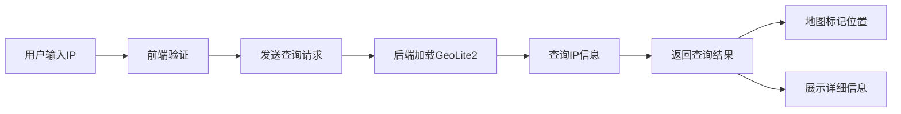

## 1. 产品概述
IP地理位置查询Web应用，支持单个和批量IP地址查询，通过地图可视化展示查询结果。
- 主要用途：查询IP地址对应的国家、城市、ASN信息，适用于网络分析、安全审计、数据统计等场景
- 核心价值：提供快速、直观的IP地理位置查询服务，支持批量处理提升效率

## 2. 核心功能

### 2.1 功能模块
1. **首页**：IP查询输入区、地图展示区、查询结果区
2. **批量查询**：支持最多100个IP批量输入与查询
3. **地图可视化**：Leaflet地图展示查询IP的地理位置

### 2.3 页面详情
| 页面名称 | 模块名称 | 功能描述 |
|-----------|-------------|---------------------|
| 首页 | IP输入区 | 单个IP输入、批量IP输入（支持换行/逗号分隔）、查询按钮 |
| 首页 | 地图展示区 | Leaflet地图，标记查询到的IP位置，支持缩放和拖拽 |
| 首页 | 结果展示区 | 展示每个IP的详细信息（国家、城市、ASN、经纬度） |
| 首页 | 历史记录 | 最近查询的IP记录（可选） |

## 3. 核心流程
用户在输入框中输入单个或多个IP地址（最多100个），点击查询按钮，后端调用GeoLite2数据库查询地理位置信息，返回结果后在地图上标记位置，并在结果区展示详细信息。

## 4. 用户界面设计
### 4.1 设计风格
- 主色调：深蓝色 (#1e3a5f) 搭配科技感青色 (#00d4ff)
- 按钮风格：圆角设计，悬停时有发光效果
- 字体：使用现代无衬线字体，标题醒目，内容清晰
- 布局风格：卡片式布局，顶部导航，左右分栏（左侧输入+结果，右侧地图）
- 图标风格：简约线性图标

### 4.2 页面设计概述
| 页面名称 | 模块名称 | UI元素 |
|-----------|-------------|-------------|
| 首页 | 输入区 | 大文本框、查询按钮、数量提示、清空按钮 |
| 首页 | 地图区 | 全屏地图、缩放控件、图层切换、标记弹窗 |
| 首页 | 结果区 | 卡片列表、IP地址标签、位置信息、ASN信息 |

### 4.3 响应式
- 桌面端：左右分栏布局（40%输入+结果，60%地图）
- 移动端：上下布局，先输入区，再地图，最后结果列表
- 触摸优化：按钮尺寸适配，滚动顺滑

### 4.4 交互动效
- 页面加载：元素渐入动画
- 查询中：加载动画与进度提示
- 地图标记：弹跳出现效果
- 结果卡片：悬停上浮效果
- 错误提示：抖动动画
