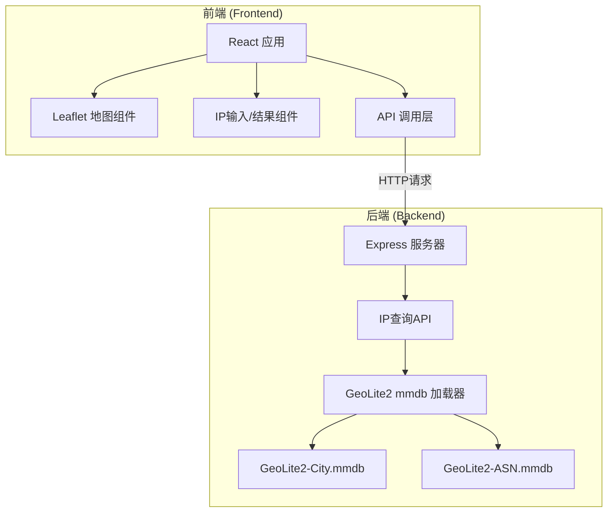
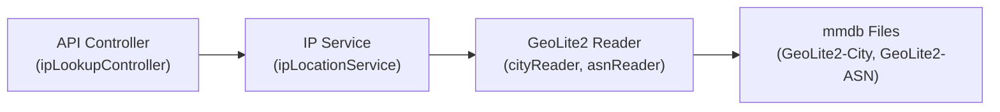

## 1. 架构设计



## 2. 技术描述
- 前端：React@18 + Vite + TypeScript + TailwindCSS@3 + Leaflet
- 后端：Node.js + Express@4 + maxmind (GeoLite2库)
- 初始化工具：Vite
- 数据库：GeoLite2 mmdb 文件（本地文件）

## 3. 路由定义
| 路由 | 用途 |
|-------|---------|
| / | 首页 - IP查询主界面 |
| /api/lookup | POST - 查询单个或多个IP的地理位置信息 |

## 4. API 定义

### IP 查询接口

**请求类型：** POST `/api/lookup`

**请求体：**
```typescript
interface LookupRequest {
  ips: string[];  // IP地址数组，最多100个
}
```

**响应体：**
```typescript
interface LookupResponse {
  results: IpLocation[];
  errors: LookupError[];
}

interface IpLocation {
  ip: string;
  country?: {
    code: string;
    name: string;
  };
  city?: {
    name: string;
  };
  location?: {
    latitude: number;
    longitude: number;
    timezone?: string;
  };
  asn?: {
    number: number;
    name: string;
  };
  postal?: {
    code: string;
  };
}

interface LookupError {
  ip: string;
  message: string;
}
```

## 5. 服务端架构



## 6. 项目结构

```
p159/
├── client/                 # 前端应用
│   ├── src/
│   │   ├── components/
│   │   │   ├── IpInput.tsx      # IP输入组件
│   │   │   ├── MapView.tsx      # 地图组件
│   │   │   └── ResultCard.tsx   # 结果卡片组件
│   │   ├── services/
│   │   │   └── api.ts           # API调用服务
│   │   ├── types/
│   │   │   └── index.ts         # 类型定义
│   │   ├── App.tsx
│   │   └── main.tsx
│   ├── index.html
│   ├── package.json
│   ├── vite.config.ts
│   └── tailwind.config.js
├── server/                 # 后端应用
│   ├── src/
│   │   ├── controllers/
│   │   │   └── ipLookup.controller.ts
│   │   ├── services/
│   │   │   └── ipLocation.service.ts
│   │   ├── types/
│   │   │   └── index.ts
│   │   └── index.ts
│   ├── data/               # mmdb数据库文件存放目录
│   ├── package.json
│   └── tsconfig.json
└── package.json            # 根目录 package.json (concurrently)
```

## 7. 开发说明

### GeoLite2 数据库
- 使用 `maxmind` 库加载 mmdb 文件
- 需要用户提供 GeoLite2-City.mmdb 和 GeoLite2-ASN.mmdb 文件
- 文件存放路径：`server/data/`

### 批量查询限制
- 单次查询最多 100 个 IP
- 后端进行数量校验
- 前端进行输入验证和提示

### Leaflet 地图配置
- 使用 OpenStreetMap 瓦片服务
- 支持多个 IP 位置标记
- 点击标记显示详细信息
- 自动调整视图以显示所有标记
