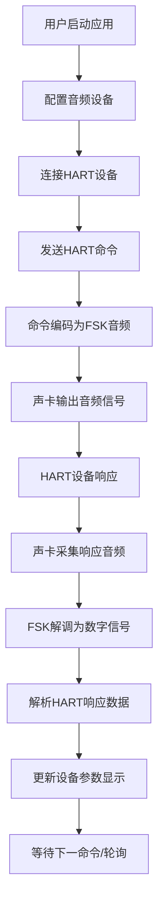

# HART FSK 调制解调器 - 产品需求文档

## 1. 产品概述
基于Electron的HART协议音频调制解调器应用，通过声卡实现FSK调制（1200Hz/2200Hz），将HART命令编码为音频信号并解码响应，实时显示现场设备参数。
- 主要用途：工业现场HART设备调试、参数监控、命令发送与响应解析
- 目标用户：工业自动化工程师、现场设备维护人员、HART协议开发者

## 2. 核心功能

### 2.1 功能模块
1. **主控制面板**：音频设备选择、通信参数配置、连接状态
2. **FSK调制解调器**：1200Hz代表Mark(1)，2200Hz代表Space(0)
3. **HART协议编解码**：命令帧封装、校验计算、响应解析
4. **设备参数监控**：实时显示PV（过程变量）、SV（设定值）等参数
5. **命令发送终端**：自定义HART命令发送、原始数据查看

### 2.2 页面详情
| 页面名称 | 模块名称 | 功能描述 |
|---------|---------|---------|
| 主界面 | 设备状态面板 | 显示连接状态、设备地址、通信统计 |
| 主界面 | 参数显示区 | 实时PV/SV数值显示、趋势图表 |
| 主界面 | 命令控制台 | 预定义命令按钮、自定义命令输入、响应日志 |
| 主界面 | 音频波形显示 | 实时发送/接收音频波形可视化 |
| 设置面板 | 音频设备配置 | 输入/输出设备选择、采样率配置 |
| 设置面板 | 协议参数 | 轮询间隔、重试次数、超时时间配置 |

## 3. 核心流程

## 4. 用户界面设计

### 4.1 设计风格
- **主色调**：工业蓝 (#165DFF) 作为主色，深灰 (#1D2129) 背景，体现专业工业感
- **辅助色**：绿色 (#00B42A) 表示正常状态，红色 (#F53F3F) 表示告警/错误
- **按钮风格**：硬朗直角边框，悬停有发光效果，工业控制台风格
- **字体**：JetBrains Mono（等宽字体，适合数据显示）+ Inter（界面文字）
- **布局风格**：深色主题、卡片式模块、网格布局、科技感发光边框
- **图标风格**：线性图标，单色，工业设备风格

### 4.2 页面设计概览
| 页面名称 | 模块名称 | UI元素 |
|---------|---------|--------|
| 主界面 | 状态面板 | 状态指示灯、设备地址、通信速率、运行时间 |
| 主界面 | 参数显示 | 大字号数值显示、单位标签、趋势曲线、变化箭头 |
| 主界面 | 命令终端 | 命令按钮组、输入框、滚动日志区、时间戳 |
| 主界面 | 波形显示 | Canvas波形图、频率标签、发送/接收通道切换 |
| 设置面板 | 配置表单 | 下拉选择器、滑块、数字输入、保存/重置按钮 |

### 4.3 响应式
- Desktop优先，适配1280px及以上分辨率
- 主区域采用弹性布局，窗口缩放时自动调整模块大小
- 关键参数显示区域保持最小尺寸，确保可读性

## 5. 功能优先级
- **P0**：FSK调制解调、HART基本命令（读PV）、音频I/O、参数显示
- **P1**：波形可视化、多命令支持、参数配置、通信日志
- **P2**：趋势记录、数据导出、批量命令、设备扫描
