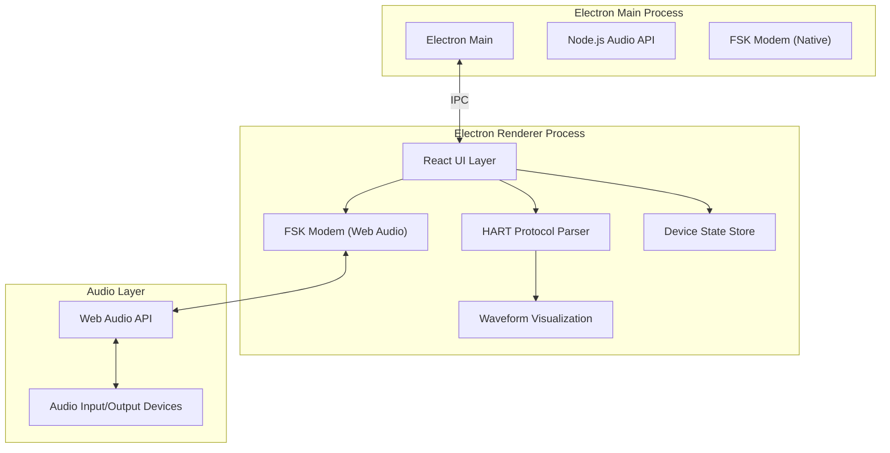

# HART FSK 调制解调器 - 技术架构文档

## 1. 架构设计



## 2. 技术栈说明

- **前端框架**：React@18 + TypeScript + Vite
- **桌面框架**：Electron@28 + electron-vite
- **样式方案**：TailwindCSS@3 + 自定义CSS变量
- **音频处理**：Web Audio API + AudioWorklet
- **状态管理**：Zustand（轻量级状态管理）
- **图表可视化**：recharts（趋势图）+ Canvas（波形图）
- **图标库**：Lucide React

## 3. 目录结构

```
src/
├── main/                # Electron 主进程
│   ├── index.ts         # 主进程入口
│   └── ipc.ts           # IPC 通信处理
├── renderer/            # Electron 渲染进程 (React)
│   ├── main.tsx         # React 入口
│   ├── App.tsx          # 主应用组件
│   ├── components/      # UI组件
│   │   ├── StatusPanel.tsx
│   │   ├── ParameterDisplay.tsx
│   │   ├── CommandTerminal.tsx
│   │   ├── WaveformDisplay.tsx
│   │   └── SettingsPanel.tsx
│   ├── hooks/           # 自定义Hooks
│   │   ├── useAudio.ts
│   │   └── useHART.ts
│   ├── store/           # 状态管理
│   │   └── deviceStore.ts
│   └── utils/           # 工具函数
│       ├── fsk-modem.ts    # FSK调制解调核心
│       ├── hart-protocol.ts # HART协议编解码
│       └── audio.ts      # 音频处理
├── shared/              # 共享类型
│   └── types.ts
└── styles/              # 全局样式
    └── index.css
```

## 4. 核心模块设计

### 4.1 FSK Modem 模块
```typescript
// FSK调制解调器接口
interface FSKModem {
  // 调制参数
  markFrequency: 1200;   // Mark频率 (逻辑1)
  spaceFrequency: 2200;  // Space频率 (逻辑0)
  baudRate: 1200;        // 波特率
  sampleRate: 48000;     // 采样率
  
  // 方法
  modulate(data: Uint8Array): Float32Array;      // 数字->音频
  demodulate(audio: Float32Array): Uint8Array;   // 音频->数字
}
```

### 4.2 HART Protocol 模块
```typescript
// HART帧结构
interface HARTFrame {
  preamble: number[];      // 前导码 (0xFF * 5-20)
  delimiter: number;       // 定界符
  address: number[];       // 设备地址 (1或5字节)
  command: number;         // 命令号
  byteCount: number;       // 数据字节数
  data: number[];          // 数据域
  checksum: number;        // 校验和
}

// HART响应解析
interface HARTResponse {
  responseCode: number;
  deviceStatus: number;
  data: any;
  pv?: number;             // 过程变量
  sv?: number;             // 设定值
  tv?: number;             // 变送器变量
  fv?: number;             // 最终变量
}
```

### 4.3 音频处理模块
- 使用 Web Audio API 进行实时音频流处理
- AudioWorklet 实现低延迟 FSK 解调
- ScriptProcessorNode 备选方案（兼容性）

## 5. 核心算法

### 5.1 FSK 调制
- 每个比特持续时间：1/1200 ≈ 833.33 μs
- 每个比特采样数：sampleRate / baudRate = 40 (48000/1200)
- 1200Hz 正弦波表示 1 (Mark)
- 2200Hz 正弦波表示 0 (Space)
- 使用查表法生成波形，提高效率

### 5.2 FSK 解调
- 过零检测法：统计单位时间内过零次数判断频率
- Goertzel算法：在指定频率点计算能量
- 滑动窗口：使用40-80个采样窗口确保可靠性
- 时钟恢复：使用PLL或过采样进行比特同步

### 5.3 HART 校验
- 纵向奇偶校验 (LRC)
- 从定界符开始到数据域最后一字节的异或和

## 6. IPC 通信定义

```typescript
// 主进程 -> 渲染进程
type IpcMainToRenderer =
  | { type: 'AUDIO_DEVICES'; payload: AudioDeviceInfo[] }
  | { type: 'AUDIO_DATA'; payload: Float32Array }
  | { type: 'ERROR'; payload: string };

// 渲染进程 -> 主进程  
type IpcRendererToMain =
  | { type: 'GET_AUDIO_DEVICES' }
  | { type: 'START_AUDIO_CAPTURE'; payload: AudioConfig }
  | { type: 'STOP_AUDIO_CAPTURE' }
  | { type: 'SEND_AUDIO'; payload: Float32Array };
```

## 7. 性能考虑
- FSK解调使用AudioWorklet在音频线程执行，避免UI阻塞
- 波形图使用Canvas 2D直接绘制，不使用SVG
- 状态更新使用批处理，减少React重渲染
- 音频缓冲采用环形缓冲区，避免内存泄漏

## 8. 开发与构建
- 开发命令：npm run dev
- 构建命令：npm run build
- 打包命令：npm run make
- 目标平台：Windows / macOS
