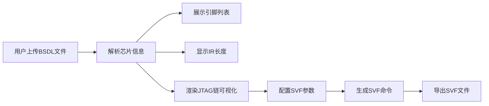

## 1. 产品概述

BSDL文件解析与JTAG链可视化工具，用于硬件工程师上传BSDL（边界扫描描述语言）文件，解析芯片引脚信息和指令寄存器长度，可视化展示JTAG链结构，并支持生成SVF（串行向量格式）测试命令。

- **核心价值**：简化JTAG边界扫描测试流程，提供直观的芯片引脚和JTAG链可视化
- **目标用户**：硬件工程师、FPGA开发人员、芯片测试工程师

## 2. 核心功能

### 2.1 用户角色
本工具为单用户工具，无复杂角色权限管理。

### 2.2 功能模块
1. **文件上传模块**：BSDL文件拖拽上传、文件选择、上传状态反馈
2. **BSDL解析模块**：解析芯片型号、引脚列表、引脚类型、指令寄存器长度等信息
3. **JTAG链可视化模块**：图形化展示JTAG链结构、TDI/TDO连接、芯片级联关系
4. **引脚信息模块**：表格展示所有引脚详情，支持搜索、筛选
5. **SVF生成模块**：选择芯片、配置指令，生成SVF测试命令，支持导出
6. **数据管理模块**：已上传文件列表、解析结果缓存

### 2.3 页面详情

| 页面名称 | 模块名称 | 功能描述 |
|-----------|-------------|---------------------|
| 主页面 | 文件上传区 | 拖拽或点击上传BSDL文件，显示上传进度和状态 |
| 主页面 | 已解析文件列表 | 展示已上传的BSDL文件及其基本信息，支持切换和删除 |
| 主页面 | 芯片信息面板 | 显示芯片型号、IR长度、引脚总数等概要信息 |
| 主页面 | 引脚详情表格 | 分页展示引脚名称、引脚类型、属性等详细信息，支持搜索和筛选 |
| 主页面 | JTAG链可视化 | 交互式SVG图形展示JTAG链结构、芯片级联、TDI/TDO路径 |
| 主页面 | SVF命令生成器 | 选择芯片和指令类型，配置参数，生成并导出SVF命令 |

## 3. 核心流程

用户上传BSDL文件 → 系统解析文件提取芯片信息 → 展示引脚列表和IR长度 → 渲染JTAG链可视化 → 用户配置参数生成SVF命令 → 导出SVF文件

## 4. 用户界面设计

### 4.1 设计风格
- **主色调**：深蓝 (#1e3a5f) 代表专业和科技感
- **强调色**：青色 (#00d4aa) 用于高亮和交互元素
- **背景色**：深灰 (#0f172a) 配合深色模式，减少视觉疲劳
- **按钮风格**：圆角设计，悬停时有平滑的颜色过渡和轻微缩放效果
- **字体**：使用 JetBrains Mono 等宽字体显示代码和引脚名称，Inter 作为界面字体
- **布局风格**：卡片式布局，网格系统，清晰的信息层级
- **图标风格**：使用线性图标，保持简洁专业

### 4.2 页面设计概览

| 页面名称 | 模块名称 | UI 元素 |
|-----------|-------------|-------------|
| 主页面 | 上传区域 | 虚线边框拖拽区、文件图标、上传按钮、悬停动画 |
| 主页面 | 芯片信息卡片 | 图标+数值网格布局、渐变色背景、阴影效果 |
| 主页面 | 引脚表格 | 斑马纹行、悬停高亮、搜索输入框、类型筛选下拉 |
| 主页面 | JTAG可视化 | SVG图形、芯片节点、连接线、悬停提示、缩放控制 |
| 主页面 | SVF生成器 | 表单布局、指令选择下拉、参数输入、代码预览区、导出按钮 |

### 4.3 响应式
- 桌面端优先设计，支持1280px及以上分辨率
- 平板端：调整布局为上下结构，JTAG可视化自适应宽度
- 移动端：简化布局，优先展示核心信息

### 4.4 交互效果
- 文件拖拽上传时有边框颜色变化动画
- JTAG链节点悬停时显示详细信息tooltip
- 表格行点击高亮，支持多选
- SVF代码生成时有打字机效果
- 页面加载时元素渐入动画

