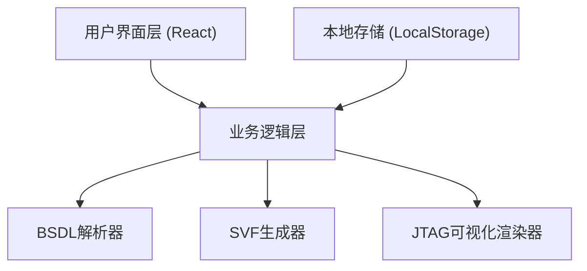

## 1. 架构设计

本应用为纯前端应用，所有功能在浏览器端完成，无需后端服务。



## 2. 技术描述

- **前端框架**: React@18 + TypeScript
- **构建工具**: Vite@5
- **样式方案**: TailwindCSS@3
- **状态管理**: React Hooks (useState, useContext)
- **文件处理**: File API + 自定义BSDL解析器
- **可视化**: 原生SVG + CSS动画
- **数据存储**: LocalStorage (缓存解析结果)

## 3. 目录结构

```
src/
├── components/
│   ├── FileUpload.tsx      # 文件上传组件
│   ├── ChipInfo.tsx        # 芯片信息展示
│   ├── PinTable.tsx        # 引脚表格
│   ├── JTAGVisualizer.tsx  # JTAG链可视化
│   └── SVFGenerator.tsx    # SVF生成器
├── parser/
│   └── bsdlParser.ts       # BSDL文件解析器
├── generator/
│   └── svfGenerator.ts     # SVF命令生成器
├── types/
│   └── index.ts            # TypeScript类型定义
├── hooks/
│   └── useBSDLStore.ts     # 状态管理Hook
├── App.tsx                 # 主应用组件
└── main.tsx                # 入口文件
```

## 4. 核心数据模型

### 4.1 芯片信息 (ChipInfo)

```typescript
interface ChipInfo {
  id: string;
  name: string;           // 芯片型号名称
  fileName: string;       // 源文件名
  irLength: number;       // 指令寄存器长度
  idcode?: string;        // IDCODE (可选)
  pins: Pin[];            // 引脚列表
  boundaryCells: BoundaryCell[]; // 边界扫描单元
  usercode?: string;      // USERCODE (可选)
  parsedAt: Date;
}
```

### 4.2 引脚信息 (Pin)

```typescript
interface Pin {
  name: string;           // 引脚名称
  type: 'input' | 'output' | 'inout' | 'power' | 'ground' | 'control';
  cell?: number;          // 关联的边界扫描单元号
  port?: string;          // 端口分组
  description?: string;
}
```

### 4.3 边界扫描单元 (BoundaryCell)

```typescript
interface BoundaryCell {
  cellNumber: number;
  function: 'INPUT' | 'OUTPUT' | 'CONTROL' | 'OBSERVE_ONLY';
  port: string;
  safeBit?: '0' | '1';
  disableBit?: number;
}
```

### 4.4 JTAG链 (JTAGChain)

```typescript
interface JTAGChain {
  devices: ChipInfo[];    // 链上的设备列表
  totalIRLength: number;  // 总IR长度
  totalDRLength: number;  // 总DR长度（所有BSR总和）
}
```

## 5. BSDL解析器设计

### 5.1 核心解析逻辑

解析器使用正则表达式匹配BSDL标准语法，提取以下关键信息：

1. **实体名称** - 芯片型号
2. **端口定义** - 所有引脚及其类型
3. **指令寄存器长度** - INSTRUCTION_LENGTH属性
4. **IDCODE寄存器** - IDCODE_REGISTER属性
5. **边界扫描寄存器** - BOUNDARY_REGISTER定义

### 5.2 主要解析函数

```typescript
function parseBSDL(content: string): ChipInfo;
function extractEntityName(content: string): string;
function extractPorts(content: string): Pin[];
function extractIRLength(content: string): number;
function extractIDCODE(content: string): string | undefined;
function extractBoundaryCells(content: string): BoundaryCell[];
```

## 6. SVF生成器设计

### 6.1 支持的SVF命令

- `ENDIR` - 设置IR结束状态
- `ENDDR` - 设置DR结束状态
- `STATE` - 设置TAP状态
- `SIR` - 扫描指令寄存器
- `SDR` - 扫描数据寄存器
- `HIR` - 头指令位
- `TIR` - 尾指令位
- `HDR` - 头数据位
- `TDR` - 尾数据位
- `RUNTEST` - 运行测试时钟

### 6.2 SVF生成接口

```typescript
interface SVFOptions {
  targetDevice: number;   // 目标设备索引
  instruction: string;    // 指令名称或二进制值
  data?: string;          // 要扫描的数据
  expectedData?: string;  // 期望的数据
  mask?: string;          // 掩码
  endIRState: string;     // IR结束状态
  endDRState: string;     // DR结束状态
  runTestClocks?: number; // RUNTEST时钟数
}

function generateSVF(chain: JTAGChain, options: SVFOptions): string;
function generateIDCOETest(chain: JTAGChain, deviceIndex: number): string;
function generateBYPASSChain(chain: JTAGChain): string;
function generateSampleTest(chain: JTAGChain, deviceIndex: number): string;
function generateExtestTest(chain: JTAGChain, deviceIndex: number): string;
```

## 7. 关键技术点

### 7.1 文件上传处理
- 使用FileReader API读取文件内容
- 支持拖拽上传和点击上传
- 文件大小限制和类型校验

### 7.2 大文件性能优化
- Web Worker后台解析
- 虚拟滚动渲染引脚列表
- 解析结果缓存到LocalStorage

### 7.3 JTAG可视化
- SVG绘制芯片节点和连接线
- 支持缩放和平移
- 交互式工具提示显示详细信息
- 动画展示数据流向

## 8. 依赖包列表

```json
{
  "dependencies": {
    "react": "^18.2.0",
    "react-dom": "^18.2.0"
  },
  "devDependencies": {
    "@types/react": "^18.2.0",
    "@types/react-dom": "^18.2.0",
    "@vitejs/plugin-react": "^4.2.0",
    "autoprefixer": "^10.4.16",
    "postcss": "^8.4.32",
    "tailwindcss": "^3.4.0",
    "typescript": "^5.3.0",
    "vite": "^5.0.0"
  }
}
```

