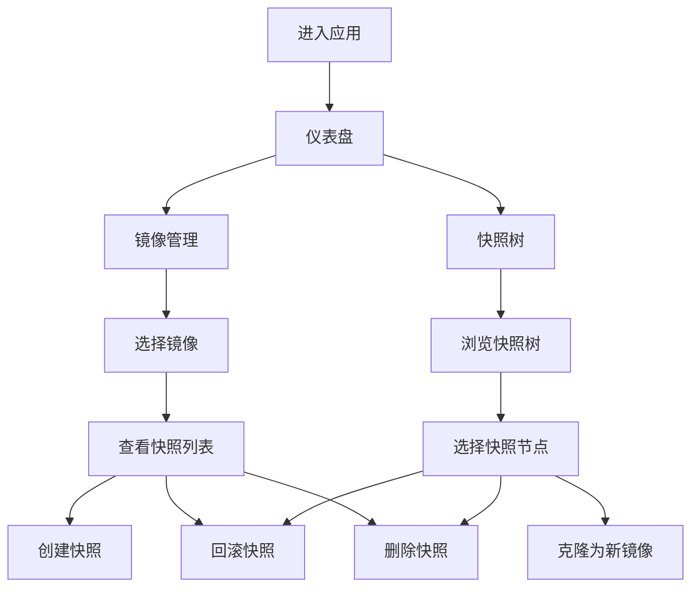

## 1. 产品概述

Ceph RBD 快照管理 Web 应用，用于通过可视化界面管理 Ceph 存储中的 RBD 镜像快照，解决命令行操作复杂、快照关系难以追踪的问题。目标用户为存储运维工程师、云平台管理员。

- 核心问题：RBD 快照的创建、回滚、删除操作需通过命令行完成，快照间的父子克隆关系不直观，管理效率低
- 产品价值：提供快照树可视化、一站式快照管理、克隆快照为新镜像，大幅提升存储运维效率

## 2. 核心功能

### 2.1 功能模块

1. **仪表盘页面**：镜像概览、存储池状态、快速操作入口
2. **镜像管理页面**：镜像列表、镜像详情、快照操作
3. **快照树页面**：快照层级关系可视化树、克隆管理

### 2.2 页面详情

| 页面名称 | 模块名称 | 功能描述 |
|----------|----------|----------|
| 仪表盘页面 | 概览统计 | 显示镜像总数、快照总数、存储池容量使用情况 |
| 仪表盘页面 | 最近活动 | 展示最近的快照操作记录 |
| 仪表盘页面 | 快速操作 | 创建快照、克隆镜像的快捷入口 |
| 镜像管理页面 | 镜像列表 | 展示所有 RBD 镜像，支持按存储池筛选，显示镜像大小、快照数量 |
| 镜像管理页面 | 镜像详情抽屉 | 点击镜像后展示详情，包含快照列表和操作按钮 |
| 镜像管理页面 | 快照操作面板 | 创建快照（输入名称）、回滚快照（确认对话框）、删除快照（确认对话框） |
| 快照树页面 | 快照树可视化 | 以树状图展示镜像-快照-克隆镜像的层级关系，支持展开/折叠节点 |
| 快照树页面 | 节点详情面板 | 点击树节点显示该快照/镜像的详细信息和可用操作 |
| 快照树页面 | 克隆操作 | 选择快照后克隆为新镜像，输入新镜像名称和存储池 |

## 3. 核心流程

### 3.1 创建快照流程
用户在镜像列表中选择镜像 → 点击"创建快照" → 输入快照名称 → 系统执行 `rbd snap create` → 刷新快照列表和快照树

### 3.2 回滚快照流程
用户在快照列表或快照树中选择快照 → 点击"回滚" → 确认对话框提示数据丢失风险 → 系统执行 `rbd snap rollback` → 操作完成通知

### 3.3 删除快照流程
用户在快照列表或快照树中选择快照 → 点击"删除" → 确认对话框（若快照有子克隆则提示） → 系统执行 `rbd snap unprotect`（如受保护）+ `rbd snap rm` → 刷新视图

### 3.4 克隆快照流程
用户在快照树中选择快照 → 点击"克隆为新镜像" → 输入新镜像名称和目标存储池 → 系统执行 `rbd clone` → 新镜像出现在列表中

## 4. 用户界面设计

### 4.1 设计风格
- **主色调**：深色主题（#0f172a 背景），配合青色/蓝绿色强调色（#22d3ee cyan-400）
- **按钮风格**：圆角按钮，hover 有发光效果，危险操作用红色（#ef4444）
- **字体**：使用 JetBrains Mono 作为代码/数据展示，Inter 作为界面文字
- **布局风格**：左侧导航栏 + 顶部工具栏 + 主内容区，卡片式布局
- **图标风格**：Lucide React 图标库，线性风格

### 4.2 页面设计概览

| 页面名称 | 模块名称 | UI 元素 |
|----------|----------|----------|
| 仪表盘页面 | 概览统计 | 4 个统计卡片，渐变背景，数字动画 |
| 仪表盘页面 | 最近活动 | 时间线列表，操作类型标签（创建/回滚/删除/克隆） |
| 镜像管理页面 | 镜像列表 | 表格布局，行 hover 高亮，支持排序 |
| 镜像管理页面 | 快照操作 | 模态对话框，表单输入，确认按钮 |
| 快照树页面 | 快照树 | SVG 渲染的树状图，节点可点击，连线动画 |
| 快照树页面 | 节点详情 | 右侧滑出面板，显示元数据和操作按钮 |

### 4.3 响应式
桌面优先设计，最小支持 1280px 宽度。快照树组件在小屏幕下自动切换为列表视图。
