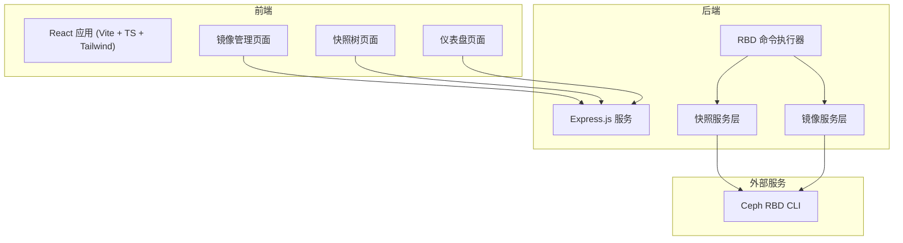
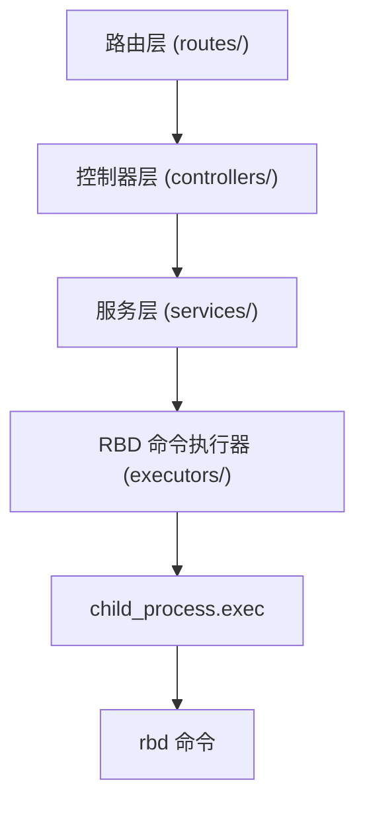
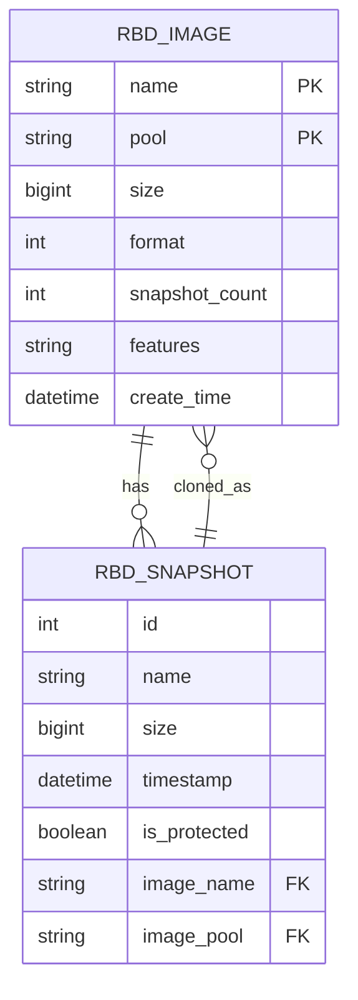

## 1. 架构设计



## 2. 技术说明

- **前端**：React 18 + TypeScript + Tailwind CSS 3 + Vite + Zustand + React Router v6
- **初始化工具**：vite-init
- **后端**：Express.js 4 + TypeScript
- **外部依赖**：Ceph RBD 命令行工具（需在运行环境中可用）
- **数据来源**：通过执行 `rbd` 命令获取实时数据，无独立数据库

## 3. 路由定义

| 路由 | 用途 |
|------|------|
| / | 仪表盘页面 - 概览统计和最近活动 |
| /images | 镜像管理页面 - 镜像列表和快照操作 |
| /snapshot-tree | 快照树页面 - 可视化快照层级关系 |

## 4. API 定义

### 4.1 镜像相关 API

```typescript
// GET /api/images - 获取所有镜像列表
interface RbdImage {
  name: string;
  pool: string;
  size: number;
  format: number;
  snapshotCount: number;
  provisionedSize: number;
}

// GET /api/images/:pool/:name - 获取单个镜像详情
interface RbdImageDetail extends RbdImage {
  snapshots: RbdSnapshot[];
  features: string[];
  createTime: string;
}

// POST /api/images - 创建新镜像
interface CreateImageRequest {
  pool: string;
  name: string;
  size: number; // in bytes
  dataPool?: string;
}
```

### 4.2 快照相关 API

```typescript
// GET /api/images/:pool/:name/snapshots - 获取镜像快照列表
interface RbdSnapshot {
  id: number;
  name: string;
  size: number;
  timestamp: string;
  isProtected: boolean;
  children?: string[]; // 克隆的子镜像
}

// POST /api/images/:pool/:name/snapshots - 创建快照
interface CreateSnapshotRequest {
  snapshotName: string;
}

// POST /api/images/:pool/:name/snapshots/:snap/rollback - 回滚快照
// DELETE /api/images/:pool/:name/snapshots/:snap - 删除快照
interface DeleteSnapshotRequest {
  force?: boolean; // 是否强制删除（需先 unprotect）
}

// POST /api/images/:pool/:name/snapshots/:snap/clone - 克隆快照为新镜像
interface CloneSnapshotRequest {
  newPool: string;
  newImageName: string;
}
```

### 4.3 通用响应

```typescript
interface ApiResponse<T> {
  success: boolean;
  data: T;
  error?: string;
  message?: string;
}
```

## 5. 后端架构图



## 6. 数据模型

### 6.1 数据模型定义



### 6.2 快照树数据结构

```typescript
interface SnapshotTreeNode {
  id: string; // unique identifier
  type: 'image' | 'snapshot';
  name: string;
  pool?: string;
  size?: number;
  timestamp?: string;
  isProtected?: boolean;
  children?: SnapshotTreeNode[]; // 对于 image 类型，children 是 snapshots；对于 snapshot 类型，children 是克隆的镜像
  parent?: string; // 父节点 ID
  level: number; // 树层级
}
```
