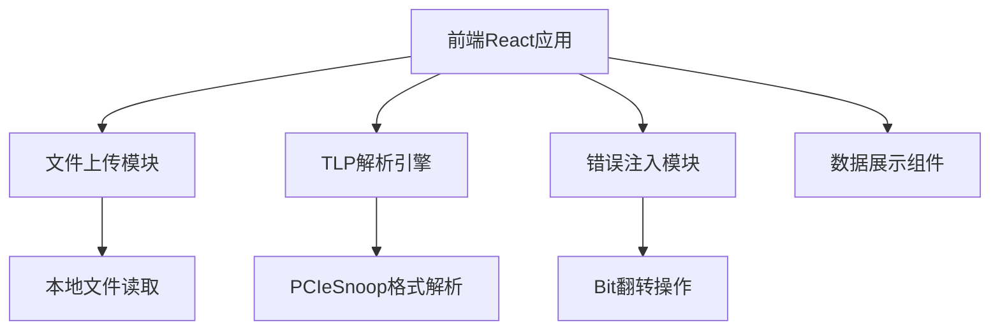

## 1. 架构设计



## 2. 技术描述

- 前端：React@18 + TypeScript + tailwindcss@3 + vite
- 后端：无需后端，纯前端应用
- 初始化工具：vite-init
- 数据处理：全部在浏览器端完成，使用File API读取本地文件

## 3. 路由定义

| 路由 | 用途 |
|------|------|
| / | 主页面（文件上传、TLP列表、详情面板） |

## 4. 核心数据结构

### 4.1 TLP数据类型定义

```typescript
interface TLPHeader {
  type: string;           // TLP类型
  length: number;         // 长度（DW）
  address?: number;       // 地址（内存读写）
  tag?: number;           // Tag
  requesterId?: number;   // 请求者ID
  completerId?: number;   // 完成者ID
  status?: string;        // 完成状态
  byteCount?: number;     // 字节计数
  lowerAddress?: number;  // 低位地址
}

interface TLP {
  index: number;          // 序号
  rawData: Uint8Array;    // 原始数据
  header: TLPHeader;      // 解析后的头部
  payload?: Uint8Array;   // 数据载荷
  timestamp?: number;     // 时间戳
}

interface ParseResult {
  tlps: TLP[];            // 解析出的TLP列表
  totalLength: number;    // 文件总长度
  parseErrors: string[];  // 解析错误
}

interface ErrorInjection {
  tlpIndex: number;       // TLP序号
  byteOffset: number;     // 字节偏移
  bitPosition: number;    // bit位置 (0-7)
}
```

## 5. 核心模块说明

### 5.1 PCIeSnoop解析器
- 支持PCIE格式解析
- 解析TLP头部字段
- 识别不同类型的TLP（Memory Read/Write, Completion等）

### 5.2 错误注入模块
- 支持指定TLP、指定字节偏移、指定bit位进行翻转
- 实时预览修改后的数据
- 支持导出修改后的文件

### 5.3 数据展示模块
- TLP列表表格展示
- 十六进制数据查看器
- 字段解析详情

