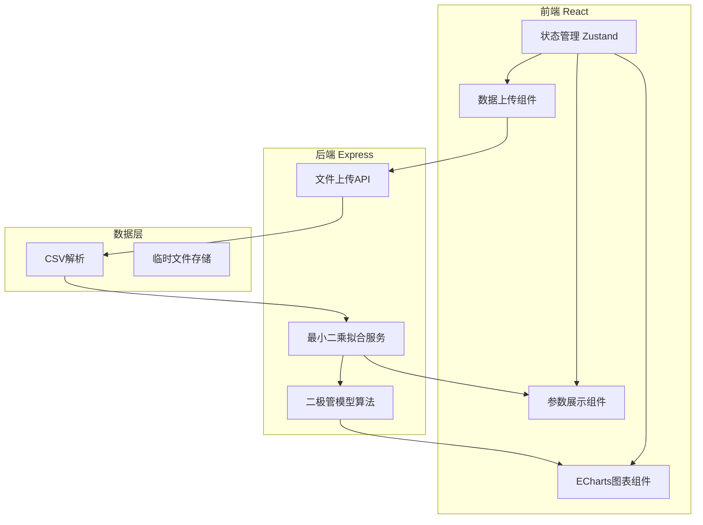
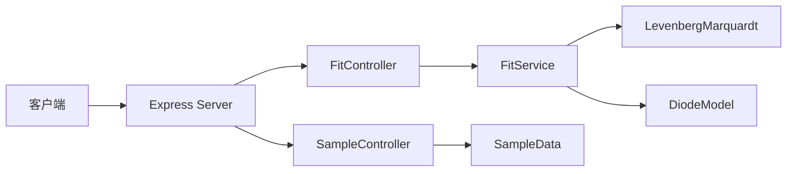

## 1. 架构设计



## 2. 技术描述

- **前端**：React@18 + TypeScript + Vite + TailwindCSS@3 + ECharts + Zustand
- **后端**：Express@4 + TypeScript
- **初始化工具**：vite-init react-express-ts 模板
- **数学计算**：使用 levenberg-marquardt 库进行非线性最小二乘拟合
- **文件处理**：multer 处理文件上传，papaparse 解析CSV

## 3. 路由定义

| 路由 | 用途 |
|-------|---------|
| / | 主页面 - 数据上传和结果展示 |
| /api/fit | POST - 上传数据并执行参数拟合 |
| /api/sample | GET - 获取示例数据 |

## 4. API 定义

### 4.1 拟合请求

```typescript
// POST /api/fit
interface FitRequest {
  // 上传的CSV文件
  file: File;
}

// 响应
interface FitResponse {
  success: boolean;
  data: {
    measuredData: Array<{ v: number; i: number }>;
    fittedData: Array<{ v: number; i: number }>;
    parameters: {
      IS: number;
      N: number;
      RS?: number;
    };
    statistics: {
      rSquared: number;
      rmse: number;
    };
  };
  error?: string;
}
```

### 4.2 示例数据

```typescript
// GET /api/sample
interface SampleResponse {
  success: boolean;
  data: Array<{ v: number; i: number }>;
}
```

## 5. 服务器架构



## 6. 数据模型

### 6.1 数据点

```typescript
interface DataPoint {
  v: number;  // 电压 (V)
  i: number;  // 电流 (A)
}
```

### 6.2 拟合参数

```typescript
interface DiodeParameters {
  IS: number;  // 反向饱和电流
  N: number;   // 发射系数
  RS?: number; // 串联电阻（可选）
}
```

### 6.3 拟合结果

```typescript
interface FitResult {
  parameters: DiodeParameters;
  fittedCurve: DataPoint[];
  statistics: {
    rSquared: number;
    rmse: number;
  };
}
```
