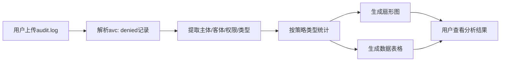

## 1. 产品概述

SELinux审计日志分析工具，用于解析audit.log中的AVC拒绝记录，提取主体、客体、权限信息，并通过可视化图表展示违反的策略类型分布。

- 主要用途：帮助系统管理员快速分析SELinux策略违规情况，识别安全风险
- 目标用户：Linux系统管理员、安全工程师、DevOps工程师
- 产品价值：简化SELinux审计日志分析流程，提供直观的可视化展示，提升安全审计效率

## 2. 核心功能

### 2.1 功能模块

1. **日志上传页**：文件上传区域、拖拽上传、示例数据加载
2. **分析结果页**：扇形图展示、数据表格、统计摘要

### 2.2 页面详情

| 页面名称 | 模块名称 | 功能描述 |
|-----------|-------------|---------------------|
| 日志分析页 | 文件上传模块 | 支持点击选择文件或拖拽上传audit.log文件，支持加载示例数据 |
| 日志分析页 | 解析引擎 | 自动解析avc: denied记录，提取主体、客体、权限、策略类型 |
| 日志分析页 | 扇形图展示 | 按策略类型（tclass）统计违规次数，以扇形图可视化展示 |
| 日志分析页 | 数据表格 | 展示每条违规记录的详细信息，支持筛选和查看 |
| 日志分析页 | 统计摘要 | 显示总违规数、涉及主体数、涉及客体数、策略类型数 |

## 3. 核心流程

用户上传audit.log文件 → 系统解析AVC拒绝记录 → 提取主体(scontext)、客体(tcontext)、权限(permission)、策略类型(tclass) → 按策略类型统计 → 生成扇形图和数据表格 → 用户查看分析结果



## 4. 用户界面设计

### 4.1 设计风格
- 主色调：深蓝与青色的科技感配色，契合安全工具的专业定位
- 字体：使用现代无衬线字体，标题使用具有科技感的字体
- 布局：卡片式布局，清晰的区域分隔
- 按钮风格：圆角矩形，带有悬停动效
- 整体风格：专业、简洁、数据驱动的安全分析工具风格

### 4.2 页面设计概述

| 页面名称 | 模块名称 | UI元素 |
|-----------|-------------|-------------|
| 日志分析页 | 头部 | 应用标题、副标题、说明文字 |
| 日志分析页 | 上传区域 | 虚线边框、上传图标、拖拽提示文字、示例数据按钮 |
| 日志分析页 | 统计卡片 | 4个统计卡片，分别显示总违规数、主体数、客体数、策略类型数 |
| 日志分析页 | 扇形图区域 | 图例、交互式扇形图、悬停显示详情 |
| 日志分析页 | 数据表格 | 可滚动表格、列标题、行高亮、详细信息展开 |

### 4.3 响应式
- Desktop-first设计，桌面端优化布局
- 移动端自适应，表格可横向滚动，图表自适应容器宽度
- 触摸设备优化按钮尺寸和点击区域

## 5. 数据说明

### 5.1 AVC日志格式
典型avc: denied记录格式：
```
type=AVC msg=audit(1620000000.123:456): avc:  denied  { read } for  pid=1234 comm="cat" name="file.txt" dev="sda1" ino=123456 scontext=system_u:system_r:httpd_t:s0 tcontext=system_u:object_r:user_home_t:s0 tclass=file permissive=0
```

### 5.2 提取字段
- **主体（scontext）**：SELinux安全上下文，如 `system_u:system_r:httpd_t:s0`
- **客体（tcontext）**：目标安全上下文，如 `system_u:object_r:user_home_t:s0`
- **权限（permission）**：被拒绝的操作，如 `read`, `write`, `execute`
- **策略类型（tclass）**：客体类别，如 `file`, `dir`, `socket`, `process`
